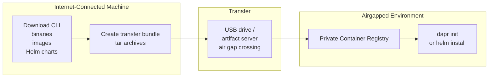

# How to Set Up Dapr in an Airgapped or Offline Environment

Author: [nawazdhandala](https://www.github.com/nawazdhandala)

Tags: Dapr, Airgapped, Offline, Private Registry, Installation

Description: Install Dapr in an airgapped environment by mirroring container images to a private registry, downloading binaries offline, and configuring Helm to use internal sources.

---

## The Airgapped Challenge

In airgapped environments, machines have no outbound internet access. Dapr needs:
1. The `daprd` binary and CLI
2. Docker images for control plane services (`daprio/dapr`)
3. Docker images for infrastructure (Redis, Zipkin)
4. Helm charts (for Kubernetes)
5. Component configuration

You prepare all of these on an internet-connected machine, then transfer and install them on the airgapped environment.



## Step 1 - Download on Internet-Connected Machine

### Download Dapr CLI

```bash
# Linux amd64
curl -L https://github.com/dapr/cli/releases/download/v1.14.0/dapr_linux_amd64.tar.gz \
  -o dapr_linux_amd64.tar.gz

# macOS arm64
curl -L https://github.com/dapr/cli/releases/download/v1.14.0/dapr_darwin_arm64.tar.gz \
  -o dapr_darwin_arm64.tar.gz
```

### Download Container Images

```bash
DAPR_VERSION=1.14.0

# Pull all required images
docker pull daprio/dapr:${DAPR_VERSION}
docker pull daprio/daprd:${DAPR_VERSION}
docker pull daprio/dapr-dashboard:latest
docker pull redis:7-alpine
docker pull openzipkin/zipkin:latest

# Save to tar archives
docker save daprio/dapr:${DAPR_VERSION} -o dapr-runtime.tar
docker save daprio/daprd:${DAPR_VERSION} -o daprd.tar
docker save daprio/dapr-dashboard:latest -o dapr-dashboard.tar
docker save redis:7-alpine -o redis.tar
docker save openzipkin/zipkin:latest -o zipkin.tar
```

### Download Helm Charts

```bash
helm repo add dapr https://dapr.github.io/helm-charts/
helm pull dapr/dapr --version 1.14.0 --destination ./helm-charts/
ls helm-charts/
# dapr-1.14.0.tgz
```

### Download the Dapr Runtime Binary (Self-Hosted Slim)

```bash
curl -L https://github.com/dapr/dapr/releases/download/v1.14.0/daprd_linux_amd64.tar.gz \
  -o daprd_linux_amd64.tar.gz
```

## Step 2 - Transfer to Airgapped Environment

Transfer all files via USB, SFTP, or your organization's artifact transfer process:

```text
airgap-bundle/
  dapr-cli/
    dapr_linux_amd64.tar.gz
  images/
    dapr-runtime.tar
    daprd.tar
    dapr-dashboard.tar
    redis.tar
    zipkin.tar
  helm-charts/
    dapr-1.14.0.tgz
  components/
    statestore.yaml
    pubsub.yaml
```

## Step 3 - Load Images into Private Registry

On the airgapped machine:

```bash
PRIVATE_REGISTRY=registry.internal.example.com:5000
DAPR_VERSION=1.14.0

# Load images
docker load -i dapr-runtime.tar
docker load -i daprd.tar
docker load -i redis.tar
docker load -i zipkin.tar

# Tag and push to private registry
docker tag daprio/dapr:${DAPR_VERSION} ${PRIVATE_REGISTRY}/daprio/dapr:${DAPR_VERSION}
docker push ${PRIVATE_REGISTRY}/daprio/dapr:${DAPR_VERSION}

docker tag daprio/daprd:${DAPR_VERSION} ${PRIVATE_REGISTRY}/daprio/daprd:${DAPR_VERSION}
docker push ${PRIVATE_REGISTRY}/daprio/daprd:${DAPR_VERSION}

docker tag redis:7-alpine ${PRIVATE_REGISTRY}/redis:7-alpine
docker push ${PRIVATE_REGISTRY}/redis:7-alpine
```

## Step 4 - Install Dapr CLI

```bash
tar -xzf dapr_linux_amd64.tar.gz
sudo mv dapr /usr/local/bin/
dapr --version
```

## Step 5 - Self-Hosted Init from Private Registry

```bash
dapr init \
  --from-dir /path/to/airgap-bundle \
  --image-registry registry.internal.example.com:5000
```

Or use slim init (no containers needed):

```bash
dapr init --slim
```

With slim init, manually start your Redis instance and place the component files:

```bash
docker load -i redis.tar
docker run -d --name dapr_redis -p 6379:6379 registry.internal.example.com:5000/redis:7-alpine
```

## Step 6 - Kubernetes Install via Helm

```bash
# Load images into each node (or use an image pull secret for private registry)
# If using a private registry, create an image pull secret:
kubectl create secret docker-registry regcred \
  --docker-server=registry.internal.example.com:5000 \
  --docker-username=<user> \
  --docker-password=<pass> \
  -n dapr-system

# Install from local chart
helm install dapr ./helm-charts/dapr-1.14.0.tgz \
  --namespace dapr-system \
  --create-namespace \
  --set global.registry=registry.internal.example.com:5000 \
  --set global.tag=${DAPR_VERSION} \
  --set dapr_operator.image.name=registry.internal.example.com:5000/daprio/dapr \
  --set dapr_sentry.image.name=registry.internal.example.com:5000/daprio/dapr \
  --set dapr_placement.image.name=registry.internal.example.com:5000/daprio/dapr \
  --set dapr_sidecar_injector.image.name=registry.internal.example.com:5000/daprio/dapr \
  --set dapr_sidecar_injector.sidecarImagePullPolicy=IfNotPresent
```

## Step 7 - Configure Sidecar Image for Kubernetes

The sidecar injector must know where to pull the `daprd` image from:

```bash
helm upgrade dapr ./helm-charts/dapr-1.14.0.tgz \
  --namespace dapr-system \
  --set dapr_sidecar_injector.sidecarImage=registry.internal.example.com:5000/daprio/daprd:${DAPR_VERSION}
```

Or patch the configmap after install:

```bash
kubectl edit configmap dapr-config -n dapr-system
# Update sidecarImageName field
```

## Step 8 - Apply Components

Your component YAML files work the same way - point to your internal Redis or other infrastructure:

```yaml
# components/statestore.yaml
apiVersion: dapr.io/v1alpha1
kind: Component
metadata:
  name: statestore
spec:
  type: state.redis
  version: v1
  metadata:
  - name: redisHost
    value: redis.internal.example.com:6379
```

```bash
kubectl apply -f components/ -n default
```

## Verifying the Airgapped Installation

```bash
dapr status -k
kubectl get pods -n dapr-system
```

```text
NAME                                    READY   STATUS
dapr-operator-xxx                       1/1     Running
dapr-sentry-xxx                         1/1     Running
dapr-placement-server-0                 1/1     Running
dapr-sidecar-injector-xxx               1/1     Running
```

## Summary

Installing Dapr in an airgapped environment requires downloading CLI binaries, container images, and Helm charts on an internet-connected machine, then transferring them to the airgapped environment. Images are loaded into a private registry. The Dapr CLI `--image-registry` flag and Helm `global.registry` value point all image pulls to the private registry. Component files are updated to reference internal infrastructure endpoints.
