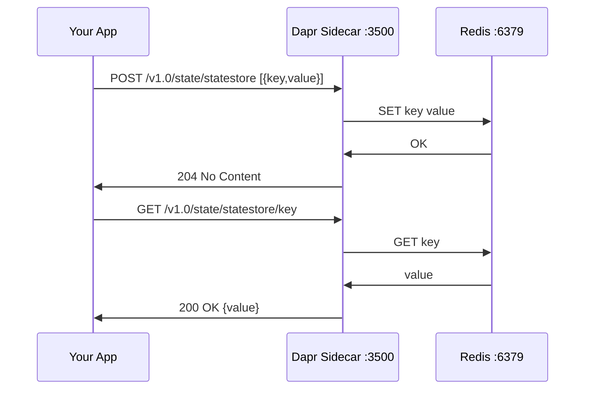

# How to Use the Dapr API for the First Time

Author: [nawazdhandala](https://www.github.com/nawazdhandala)

Tags: Dapr, API, HTTP, Getting Started, Developer Tool

Description: A hands-on introduction to using the Dapr HTTP API for state management, service invocation, and pub/sub messaging using curl and code examples.

---

## What Is the Dapr API?

The Dapr API is a RESTful HTTP and gRPC interface exposed by the Dapr sidecar on `localhost`. Every Dapr building block is accessible through a consistent URL pattern at `http://localhost:3500/v1.0/...`. This means you can interact with state stores, message brokers, secrets, and other services without any SDK - just plain HTTP calls.

## Prerequisites

- Dapr CLI installed and initialized (`dapr init`)
- Docker running (for Redis container started by `dapr init`)
- curl or any HTTP client available

## Starting a Dapr Sidecar for Testing

For quick API exploration, you can start a standalone sidecar without an application:

```bash
dapr run --app-id test-app --dapr-http-port 3500
```

This starts the sidecar on port 3500 with access to all default components.

## API URL Structure

The Dapr HTTP API follows this pattern:

```yaml
http://localhost:<dapr-http-port>/v1.0/<building-block>/<component-name>/<operation>
```

For example:
- `http://localhost:3500/v1.0/state/statestore` - state store named "statestore"
- `http://localhost:3500/v1.0/invoke/myservice/method/hello` - invoke method on "myservice"
- `http://localhost:3500/v1.0/publish/pubsub/orders` - publish to topic "orders"

## Working with State

### Saving State

```bash
curl -X POST http://localhost:3500/v1.0/state/statestore \
  -H "Content-Type: application/json" \
  -d '[
    {"key": "user1", "value": {"name": "Alice", "age": 30}},
    {"key": "user2", "value": {"name": "Bob", "age": 25}}
  ]'
```

### Getting State

```bash
curl http://localhost:3500/v1.0/state/statestore/user1
```

Response:

```json
{"name": "Alice", "age": 30}
```

### Deleting State

```bash
curl -X DELETE http://localhost:3500/v1.0/state/statestore/user1
```

## Publishing a Message

Publish a message to a topic named "orders" on the "pubsub" component:

```bash
curl -X POST http://localhost:3500/v1.0/publish/pubsub/orders \
  -H "Content-Type: application/json" \
  -d '{"orderId": "123", "item": "widget", "quantity": 5}'
```

## Invoking Another Service

Call the `getProduct` method on a service named `product-service`:

```bash
curl http://localhost:3500/v1.0/invoke/product-service/method/getProduct/123
```

## Retrieving a Secret

Read a secret from the default secret store:

```bash
curl http://localhost:3500/v1.0/secrets/kubernetes/mysecret
```

## Using the API from Code

### Python

```python
import requests

DAPR_HTTP_PORT = 3500
BASE_URL = f"http://localhost:{DAPR_HTTP_PORT}/v1.0"

# Save state
requests.post(
    f"{BASE_URL}/state/statestore",
    json=[{"key": "counter", "value": 42}]
)

# Get state
response = requests.get(f"{BASE_URL}/state/statestore/counter")
print(response.json())  # 42

# Publish a message
requests.post(
    f"{BASE_URL}/publish/pubsub/orders",
    json={"orderId": "abc", "amount": 99.99}
)
```

### Node.js

```javascript
const axios = require('axios');

const DAPR_HTTP_PORT = process.env.DAPR_HTTP_PORT || 3500;
const BASE_URL = `http://localhost:${DAPR_HTTP_PORT}/v1.0`;

async function main() {
  // Save state
  await axios.post(`${BASE_URL}/state/statestore`, [
    { key: 'session', value: { userId: 'u1', token: 'abc123' } }
  ]);

  // Get state
  const res = await axios.get(`${BASE_URL}/state/statestore/session`);
  console.log(res.data);

  // Invoke a service
  const product = await axios.get(`${BASE_URL}/invoke/catalog/method/products`);
  console.log(product.data);
}

main();
```

### Go

```go
package main

import (
    "bytes"
    "encoding/json"
    "fmt"
    "net/http"
    "os"
)

func main() {
    port := os.Getenv("DAPR_HTTP_PORT")
    if port == "" {
        port = "3500"
    }
    baseURL := fmt.Sprintf("http://localhost:%s/v1.0", port)

    // Save state
    body, _ := json.Marshal([]map[string]interface{}{
        {"key": "greeting", "value": "hello"},
    })
    http.Post(baseURL+"/state/statestore", "application/json", bytes.NewBuffer(body))

    // Get state
    resp, _ := http.Get(baseURL + "/state/statestore/greeting")
    defer resp.Body.Close()
    fmt.Println(resp.Status)
}
```

## Dapr Metadata API

The metadata endpoint returns information about the running sidecar:

```bash
curl http://localhost:3500/v1.0/metadata
```

Response includes the app ID, registered components, subscriptions, and HTTP endpoints.

## Health Check

Check if the sidecar is healthy:

```bash
curl http://localhost:3500/v1.0/healthz
```

Returns `204 No Content` when healthy.

## API Flow Diagram



## Summary

The Dapr HTTP API provides a simple, language-agnostic way to use all Dapr building blocks from any application. With just curl or an HTTP library, you can save and retrieve state, publish messages, invoke other services, and read secrets. The API is available at `http://localhost:3500/v1.0/` and follows a consistent pattern across all building blocks.
