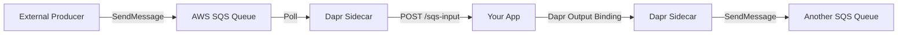

# How to Configure Dapr Binding with AWS SQS

Author: [nawazdhandala](https://www.github.com/nawazdhandala)

Tags: Dapr, Binding, AWS, SQS, Queue

Description: Configure the Dapr AWS SQS input and output binding to trigger your application from queue messages and send messages to SQS queues using IAM credentials or IRSA.

---

## Overview

The Dapr AWS SQS binding lets your application receive messages from an SQS queue (input) and send messages to a queue (output) without SDK-level AWS integration. Dapr handles polling, visibility timeout, and message deletion.



## Prerequisites

- AWS account with SQS permissions
- Dapr CLI installed and initialized
- AWS CLI configured

## Create SQS Queue

```bash
AWS_REGION="us-east-1"

# Create standard queue
QUEUE_URL=$(aws sqs create-queue \
  --queue-name dapr-input-queue \
  --region $AWS_REGION \
  --attributes '{
    "VisibilityTimeout": "30",
    "MessageRetentionPeriod": "86400"
  }' \
  --query QueueUrl --output text)

# Create output queue
aws sqs create-queue \
  --queue-name dapr-output-queue \
  --region $AWS_REGION

echo "Input queue: $QUEUE_URL"
```

## IAM Policy

```json
{
  "Version": "2012-10-17",
  "Statement": [
    {
      "Effect": "Allow",
      "Action": [
        "sqs:ReceiveMessage",
        "sqs:DeleteMessage",
        "sqs:GetQueueAttributes",
        "sqs:SendMessage",
        "sqs:ChangeMessageVisibility"
      ],
      "Resource": [
        "arn:aws:sqs:us-east-1:*:dapr-input-queue",
        "arn:aws:sqs:us-east-1:*:dapr-output-queue"
      ]
    }
  ]
}
```

## Input Binding Component

```yaml
# binding-sqs-input.yaml
apiVersion: dapr.io/v1alpha1
kind: Component
metadata:
  name: sqs-input
  namespace: default
spec:
  type: bindings.aws.sqs
  version: v1
  metadata:
  - name: queueName
    value: "dapr-input-queue"
  - name: region
    value: "us-east-1"
  - name: accessKey
    secretKeyRef:
      name: aws-secret
      key: accessKey
  - name: secretKey
    secretKeyRef:
      name: aws-secret
      key: secretKey
  - name: waitTimeSeconds
    value: "20"
  - name: visibilityTimeoutSeconds
    value: "30"
  - name: disableEntityManagement
    value: "false"
```

## Output Binding Component

```yaml
# binding-sqs-output.yaml
apiVersion: dapr.io/v1alpha1
kind: Component
metadata:
  name: sqs-output
  namespace: default
spec:
  type: bindings.aws.sqs
  version: v1
  metadata:
  - name: queueName
    value: "dapr-output-queue"
  - name: region
    value: "us-east-1"
  - name: accessKey
    secretKeyRef:
      name: aws-secret
      key: accessKey
  - name: secretKey
    secretKeyRef:
      name: aws-secret
      key: secretKey
```

## Kubernetes Secret

```bash
kubectl create secret generic aws-secret \
  --from-literal=accessKey=YOUR_ACCESS_KEY_ID \
  --from-literal=secretKey=YOUR_SECRET_ACCESS_KEY \
  --namespace default

kubectl apply -f binding-sqs-input.yaml
kubectl apply -f binding-sqs-output.yaml
```

## Application: Handling Input Binding (Python)

When a message arrives on the SQS queue, Dapr POSTs it to `/sqs-input` (matching the component name):

```python
# app.py
import json
from flask import Flask, request, jsonify
import requests

app = Flask(__name__)
DAPR_HTTP_PORT = 3500

@app.route('/sqs-input', methods=['POST'])
def handle_sqs_message():
    """Called by Dapr when a message arrives on the SQS queue."""
    body = request.get_json()

    # SQS message body is in the raw request data
    raw_data = request.data.decode('utf-8')
    print(f"Received SQS message: {raw_data}")

    try:
        message = json.loads(raw_data)
        order_id = message.get('orderId', 'unknown')
        print(f"Processing order: {order_id}")

        # Forward to output queue after processing
        send_to_output_queue({"orderId": order_id, "status": "processed"})

        return jsonify({"status": "success"})
    except Exception as e:
        print(f"Error: {e}")
        return jsonify({"status": "error", "message": str(e)}), 500

def send_to_output_queue(data: dict):
    """Send a message to another SQS queue via Dapr output binding."""
    url = f"http://localhost:{DAPR_HTTP_PORT}/v1.0/bindings/sqs-output"
    payload = {
        "data": data,
        "operation": "create"
    }
    response = requests.post(url, json=payload)
    response.raise_for_status()
    print(f"Sent to output queue: {data}")

if __name__ == '__main__':
    app.run(host='0.0.0.0', port=5001)
```

## Application: Sending Output Binding (curl)

```bash
# Send a message to the SQS output queue
curl -X POST http://localhost:3500/v1.0/bindings/sqs-output \
  -H "Content-Type: application/json" \
  -d '{
    "data": {
      "orderId": "sqs-001",
      "item": "headphones",
      "status": "shipped"
    },
    "operation": "create"
  }'
```

## Output Binding with Metadata (FIFO Queue)

For SQS FIFO queues, pass the required deduplication and group IDs:

```bash
curl -X POST http://localhost:3500/v1.0/bindings/sqs-output \
  -H "Content-Type: application/json" \
  -d '{
    "data": {"orderId": "fifo-001"},
    "operation": "create",
    "metadata": {
      "MessageGroupId": "order-group-1",
      "MessageDeduplicationId": "fifo-001-dedup"
    }
  }'
```

## Running Locally

```bash
dapr run \
  --app-id sqs-processor \
  --app-port 5001 \
  --dapr-http-port 3500 \
  --components-path ~/.dapr/components \
  -- python app.py
```

## Testing: Push a Message to SQS

```bash
aws sqs send-message \
  --queue-url $QUEUE_URL \
  --message-body '{"orderId": "test-001", "item": "monitor"}' \
  --region us-east-1
```

Dapr will poll the queue and deliver the message to your `/sqs-input` endpoint.

## IRSA Configuration for EKS

When using IRSA, omit the `accessKey` and `secretKey` fields:

```yaml
  metadata:
  - name: queueName
    value: "dapr-input-queue"
  - name: region
    value: "us-east-1"
```

Annotate the Kubernetes service account:

```bash
kubectl annotate serviceaccount sqs-processor \
  --namespace default \
  eks.amazonaws.com/role-arn=arn:aws:iam::123456789:role/dapr-sqs-role
```

## Summary

The Dapr AWS SQS binding provides input (polling) and output (send) operations against SQS queues. Configure the component with the queue name, region, and IAM credentials or IRSA. Dapr polls the input queue using long polling (`waitTimeSeconds`) and delivers messages to the endpoint matching the component name. Use the output binding to send messages to any SQS queue with a simple HTTP POST to `/v1.0/bindings/{componentName}`.
