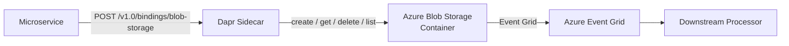

# How to Configure Dapr Binding with Azure Blob Storage

Author: [OneUptime](https://www.github.com/OneUptime)

Tags: Dapr, Binding, Azure, Blob Storage, Output

Description: Configure the Dapr Azure Blob Storage output binding to create, get, and delete blobs from your microservices without the Azure SDK using connection strings or managed identity.

---

## Overview

The Dapr Azure Blob Storage binding provides output operations to create, read, list, and delete blobs. This allows your microservices to store files, export data, or trigger downstream processing via Azure Event Grid blob events.



## Prerequisites

- Azure subscription with a Storage account
- Dapr CLI installed and initialized
- Azure CLI configured

## Create Azure Storage Resources

```bash
RESOURCE_GROUP="dapr-rg"
STORAGE_ACCOUNT="daprblobs$(openssl rand -hex 4)"
CONTAINER="exports"
LOCATION="eastus"

# Create storage account
az storage account create \
  --name $STORAGE_ACCOUNT \
  --resource-group $RESOURCE_GROUP \
  --location $LOCATION \
  --sku Standard_LRS \
  --kind StorageV2

# Create container
az storage container create \
  --name $CONTAINER \
  --account-name $STORAGE_ACCOUNT

# Get connection string
CONNECTION_STRING=$(az storage account show-connection-string \
  --name $STORAGE_ACCOUNT \
  --resource-group $RESOURCE_GROUP \
  --query connectionString -o tsv)

echo "Connection string: $CONNECTION_STRING"
```

## Kubernetes Secret

```bash
kubectl create secret generic azure-blob-secret \
  --from-literal=connectionString="$CONNECTION_STRING" \
  --namespace default
```

## Component Configuration (Connection String)

```yaml
# binding-azure-blob.yaml
apiVersion: dapr.io/v1alpha1
kind: Component
metadata:
  name: blob-storage
  namespace: default
spec:
  type: bindings.azure.blobstorage
  version: v1
  metadata:
  - name: storageAccount
    value: "daprblobs"
  - name: storageAccessKey
    secretKeyRef:
      name: azure-blob-secret
      key: storageAccessKey
  - name: container
    value: "exports"
  - name: decodeBase64
    value: "false"
  - name: encodeBase64
    value: "false"
  - name: publicAccessLevel
    value: "none"
```

Alternatively, use a full connection string:

```yaml
  - name: storageConnectionString
    secretKeyRef:
      name: azure-blob-secret
      key: connectionString
```

## Component Configuration (Managed Identity)

```yaml
# binding-azure-blob-msi.yaml
apiVersion: dapr.io/v1alpha1
kind: Component
metadata:
  name: blob-storage
  namespace: default
spec:
  type: bindings.azure.blobstorage
  version: v1
  metadata:
  - name: storageAccount
    value: "daprblobs"
  - name: container
    value: "exports"
  - name: azureClientId
    value: "YOUR_MANAGED_IDENTITY_CLIENT_ID"
```

## Operations

The Azure Blob Storage binding supports these operations:

| Operation | Description |
|-----------|-------------|
| `create` | Upload a blob |
| `get` | Download a blob |
| `delete` | Delete a blob |
| `list` | List blobs in the container |

## Creating a Blob

```bash
# Upload JSON data as a blob
curl -X POST http://localhost:3500/v1.0/bindings/blob-storage \
  -H "Content-Type: application/json" \
  -d '{
    "operation": "create",
    "data": "{\"report\": \"daily\", \"records\": 1000}",
    "metadata": {
      "blobName": "reports/2026-03-31-daily.json",
      "contentType": "application/json"
    }
  }'
```

Response:

```json
{
  "blobURL": "https://daprblobs.blob.core.windows.net/exports/reports/2026-03-31-daily.json"
}
```

## Uploading Binary Data (Base64)

```bash
# Encode a file to base64 and upload
BASE64_DATA=$(base64 -i ./report.pdf)

curl -X POST http://localhost:3500/v1.0/bindings/blob-storage \
  -H "Content-Type: application/json" \
  -d "{
    \"operation\": \"create\",
    \"data\": \"$BASE64_DATA\",
    \"metadata\": {
      \"blobName\": \"reports/report.pdf\",
      \"contentType\": \"application/pdf\"
    }
  }"
```

Set `encodeBase64: "true"` in the component metadata so Dapr knows to decode it.

## Getting a Blob

```bash
curl -X POST http://localhost:3500/v1.0/bindings/blob-storage \
  -H "Content-Type: application/json" \
  -d '{
    "operation": "get",
    "metadata": {
      "blobName": "reports/2026-03-31-daily.json"
    }
  }'
```

## Listing Blobs

```bash
curl -X POST http://localhost:3500/v1.0/bindings/blob-storage \
  -H "Content-Type: application/json" \
  -d '{
    "operation": "list",
    "data": "",
    "metadata": {
      "prefix": "reports/",
      "maxResults": "20"
    }
  }'
```

## Deleting a Blob

```bash
curl -X POST http://localhost:3500/v1.0/bindings/blob-storage \
  -H "Content-Type: application/json" \
  -d '{
    "operation": "delete",
    "metadata": {
      "blobName": "reports/2026-03-31-daily.json"
    }
  }'
```

## Python Application Example

```python
# blob_service.py
import json
import base64
import requests
from datetime import datetime

DAPR_HTTP_PORT = 3500
BINDING_NAME = "blob-storage"

def upload_report(report_data: dict, filename: str) -> str:
    url = f"http://localhost:{DAPR_HTTP_PORT}/v1.0/bindings/{BINDING_NAME}"
    payload = {
        "operation": "create",
        "data": json.dumps(report_data),
        "metadata": {
            "blobName": filename,
            "contentType": "application/json"
        }
    }
    response = requests.post(url, json=payload)
    response.raise_for_status()
    result = response.json()
    return result.get("blobURL", "")

def download_report(filename: str) -> dict:
    url = f"http://localhost:{DAPR_HTTP_PORT}/v1.0/bindings/{BINDING_NAME}"
    payload = {
        "operation": "get",
        "metadata": {"blobName": filename}
    }
    response = requests.post(url, json=payload)
    response.raise_for_status()
    return json.loads(response.text)

if __name__ == "__main__":
    report = {
        "date": datetime.utcnow().isoformat(),
        "totalOrders": 500,
        "revenue": 49999.99
    }
    filename = f"reports/{datetime.utcnow().strftime('%Y-%m-%d')}.json"
    blob_url = upload_report(report, filename)
    print(f"Uploaded report to: {blob_url}")
```

## Summary

The Dapr Azure Blob Storage output binding supports `create`, `get`, `delete`, and `list` operations against Azure Blob Storage containers. Configure the component with a connection string or Managed Identity. Use the `blobName` metadata field to specify the full blob path, and set `contentType` for correct MIME handling. This binding removes the need for the Azure Storage SDK in your application code.
