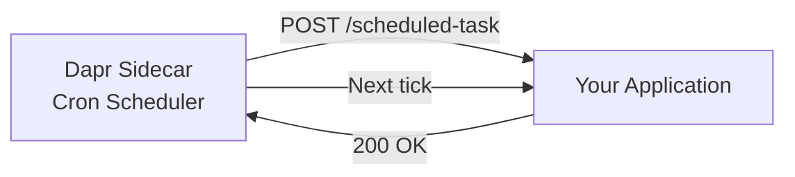

# How to Set Up Dapr Binding with Cron Scheduler

Author: [nawazdhandala](https://www.github.com/nawazdhandala)

Tags: Dapr, Binding, Cron, Scheduler, Periodic Task

Description: Configure a Dapr cron input binding to trigger your application on a schedule without an external scheduler service, using standard cron expressions.

---

## What Is the Dapr Cron Binding?

The Dapr cron binding is an input binding that triggers your application's endpoint on a recurring schedule defined by a cron expression. It replaces external cron services (crontab, Kubernetes CronJobs, cloud scheduler services) for application-level periodic tasks like cleanup jobs, report generation, and health checks.

## How the Cron Binding Works



## Prerequisites

- Dapr initialized (self-hosted or Kubernetes)
- Your application exposes an HTTP endpoint matching the binding name

## Configuring the Cron Binding

```yaml
# cron-binding.yaml
apiVersion: dapr.io/v1alpha1
kind: Component
metadata:
  name: scheduled-task
spec:
  type: bindings.cron
  version: v1
  metadata:
  - name: schedule
    value: "@every 1m"
  - name: direction
    value: "input"
```

### Cron Expression Formats

The Dapr cron binding supports both standard cron expressions and special schedules:

```yaml
# Every minute
value: "@every 1m"

# Every 30 seconds
value: "@every 30s"

# Every hour
value: "@every 1h"

# Standard 5-field cron: minute hour day month weekday
value: "0 * * * *"       # Every hour at :00
value: "*/5 * * * *"     # Every 5 minutes
value: "0 9 * * 1-5"     # 9 AM on weekdays
value: "0 0 1 * *"       # First day of every month at midnight

# Special shortcuts
value: "@hourly"
value: "@daily"
value: "@weekly"
value: "@monthly"
```

## Handling Cron Events

### Python

```python
# app.py
from flask import Flask, request, jsonify
import json
from datetime import datetime

app = Flask(__name__)

@app.route('/scheduled-task', methods=['POST'])
def run_scheduled_task():
    """Called by Dapr cron binding on schedule."""
    print(f"Cron triggered at {datetime.utcnow().isoformat()}")

    # Perform scheduled work
    try:
        result = perform_cleanup()
        print(f"Cleanup complete: {result}")
        return jsonify({"status": "completed", "result": result})
    except Exception as e:
        print(f"Scheduled task failed: {e}")
        return jsonify({"error": str(e)}), 500

def perform_cleanup():
    # Your periodic task logic here
    expired_count = delete_expired_sessions()
    return {"expiredSessionsDeleted": expired_count}

def delete_expired_sessions():
    # Simulate cleanup
    print("Deleting expired sessions...")
    return 42

if __name__ == "__main__":
    app.run(host="0.0.0.0", port=5001)
```

Start with Dapr:

```bash
dapr run \
  --app-id cron-app \
  --app-port 5001 \
  --dapr-http-port 3500 \
  -- python app.py
```

### Node.js

```javascript
const express = require('express');
const app = express();
app.use(express.json());

// Route name must match the binding component name
app.post('/scheduled-task', async (req, res) => {
  console.log(`Cron triggered at ${new Date().toISOString()}`);

  try {
    const result = await runCleanup();
    console.log('Cleanup done:', result);
    res.status(200).send('OK');
  } catch (err) {
    console.error('Cron job failed:', err);
    res.status(500).send(err.message);
  }
});

async function runCleanup() {
  // Your periodic work
  return { deletedItems: 15 };
}

app.listen(3001, () => console.log('App started on :3001'));
```

### Go

```go
package main

import (
    "fmt"
    "log"
    "net/http"
    "time"
)

func cronHandler(w http.ResponseWriter, r *http.Request) {
    fmt.Printf("Cron triggered at %s\n", time.Now().UTC().Format(time.RFC3339))

    // Perform the scheduled task
    if err := performScheduledTask(); err != nil {
        log.Printf("Scheduled task error: %v", err)
        w.WriteHeader(http.StatusInternalServerError)
        return
    }

    w.WriteHeader(http.StatusOK)
}

func performScheduledTask() error {
    // Cleanup, report generation, etc.
    fmt.Println("Running scheduled maintenance...")
    return nil
}

func main() {
    http.HandleFunc("/scheduled-task", cronHandler)
    log.Fatal(http.ListenAndServe(":3001", nil))
}
```

## Multiple Cron Schedules

Define multiple cron bindings for different schedules:

```yaml
# hourly-report.yaml
apiVersion: dapr.io/v1alpha1
kind: Component
metadata:
  name: hourly-report
spec:
  type: bindings.cron
  version: v1
  metadata:
  - name: schedule
    value: "@hourly"
  - name: direction
    value: "input"
```

```yaml
# daily-cleanup.yaml
apiVersion: dapr.io/v1alpha1
kind: Component
metadata:
  name: daily-cleanup
spec:
  type: bindings.cron
  version: v1
  metadata:
  - name: schedule
    value: "0 2 * * *"   # 2 AM daily
  - name: direction
    value: "input"
```

Your app handles each on a separate route:

```python
@app.route('/hourly-report', methods=['POST'])
def generate_hourly_report():
    generate_report("hourly")
    return "", 200

@app.route('/daily-cleanup', methods=['POST'])
def run_daily_cleanup():
    cleanup()
    return "", 200
```

## Combining Cron with State Management

Track the last run time using Dapr state:

```python
import requests

DAPR_PORT = "3500"

@app.route('/scheduled-task', methods=['POST'])
def scheduled_task():
    now = datetime.utcnow().isoformat()

    # Read last run time
    resp = requests.get(f"http://localhost:{DAPR_PORT}/v1.0/state/statestore/cron:last-run")
    last_run = resp.json() if resp.text else None

    print(f"Running at {now}, last run was {last_run}")

    # Do work
    perform_cleanup()

    # Save last run time
    requests.post(
        f"http://localhost:{DAPR_PORT}/v1.0/state/statestore",
        json=[{"key": "cron:last-run", "value": now}]
    )

    return "", 200
```

## Kubernetes Deployment

On Kubernetes, the cron binding works without any additional configuration. Deploy the component YAML and annotate the deployment:

```yaml
apiVersion: apps/v1
kind: Deployment
metadata:
  name: scheduled-worker
spec:
  replicas: 1
  template:
    metadata:
      annotations:
        dapr.io/enabled: "true"
        dapr.io/app-id: "scheduled-worker"
        dapr.io/app-port: "5001"
    spec:
      containers:
      - name: app
        image: myapp:latest
```

Note: If you scale to multiple replicas, all replicas receive the cron trigger. Use a distributed lock or singleton pattern if you only want one execution per tick.

## Summary

The Dapr cron binding provides a simple, portable way to trigger your application on a schedule. Configure the schedule with standard cron expressions or convenient shortcuts like `@every 1m`. Your application endpoint is called via HTTP by the sidecar on each tick. No external scheduler service, no infrastructure to manage - just a component YAML and an HTTP handler.
