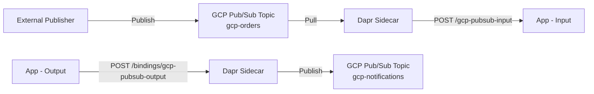

# How to Configure Dapr Binding with GCP Cloud Pub/Sub

Author: [OneUptime](https://www.github.com/OneUptime)

Tags: Dapr, Binding, GCP, Google Cloud, Pub/Sub

Description: Configure the Dapr GCP Pub/Sub binding as an input trigger and output sink to receive messages from and publish messages to Google Cloud Pub/Sub topics.

---

## Overview

The Dapr GCP Pub/Sub binding provides input (pull subscription trigger) and output (publish) operations for Google Cloud Pub/Sub. Unlike the pub/sub component, bindings are suited for triggering application logic from external events or sending messages to a single topic without a full subscriber model.



## Prerequisites

- Google Cloud project with Pub/Sub API enabled
- Service account with Pub/Sub Publisher and Subscriber roles
- Dapr CLI installed and initialized

## Create GCP Resources

```bash
PROJECT_ID="my-gcp-project"
INPUT_TOPIC="gcp-orders"
INPUT_SUBSCRIPTION="gcp-orders-dapr-sub"
OUTPUT_TOPIC="gcp-notifications"

gcloud config set project $PROJECT_ID

# Create topics
gcloud pubsub topics create $INPUT_TOPIC
gcloud pubsub topics create $OUTPUT_TOPIC

# Create pull subscription for input binding
gcloud pubsub subscriptions create $INPUT_SUBSCRIPTION \
  --topic=$INPUT_TOPIC \
  --ack-deadline=60 \
  --message-retention-duration=7d

# Create service account
gcloud iam service-accounts create dapr-binding-sa \
  --display-name="Dapr Binding Service Account"

# Grant roles
for ROLE in roles/pubsub.publisher roles/pubsub.subscriber; do
  gcloud projects add-iam-policy-binding $PROJECT_ID \
    --member="serviceAccount:dapr-binding-sa@${PROJECT_ID}.iam.gserviceaccount.com" \
    --role=$ROLE
done

# Create key
gcloud iam service-accounts keys create gcp-binding-key.json \
  --iam-account=dapr-binding-sa@${PROJECT_ID}.iam.gserviceaccount.com
```

## Kubernetes Secret

```bash
kubectl create secret generic gcp-binding-secret \
  --from-file=gcp-key.json=./gcp-binding-key.json \
  --namespace default
```

## Input Binding Component

```yaml
# binding-gcp-pubsub-input.yaml
apiVersion: dapr.io/v1alpha1
kind: Component
metadata:
  name: gcp-pubsub-input
  namespace: default
spec:
  type: bindings.gcp.pubsub
  version: v1
  metadata:
  - name: topic
    value: "gcp-orders"
  - name: subscription
    value: "gcp-orders-dapr-sub"
  - name: type
    value: "service_account"
  - name: projectId
    value: "my-gcp-project"
  - name: identityProjectId
    value: "my-gcp-project"
  - name: privateKeyId
    secretKeyRef:
      name: gcp-binding-secret
      key: private_key_id
  - name: privateKey
    secretKeyRef:
      name: gcp-binding-secret
      key: private_key
  - name: clientEmail
    value: "dapr-binding-sa@my-gcp-project.iam.gserviceaccount.com"
  - name: clientId
    secretKeyRef:
      name: gcp-binding-secret
      key: client_id
  - name: authUri
    value: "https://accounts.google.com/o/oauth2/auth"
  - name: tokenUri
    value: "https://oauth2.googleapis.com/token"
```

## Output Binding Component

```yaml
# binding-gcp-pubsub-output.yaml
apiVersion: dapr.io/v1alpha1
kind: Component
metadata:
  name: gcp-pubsub-output
  namespace: default
spec:
  type: bindings.gcp.pubsub
  version: v1
  metadata:
  - name: topic
    value: "gcp-notifications"
  - name: type
    value: "service_account"
  - name: projectId
    value: "my-gcp-project"
  - name: identityProjectId
    value: "my-gcp-project"
  - name: privateKey
    secretKeyRef:
      name: gcp-binding-secret
      key: private_key
  - name: clientEmail
    value: "dapr-binding-sa@my-gcp-project.iam.gserviceaccount.com"
  - name: authUri
    value: "https://accounts.google.com/o/oauth2/auth"
  - name: tokenUri
    value: "https://oauth2.googleapis.com/token"
```

## Application: Handling Input Binding

```python
# app.py
import json
from flask import Flask, request, jsonify
import requests

app = Flask(__name__)
DAPR_HTTP_PORT = 3500

@app.route('/gcp-pubsub-input', methods=['POST'])
def handle_gcp_message():
    """Triggered by Dapr when a message arrives on gcp-orders topic."""
    raw_data = request.data.decode('utf-8')
    headers = dict(request.headers)

    print(f"GCP Pub/Sub message received")
    print(f"Data: {raw_data}")
    print(f"Content-Type: {headers.get('Content-Type')}")

    try:
        data = json.loads(raw_data)
        order_id = data.get('orderId', 'unknown')
        print(f"Processing order: {order_id}")

        # Send notification via output binding
        send_notification(order_id, "Order received and processing")

        return jsonify({"status": "success"})
    except Exception as e:
        print(f"Error processing message: {e}")
        return jsonify({"status": "error"}), 500

def send_notification(order_id: str, message: str):
    url = f"http://localhost:{DAPR_HTTP_PORT}/v1.0/bindings/gcp-pubsub-output"
    payload = {
        "data": json.dumps({
            "orderId": order_id,
            "notification": message
        }),
        "operation": "create"
    }
    response = requests.post(url, json=payload)
    response.raise_for_status()
    print(f"Notification sent for order {order_id}")

if __name__ == '__main__':
    app.run(host='0.0.0.0', port=5001)
```

## Using the Output Binding Directly

```bash
# Publish a message to GCP Pub/Sub via Dapr output binding
curl -X POST http://localhost:3500/v1.0/bindings/gcp-pubsub-output \
  -H "Content-Type: application/json" \
  -d '{
    "data": "{\"orderId\": \"gcp-001\", \"event\": \"shipped\"}",
    "operation": "create"
  }'
```

## Running Locally

```bash
dapr run \
  --app-id gcp-pubsub-app \
  --app-port 5001 \
  --dapr-http-port 3500 \
  --components-path ~/.dapr/components \
  -- python app.py
```

## Testing: Publish to GCP Pub/Sub

```bash
# Publish a test message directly using gcloud
gcloud pubsub topics publish gcp-orders \
  --message='{"orderId": "test-001", "item": "widget"}' \
  --project=my-gcp-project
```

Dapr will pull the message from the subscription and POST it to `/gcp-pubsub-input`.

## Summary

The Dapr GCP Pub/Sub binding provides input triggering from pull subscriptions and output publishing to topics without the GCP client library. Use separate component instances for input and output, each pointing to their respective topic and subscription. The application handler endpoint name must match the component name. Use Workload Identity on GKE to avoid managing service account key files in production.
