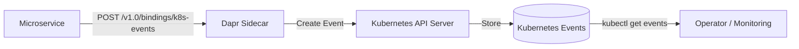

# How to Configure Dapr Binding with Kubernetes Events

Author: [OneUptime](https://www.github.com/OneUptime)

Tags: Dapr, Binding, Kubernetes, Events, Monitoring

Description: Configure the Dapr Kubernetes Events output binding to create Kubernetes events from microservices for auditing, debugging, and cluster-native operational logging.

---

## Overview

The Dapr Kubernetes Events binding is an output-only binding that creates Kubernetes Event objects in the cluster. This enables your microservices to emit cluster-native events visible via `kubectl get events`, useful for operational auditing, debugging, and GitOps pipelines.



## Prerequisites

- Dapr running on Kubernetes
- A service account with permission to create Kubernetes events
- Dapr CLI and kubectl configured

## RBAC: Grant Event Create Permission

The Dapr sidecar needs permission to create events in the namespace:

```yaml
# dapr-events-rbac.yaml
apiVersion: v1
kind: ServiceAccount
metadata:
  name: order-processor
  namespace: default
---
apiVersion: rbac.authorization.k8s.io/v1
kind: Role
metadata:
  name: dapr-events-creator
  namespace: default
rules:
- apiGroups: [""]
  resources: ["events"]
  verbs: ["create", "patch", "update"]
---
apiVersion: rbac.authorization.k8s.io/v1
kind: RoleBinding
metadata:
  name: dapr-events-creator-binding
  namespace: default
subjects:
- kind: ServiceAccount
  name: order-processor
  namespace: default
roleRef:
  kind: Role
  name: dapr-events-creator
  apiGroup: rbac.authorization.k8s.io
```

```bash
kubectl apply -f dapr-events-rbac.yaml
```

## Component Configuration

```yaml
# binding-k8s-events.yaml
apiVersion: dapr.io/v1alpha1
kind: Component
metadata:
  name: k8s-events
  namespace: default
spec:
  type: bindings.kubernetes
  version: v1
  metadata:
  - name: namespace
    value: "default"
```

Apply:

```bash
kubectl apply -f binding-k8s-events.yaml
```

## Creating a Kubernetes Event

```bash
curl -X POST http://localhost:3500/v1.0/bindings/k8s-events \
  -H "Content-Type: application/json" \
  -d '{
    "operation": "create",
    "data": {
      "involvedObject": {
        "kind": "Pod",
        "namespace": "default",
        "name": "order-processor-abc123",
        "apiVersion": "v1"
      },
      "reason": "OrderProcessed",
      "message": "Order ORD-001 was processed successfully",
      "type": "Normal",
      "source": {
        "component": "order-processor"
      }
    }
  }'
```

View the event:

```bash
kubectl get events -n default --sort-by='.lastTimestamp'
```

## Event Types

| Type | When to Use |
|------|------------|
| `Normal` | Informational events (order placed, shipped) |
| `Warning` | Degraded or unexpected state (retries, slow processing) |

## Python Application: Audit Event Emitter

```python
# audit_service.py
import json
import socket
import requests
from flask import Flask, request, jsonify
from datetime import datetime

app = Flask(__name__)
DAPR_HTTP_PORT = 3500
BINDING_NAME = "k8s-events"
POD_NAME = socket.gethostname()
NAMESPACE = "default"

def emit_k8s_event(reason: str, message: str, event_type: str = "Normal",
                   involved_kind: str = "Pod", component: str = "order-processor"):
    """Emit a Kubernetes Event via Dapr binding."""
    url = f"http://localhost:{DAPR_HTTP_PORT}/v1.0/bindings/{BINDING_NAME}"
    payload = {
        "operation": "create",
        "data": {
            "involvedObject": {
                "kind": involved_kind,
                "namespace": NAMESPACE,
                "name": POD_NAME,
                "apiVersion": "v1"
            },
            "reason": reason,
            "message": message,
            "type": event_type,
            "source": {
                "component": component
            }
        }
    }
    response = requests.post(url, json=payload)
    if response.status_code not in (200, 204):
        print(f"Failed to emit event: {response.text}")
    else:
        print(f"K8s event emitted: [{event_type}] {reason}: {message}")

@app.route('/process-order', methods=['POST'])
def process_order():
    data = request.get_json()
    order_id = data.get('orderId', 'unknown')

    try:
        # Simulate processing
        print(f"Processing order {order_id}")

        emit_k8s_event(
            reason="OrderProcessed",
            message=f"Order {order_id} successfully processed at {datetime.utcnow().isoformat()}",
            event_type="Normal"
        )
        return jsonify({"status": "processed", "orderId": order_id})

    except Exception as e:
        emit_k8s_event(
            reason="OrderFailed",
            message=f"Order {order_id} failed: {str(e)}",
            event_type="Warning"
        )
        return jsonify({"status": "error", "message": str(e)}), 500

@app.route('/deployment-event', methods=['POST'])
def deployment_event():
    """Emit an event tied to a Deployment object."""
    data = request.get_json()
    url = f"http://localhost:{DAPR_HTTP_PORT}/v1.0/bindings/{BINDING_NAME}"
    payload = {
        "operation": "create",
        "data": {
            "involvedObject": {
                "kind": "Deployment",
                "namespace": NAMESPACE,
                "name": "order-processor",
                "apiVersion": "apps/v1"
            },
            "reason": data.get('reason', 'ConfigUpdate'),
            "message": data.get('message', 'Configuration updated'),
            "type": data.get('type', 'Normal'),
            "source": {
                "component": "config-manager"
            }
        }
    }
    response = requests.post(url, json=payload)
    return jsonify({"emitted": response.status_code in (200, 204)})

if __name__ == '__main__':
    app.run(host='0.0.0.0', port=5001)
```

## Kubernetes Deployment with Service Account

```yaml
# deployment.yaml
apiVersion: apps/v1
kind: Deployment
metadata:
  name: order-processor
  namespace: default
spec:
  replicas: 1
  selector:
    matchLabels:
      app: order-processor
  template:
    metadata:
      labels:
        app: order-processor
      annotations:
        dapr.io/enabled: "true"
        dapr.io/app-id: "order-processor"
        dapr.io/app-port: "5001"
    spec:
      serviceAccountName: order-processor
      containers:
      - name: order-processor
        image: your-registry/order-processor:latest
        ports:
        - containerPort: 5001
```

## Viewing Events

```bash
# List all events in namespace
kubectl get events -n default

# Watch events in real time
kubectl get events -n default --watch

# Filter by reason
kubectl get events -n default \
  --field-selector reason=OrderProcessed

# Get events for a specific pod
kubectl describe pod order-processor-abc123 -n default | grep -A 20 Events:
```

## Summary

The Dapr Kubernetes Events binding creates native Kubernetes Event objects that appear in `kubectl get events` output. Configure the binding with the target namespace, grant the pod's service account permission to create events, and emit `Normal` or `Warning` type events from your application code. This provides a zero-configuration audit trail integrated directly into Kubernetes tooling without a separate logging pipeline.
