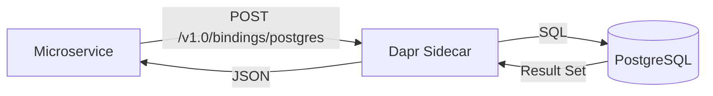

# How to Configure Dapr Binding with PostgreSQL

Author: [OneUptime](https://www.github.com/OneUptime)

Tags: Dapr, Binding, PostgreSQL, Database, SQL

Description: Configure the Dapr PostgreSQL output binding to run parameterized queries and exec statements from microservices without embedding a PostgreSQL driver or connection pool.

---

## Overview

The Dapr PostgreSQL binding is an output-only binding that supports `exec` (INSERT, UPDATE, DELETE) and `query` (SELECT) operations against PostgreSQL. It uses prepared statement-style parameterized queries to prevent SQL injection.



## Prerequisites

- PostgreSQL running locally or on Kubernetes
- Dapr CLI installed and initialized

## Deploy PostgreSQL

```bash
# Docker
docker run -d \
  --name postgres \
  -p 5432:5432 \
  -e POSTGRES_USER=dapr \
  -e POSTGRES_PASSWORD=daprpassword \
  -e POSTGRES_DB=ordersdb \
  postgres:16-alpine

# Create schema
docker exec -i postgres psql -U dapr -d ordersdb << 'SQL'
CREATE TABLE IF NOT EXISTS orders (
  id SERIAL PRIMARY KEY,
  order_id VARCHAR(50) UNIQUE NOT NULL,
  customer_id VARCHAR(50) NOT NULL,
  item VARCHAR(100) NOT NULL,
  quantity INTEGER NOT NULL DEFAULT 1,
  total NUMERIC(10,2) NOT NULL,
  status VARCHAR(20) NOT NULL DEFAULT 'pending',
  created_at TIMESTAMPTZ DEFAULT NOW(),
  updated_at TIMESTAMPTZ DEFAULT NOW()
);

CREATE INDEX idx_orders_customer_id ON orders(customer_id);
CREATE INDEX idx_orders_status ON orders(status);
SQL
```

## Kubernetes Deployment

```yaml
# postgres.yaml
apiVersion: apps/v1
kind: Deployment
metadata:
  name: postgres
  namespace: default
spec:
  replicas: 1
  selector:
    matchLabels:
      app: postgres
  template:
    metadata:
      labels:
        app: postgres
    spec:
      containers:
      - name: postgres
        image: postgres:16-alpine
        env:
        - name: POSTGRES_USER
          value: dapr
        - name: POSTGRES_PASSWORD
          valueFrom:
            secretKeyRef:
              name: postgres-secret
              key: password
        - name: POSTGRES_DB
          value: ordersdb
        ports:
        - containerPort: 5432
---
apiVersion: v1
kind: Service
metadata:
  name: postgres
  namespace: default
spec:
  selector:
    app: postgres
  ports:
  - port: 5432
    targetPort: 5432
```

```bash
kubectl create secret generic postgres-secret \
  --from-literal=password=daprpassword \
  --from-literal=url="host=postgres user=dapr password=daprpassword dbname=ordersdb port=5432 sslmode=disable" \
  --namespace default

kubectl apply -f postgres.yaml
```

## Component Configuration

```yaml
# binding-postgresql.yaml
apiVersion: dapr.io/v1alpha1
kind: Component
metadata:
  name: postgres
  namespace: default
spec:
  type: bindings.postgresql
  version: v1
  metadata:
  - name: url
    secretKeyRef:
      name: postgres-secret
      key: url
  - name: maxConns
    value: "10"
  - name: connectionMaxIdleTime
    value: "0"
```

Apply:

```bash
kubectl apply -f binding-postgresql.yaml
```

## Insert a Row (exec)

```bash
curl -X POST http://localhost:3500/v1.0/bindings/postgres \
  -H "Content-Type: application/json" \
  -d '{
    "operation": "exec",
    "data": {
      "sql": "INSERT INTO orders (order_id, customer_id, item, quantity, total) VALUES ($1, $2, $3, $4, $5)",
      "params": ["ORD-PG-001", "CUST-200", "keyboard", 2, 149.98]
    }
  }'
```

Response:

```json
{
  "rowsAffected": 1
}
```

## Query Rows (query)

```bash
curl -X POST http://localhost:3500/v1.0/bindings/postgres \
  -H "Content-Type: application/json" \
  -d '{
    "operation": "query",
    "data": {
      "sql": "SELECT order_id, item, quantity, total, status FROM orders WHERE customer_id = $1 ORDER BY created_at DESC LIMIT 10",
      "params": ["CUST-200"]
    }
  }'
```

Response:

```json
[
  {
    "order_id": "ORD-PG-001",
    "item": "keyboard",
    "quantity": 2,
    "total": "149.98",
    "status": "pending"
  }
]
```

## Update Status

```bash
curl -X POST http://localhost:3500/v1.0/bindings/postgres \
  -H "Content-Type: application/json" \
  -d '{
    "operation": "exec",
    "data": {
      "sql": "UPDATE orders SET status = $1, updated_at = NOW() WHERE order_id = $2",
      "params": ["shipped", "ORD-PG-001"]
    }
  }'
```

## Python Application: Order Service

```python
# order_service.py
import json
import requests
from flask import Flask, request, jsonify

app = Flask(__name__)
DAPR_HTTP_PORT = 3500
BINDING_NAME = "postgres"

def pg_exec(sql: str, params: list = None) -> dict:
    url = f"http://localhost:{DAPR_HTTP_PORT}/v1.0/bindings/{BINDING_NAME}"
    response = requests.post(url, json={
        "operation": "exec",
        "data": {"sql": sql, "params": params or []}
    })
    response.raise_for_status()
    return response.json()

def pg_query(sql: str, params: list = None) -> list:
    url = f"http://localhost:{DAPR_HTTP_PORT}/v1.0/bindings/{BINDING_NAME}"
    response = requests.post(url, json={
        "operation": "query",
        "data": {"sql": sql, "params": params or []}
    })
    response.raise_for_status()
    return response.json()

@app.route('/orders', methods=['POST'])
def create_order():
    data = request.get_json()
    pg_exec(
        "INSERT INTO orders (order_id, customer_id, item, quantity, total) VALUES ($1, $2, $3, $4, $5)",
        [data['orderId'], data['customerId'], data['item'], data['quantity'], data['total']]
    )
    return jsonify({"orderId": data['orderId'], "status": "created"}), 201

@app.route('/orders', methods=['GET'])
def list_orders():
    customer_id = request.args.get('customerId')
    status = request.args.get('status')

    if customer_id and status:
        rows = pg_query(
            "SELECT order_id, item, quantity, total, status, created_at FROM orders WHERE customer_id = $1 AND status = $2",
            [customer_id, status]
        )
    elif customer_id:
        rows = pg_query(
            "SELECT order_id, item, quantity, total, status, created_at FROM orders WHERE customer_id = $1 ORDER BY created_at DESC",
            [customer_id]
        )
    else:
        rows = pg_query(
            "SELECT order_id, item, quantity, total, status, created_at FROM orders ORDER BY created_at DESC LIMIT 50"
        )
    return jsonify(rows)

@app.route('/orders/<order_id>', methods=['DELETE'])
def delete_order(order_id):
    result = pg_exec(
        "DELETE FROM orders WHERE order_id = $1",
        [order_id]
    )
    return jsonify({"deleted": result.get('rowsAffected', 0)})

@app.route('/orders/stats', methods=['GET'])
def order_stats():
    rows = pg_query("""
        SELECT
          status,
          COUNT(*) as count,
          SUM(total) as revenue
        FROM orders
        GROUP BY status
        ORDER BY count DESC
    """)
    return jsonify(rows)

if __name__ == '__main__':
    app.run(host='0.0.0.0', port=5001)
```

## Running Locally

```bash
dapr run \
  --app-id order-service \
  --app-port 5001 \
  --dapr-http-port 3500 \
  --components-path ~/.dapr/components \
  -- python order_service.py
```

## Summary

The Dapr PostgreSQL binding supports `exec` for writes and `query` for reads using `$1`-style positional parameters. Configure the component with a PostgreSQL connection URL and optional connection pool settings. The query response returns rows as a JSON array of objects with column names as keys. Use this binding to perform database operations from microservices without managing PostgreSQL drivers or connection pools in application code.
