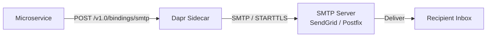

# How to Configure Dapr Binding with SMTP Email

Author: [OneUptime](https://www.github.com/OneUptime)

Tags: Dapr, Binding, SMTP, Email, Notification

Description: Configure the Dapr SMTP output binding to send emails from microservices using any SMTP server, with support for HTML content, attachments metadata, and TLS.

---

## Overview

The Dapr SMTP binding is an output-only binding that sends email through any SMTP server such as SendGrid, Mailgun, AWS SES SMTP, or a self-hosted Postfix. This removes SMTP client libraries from your application code.



## Prerequisites

- SMTP server credentials (host, port, username, password)
- Dapr CLI installed and initialized

## Kubernetes Secret

```bash
kubectl create secret generic smtp-secret \
  --from-literal=password=YOUR_SMTP_PASSWORD \
  --namespace default
```

## Component Configuration

```yaml
# binding-smtp.yaml
apiVersion: dapr.io/v1alpha1
kind: Component
metadata:
  name: smtp
  namespace: default
spec:
  type: bindings.smtp
  version: v1
  metadata:
  - name: host
    value: "smtp.sendgrid.net"
  - name: port
    value: "587"
  - name: user
    value: "apikey"
  - name: password
    secretKeyRef:
      name: smtp-secret
      key: password
  - name: skipTLSVerify
    value: "false"
  - name: emailFrom
    value: "noreply@example.com"
  - name: emailTo
    value: "admin@example.com"
  - name: emailCC
    value: ""
  - name: emailBCC
    value: ""
  - name: subject
    value: "Dapr Notification"
```

For Gmail SMTP:

```yaml
  metadata:
  - name: host
    value: "smtp.gmail.com"
  - name: port
    value: "587"
  - name: user
    value: "your-email@gmail.com"
  - name: password
    secretKeyRef:
      name: smtp-secret
      key: appPassword
```

Apply:

```bash
# Self-hosted
cp binding-smtp.yaml ~/.dapr/components/

# Kubernetes
kubectl apply -f binding-smtp.yaml
```

## Sending a Plain Text Email

```bash
curl -X POST http://localhost:3500/v1.0/bindings/smtp \
  -H "Content-Type: application/json" \
  -d '{
    "data": "Hello! Your order ORD-001 has been confirmed.",
    "operation": "create",
    "metadata": {
      "emailTo": "customer@example.com",
      "subject": "Order Confirmation - ORD-001"
    }
  }'
```

## Sending an HTML Email

```bash
curl -X POST http://localhost:3500/v1.0/bindings/smtp \
  -H "Content-Type: application/json" \
  -d '{
    "data": "<h1>Order Confirmed!</h1><p>Your order <strong>ORD-001</strong> has been received.</p><p>Estimated delivery: 3-5 business days.</p>",
    "operation": "create",
    "metadata": {
      "emailTo": "customer@example.com",
      "subject": "Order Confirmation - ORD-001",
      "contentType": "text/html"
    }
  }'
```

## Python Application: Email Notification Service

```python
# email_service.py
import json
import requests
from flask import Flask, request, jsonify
from datetime import datetime

app = Flask(__name__)
DAPR_HTTP_PORT = 3500
BINDING_NAME = "smtp"

def send_email(to: str, subject: str, body: str, html: bool = False):
    url = f"http://localhost:{DAPR_HTTP_PORT}/v1.0/bindings/{BINDING_NAME}"
    metadata = {
        "emailTo": to,
        "subject": subject,
    }
    if html:
        metadata["contentType"] = "text/html"

    payload = {
        "data": body,
        "operation": "create",
        "metadata": metadata
    }
    response = requests.post(url, json=payload)
    response.raise_for_status()
    print(f"Email sent to {to}: {subject}")

def send_order_confirmation(order_id: str, customer_email: str, items: list, total: float):
    items_html = "".join([
        f"<tr><td>{item['name']}</td><td>{item['qty']}</td><td>${item['price']:.2f}</td></tr>"
        for item in items
    ])

    body = f"""
    <html>
    <body>
      <h2>Order Confirmation</h2>
      <p>Thank you for your order!</p>
      <p><strong>Order ID:</strong> {order_id}</p>
      <p><strong>Date:</strong> {datetime.utcnow().strftime('%Y-%m-%d %H:%M UTC')}</p>
      <table border="1" cellpadding="5">
        <tr><th>Item</th><th>Qty</th><th>Price</th></tr>
        {items_html}
        <tr><td colspan="2"><strong>Total</strong></td><td><strong>${total:.2f}</strong></td></tr>
      </table>
      <p>Your order will be processed within 1 business day.</p>
    </body>
    </html>
    """
    send_email(customer_email, f"Order Confirmed - {order_id}", body, html=True)

def send_alert_email(subject: str, message: str):
    """Send operational alert to admin."""
    send_email("ops@example.com", f"[ALERT] {subject}", message)

@app.route('/order-confirmed', methods=['POST'])
def order_confirmed():
    data = request.get_json()
    send_order_confirmation(
        order_id=data['orderId'],
        customer_email=data['customerEmail'],
        items=data.get('items', []),
        total=data.get('total', 0.0)
    )
    return jsonify({"status": "email_sent"})

@app.route('/send-password-reset', methods=['POST'])
def send_password_reset():
    data = request.get_json()
    email = data['email']
    reset_link = data['resetLink']

    body = f"""
    <html><body>
      <h2>Password Reset Request</h2>
      <p>Click the link below to reset your password. This link expires in 1 hour.</p>
      <p><a href="{reset_link}">Reset Password</a></p>
      <p>If you did not request this, please ignore this email.</p>
    </body></html>
    """
    send_email(email, "Password Reset Request", body, html=True)
    return jsonify({"status": "reset_email_sent"})

if __name__ == '__main__':
    app.run(host='0.0.0.0', port=5001)
```

## Using Multiple Recipients

```bash
curl -X POST http://localhost:3500/v1.0/bindings/smtp \
  -H "Content-Type: application/json" \
  -d '{
    "data": "Monthly report is ready for review.",
    "operation": "create",
    "metadata": {
      "emailTo": "manager@example.com",
      "emailCC": "analyst@example.com,director@example.com",
      "subject": "March 2026 Monthly Report"
    }
  }'
```

## Testing with MailHog (Local SMTP)

For local development, use MailHog as a fake SMTP server:

```bash
docker run -d \
  --name mailhog \
  -p 1025:1025 \
  -p 8025:8025 \
  mailhog/mailhog
```

Update the component for local testing:

```yaml
  metadata:
  - name: host
    value: "localhost"
  - name: port
    value: "1025"
  - name: skipTLSVerify
    value: "true"
```

Visit `http://localhost:8025` to view captured emails.

## Summary

The Dapr SMTP binding sends emails through any SMTP server without requiring an SMTP client library in your application. Configure the host, port, and credentials in the component YAML, then POST to `/v1.0/bindings/smtp` with the email body and per-request metadata overrides for `emailTo`, `subject`, and `contentType`. Use MailHog for local development and configure TLS for production SMTP servers.
