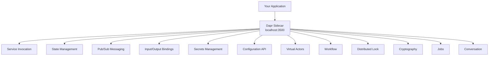
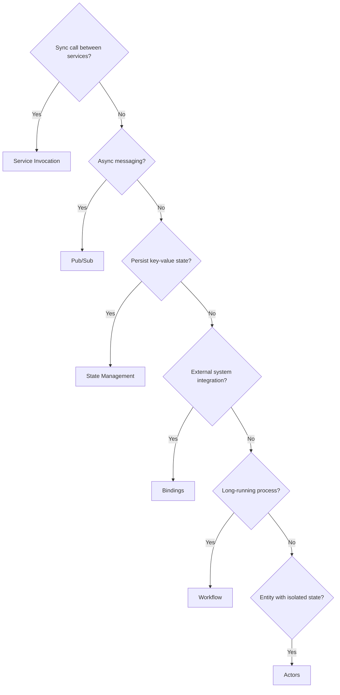

# How to Understand Dapr Building Blocks and When to Use Each

Author: [nawazdhandala](https://www.github.com/nawazdhandala)

Tags: Dapr, Building Block, Microservice, Architecture, Distributed System

Description: A comprehensive overview of all Dapr building blocks, what each one does, and guidance on when to use each in your microservices architecture.

---

## What Are Dapr Building Blocks?

Dapr building blocks are independent APIs exposed by the Dapr sidecar that solve common distributed systems problems. Each building block is optional - you use only the ones your application needs. They are accessed through HTTP or gRPC calls to `localhost:3500`.



## Service Invocation

**What it does:** Lets your service call another Dapr-enabled service by name, with automatic service discovery, mTLS encryption, retries, and distributed tracing.

**When to use it:** When you need synchronous request/response communication between microservices and want built-in security and observability without a service mesh.

```bash
# Call the /products endpoint on the catalog service
curl http://localhost:3500/v1.0/invoke/catalog/method/products
```

**Skip it when:** You are already using a service mesh like Istio that handles mTLS and retries.

## State Management

**What it does:** Provides key-value CRUD operations backed by pluggable stores (Redis, PostgreSQL, CosmosDB, DynamoDB, and many more). Supports transactions, concurrency control, and TTL.

**When to use it:** When your service needs to persist state without coupling to a specific database SDK.

```bash
curl -X POST http://localhost:3500/v1.0/state/statestore \
  -H "Content-Type: application/json" \
  -d '[{"key": "session-123", "value": {"userId": "u1"}}]'
```

**Skip it when:** You have a dedicated data layer with complex relational queries that need full SQL.

## Publish/Subscribe Messaging

**What it does:** Decouples services through asynchronous message passing. Publishers send to a topic; subscribers receive from a topic. Supports Kafka, Redis, Azure Service Bus, AWS SNS/SQS, and more.

**When to use it:** When you want event-driven communication, fan-out to multiple consumers, or reliable async processing.

```bash
curl -X POST http://localhost:3500/v1.0/publish/pubsub/orders \
  -H "Content-Type: application/json" \
  -d '{"orderId": "123", "status": "placed"}'
```

**Skip it when:** You need strict ordering guarantees at very high throughput that your chosen broker cannot provide.

## Bindings

**What it does:** Connects your service to external systems (AWS S3, Kafka, SMTP, cron triggers, HTTP endpoints) without writing integration code. Input bindings trigger your app; output bindings let your app write to external systems.

**When to use it:** When you need to integrate with third-party systems or trigger workflows on a schedule.

```yaml
apiVersion: dapr.io/v1alpha1
kind: Component
metadata:
  name: cron-trigger
spec:
  type: bindings.cron
  version: v1
  metadata:
  - name: schedule
    value: "@every 30s"
```

**Skip it when:** The external system has a mature SDK and you want fine-grained control over the integration.

## Secrets Management

**What it does:** Retrieves secrets from external stores (Kubernetes secrets, HashiCorp Vault, AWS Secrets Manager, Azure Key Vault) through a unified API. Secrets can also be referenced inside component YAML files.

**When to use it:** Always. Avoid hard-coding credentials in your application or component files.

```bash
curl http://localhost:3500/v1.0/secrets/vault/db-password
```

## Configuration API

**What it does:** Reads dynamic configuration values from a store and subscribes to changes at runtime. Backed by Redis or other configuration providers.

**When to use it:** When you need feature flags, runtime tuning parameters, or configuration that changes without a redeployment.

```bash
curl "http://localhost:3500/v1.0/configuration/configstore?key=feature-flag-a"
```

## Virtual Actors

**What it does:** Implements the actor pattern. Each actor is a single-threaded object with its own state. Dapr manages placement, activation, and garbage collection of actor instances.

**When to use it:** When you model entities (users, devices, orders) that require isolated, serialized state mutations - especially at large scale.

**Skip it when:** Your concurrency requirements are simple and a stateless service plus a database is sufficient.

## Workflow

**What it does:** Orchestrates long-running, stateful workflows using durable execution. Supports parallel fan-out, compensation (saga), and human-approval steps.

**When to use it:** When you have multi-step business processes that can span minutes, hours, or days and must survive process restarts.

## Distributed Lock

**What it does:** Provides mutual exclusion across distributed services using a named lock resource. Backed by Redis or other lock providers.

**When to use it:** When multiple service instances compete to process a resource (e.g., cron jobs running on multiple replicas).

```bash
curl -X POST http://localhost:3500/v1.0-alpha1/lock/lockstore \
  -H "Content-Type: application/json" \
  -d '{"resourceId": "invoice-42", "lockOwner": "instance-1", "expiryInSeconds": 60}'
```

## Cryptography

**What it does:** Performs encrypt and decrypt operations on data using keys stored in a secrets backend. Prevents your application from directly handling key material.

**When to use it:** When you need to encrypt sensitive data at the application layer without managing key storage yourself.

## Jobs

**What it does:** Schedules future or recurring jobs using a durable scheduler. Unlike cron bindings, jobs survive sidecar restarts.

**When to use it:** When you need reliable scheduled tasks that must not be missed even if the service restarts.

## Conversation API

**What it does:** Provides a unified interface to large language models (OpenAI, Anthropic, Hugging Face) with built-in PII scrubbing and prompt caching.

**When to use it:** When you want to integrate LLM calls into your service without coupling to a specific provider SDK.

## Choosing the Right Building Blocks



## Summary

Dapr building blocks are opt-in APIs that solve specific distributed systems problems. Service invocation handles synchronous calls with mTLS; pub/sub handles async messaging; state management provides portable persistence; bindings connect to external systems; secrets management centralizes credential access; and actors, workflow, distributed locks, cryptography, jobs, and the conversation API address advanced patterns. Choose the building blocks that match your application's needs and leave the rest unused.
