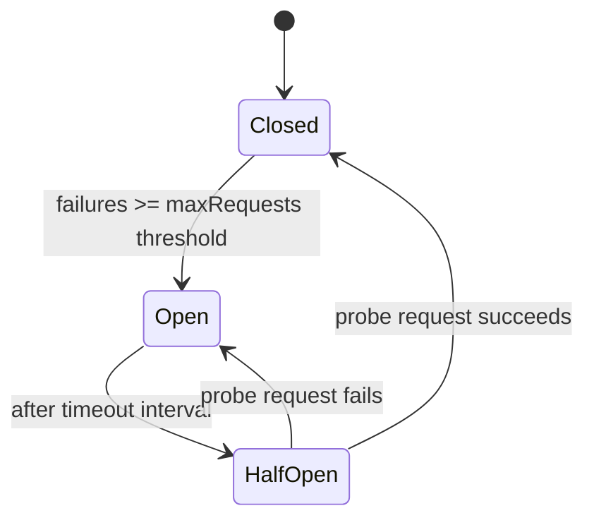

# How to Configure Dapr Circuit Breaker with Resiliency CRD

Author: [nawazdhandala](https://www.github.com/nawazdhandala)

Tags: Dapr, Circuit Breaker, Resiliency, Microservice, Fault Tolerance

Description: Configure circuit breakers for Dapr service calls using the Resiliency CRD to prevent cascading failures and allow failing services to recover.

---

## Overview

A circuit breaker monitors the failure rate of calls to a service and temporarily stops sending requests when the failure threshold is exceeded. This prevents cascading failures across microservices. Dapr's Resiliency CRD supports circuit breakers natively without any SDK changes.

## Circuit Breaker State Machine



| State | Behaviour |
|---|---|
| Closed | All requests pass through; failure counter increments on error |
| Open | Requests are immediately rejected with an error; no calls to service |
| Half-Open | One probe request is sent; success closes, failure re-opens |

## Basic Circuit Breaker Configuration

```yaml
# components/resiliency.yaml
apiVersion: dapr.io/v1alpha1
kind: Resiliency
metadata:
  name: order-resiliency
  namespace: default
spec:
  policies:
    circuitBreakers:
      orderServiceCB:
        maxRequests: 1          # requests allowed in half-open state
        interval: 10s           # counting window for failures
        timeout: 30s            # how long to stay open before trying half-open
        trip: consecutiveFailures >= 5

  targets:
    apps:
      order-service:
        circuitBreaker: orderServiceCB
```

## Trip Expressions

The `trip` field uses a CEL (Common Expression Language) expression:

```yaml
# Trip after 5 consecutive failures
trip: consecutiveFailures >= 5

# Trip when error rate exceeds 50% in the counting window
trip: requests > 10 && (failures / requests) > 0.5

# Trip after any failure
trip: consecutiveFailures >= 1
```

## Combined Retry and Circuit Breaker

Circuit breakers and retries work together. The retry policy runs within a closed circuit:

```yaml
apiVersion: dapr.io/v1alpha1
kind: Resiliency
metadata:
  name: payment-resiliency
  namespace: default
spec:
  policies:
    retries:
      paymentRetry:
        policy: exponential
        initialInterval: 200ms
        maxInterval: 30s
        maxRetries: 3
    circuitBreakers:
      paymentCB:
        maxRequests: 1
        interval: 30s
        timeout: 60s
        trip: consecutiveFailures >= 5

  targets:
    apps:
      payment-service:
        retry: paymentRetry
        circuitBreaker: paymentCB
```

## Apply Circuit Breaker to State Store and Pub/Sub

```yaml
spec:
  policies:
    circuitBreakers:
      stateCB:
        maxRequests: 1
        interval: 20s
        timeout: 45s
        trip: consecutiveFailures >= 3
      pubsubCB:
        maxRequests: 2
        interval: 15s
        timeout: 30s
        trip: consecutiveFailures >= 5

  targets:
    components:
      statestore:
        outbound:
          circuitBreaker: stateCB
      pubsub:
        outbound:
          circuitBreaker: pubsubCB
```

## Scoping Resiliency to Specific Apps

Namespace the policy to only apply when a specific caller app makes calls:

```yaml
apiVersion: dapr.io/v1alpha1
kind: Resiliency
metadata:
  name: frontend-resiliency
  namespace: default
  annotations:
    dapr.io/app-id: "frontend-service"  # applies only when called from frontend-service
spec:
  policies:
    circuitBreakers:
      backendCB:
        maxRequests: 1
        interval: 10s
        timeout: 30s
        trip: consecutiveFailures >= 3
  targets:
    apps:
      backend-service:
        circuitBreaker: backendCB
```

## Full Example with Timeout

```yaml
apiVersion: dapr.io/v1alpha1
kind: Resiliency
metadata:
  name: full-resiliency
  namespace: production
spec:
  policies:
    timeouts:
      defaultTimeout: 5s
    retries:
      defaultRetry:
        policy: exponential
        initialInterval: 100ms
        maxInterval: 20s
        maxRetries: 4
    circuitBreakers:
      defaultCB:
        maxRequests: 1
        interval: 20s
        timeout: 60s
        trip: consecutiveFailures >= 5

  targets:
    apps:
      order-service:
        timeout: defaultTimeout
        retry: defaultRetry
        circuitBreaker: defaultCB
      inventory-service:
        timeout: defaultTimeout
        retry: defaultRetry
        circuitBreaker: defaultCB
```

## Deploy to Kubernetes

```bash
kubectl apply -f resiliency.yaml

# Verify
kubectl get resiliency -n production
kubectl describe resiliency full-resiliency -n production
```

## Handle Circuit Breaker Errors in Code

When the circuit is open, Dapr returns an error. Handle it gracefully:

```go
// Go example
resp, err := client.InvokeMethodWithContent(ctx, "order-service", "createOrder", "post", content)
if err != nil {
    if strings.Contains(err.Error(), "circuit breaker is open") {
        // Fall back to degraded mode or queue the request
        log.Println("Circuit is open, using fallback")
        return handleFallback(payload)
    }
    return err
}
```

```python
# Python example
from dapr.clients import DaprClient
from grpc import RpcError, StatusCode

async with DaprClient() as client:
    try:
        resp = await client.invoke_method(
            app_id="order-service",
            method_name="createOrder",
            http_verb="POST",
            data=payload,
        )
    except RpcError as e:
        if e.code() == StatusCode.UNAVAILABLE:
            # Circuit is open or service is down
            return handle_fallback(payload)
        raise
```

## Self-Hosted Mode

```bash
# Place resiliency.yaml in the components directory
dapr run \
  --app-id frontend-service \
  --components-path ./components \
  -- go run main.go
```

## Summary

Dapr circuit breakers are declared in the Resiliency CRD under `spec.policies.circuitBreakers`. They transition through Closed, Open, and Half-Open states based on a CEL `trip` expression. Circuit breakers can be applied to service-to-service calls and to component outbound calls (state, pub/sub). Combined with retry and timeout policies, they form a comprehensive resilience strategy that requires no code changes to application logic.
