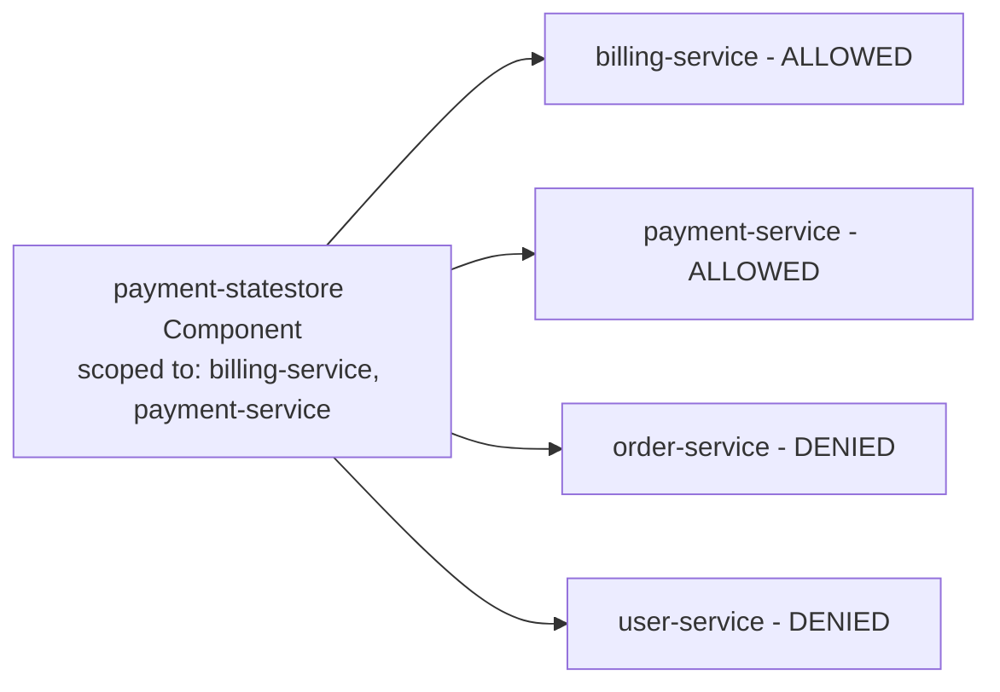
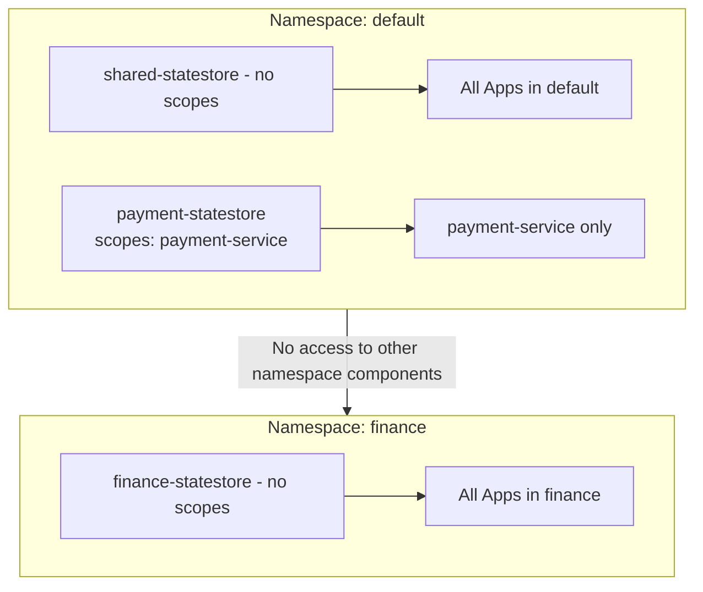

# How to Use Dapr Component Scoping per Application

Author: [nawazdhandala](https://www.github.com/nawazdhandala)

Tags: Dapr, Component, Scoping, Security, Configuration

Description: Learn how to use Dapr component scoping to restrict which applications can access specific Dapr components, enabling multi-tenant component isolation in shared clusters.

---

## Introduction

By default, a Dapr component deployed in a namespace is accessible to all applications in that namespace. Component scoping allows you to restrict which applications (by app ID) can access a given component. This is essential for:

- Multi-tenant environments where different teams share a namespace
- Security isolation (e.g., only the billing service can access the payment state store)
- Compliance requirements to limit access to sensitive data stores

## How Component Scoping Works



Scoping is configured with `scopes` in the component YAML. When `scopes` is set, only listed app IDs can use the component.

## Configuring Component Scopes

### Basic Scoping

```yaml
apiVersion: dapr.io/v1alpha1
kind: Component
metadata:
  name: payment-statestore
  namespace: default
spec:
  type: state.redis
  version: v1
  metadata:
  - name: redisHost
    value: "redis-master:6379"
  - name: actorStateStore
    value: "false"
scopes:
- billing-service
- payment-service
```

Only `billing-service` and `payment-service` can use `payment-statestore`. Any other app receives an error when trying to access this component.

### Scoping a Pub/Sub Component

```yaml
apiVersion: dapr.io/v1alpha1
kind: Component
metadata:
  name: orders-pubsub
  namespace: default
spec:
  type: pubsub.redis
  version: v1
  metadata:
  - name: redisHost
    value: "redis-master:6379"
scopes:
- order-service
- fulfillment-service
- notification-service
```

### Scoping a Secret Store

```yaml
apiVersion: dapr.io/v1alpha1
kind: Component
metadata:
  name: payment-secrets
  namespace: default
spec:
  type: secretstores.azure.keyvault
  version: v1
  metadata:
  - name: vaultName
    value: "payment-keyvault"
scopes:
- payment-service
- billing-service
```

## No Scopes = Open to All Apps in Namespace

A component without `scopes` is accessible to all applications in the namespace:

```yaml
# No scopes - accessible to all apps in 'default' namespace
apiVersion: dapr.io/v1alpha1
kind: Component
metadata:
  name: shared-statestore
  namespace: default
spec:
  type: state.redis
  version: v1
  metadata:
  - name: redisHost
    value: "redis-master:6379"
```

## Multiple Components, Different Scopes

In a complex system, you can have multiple state stores with different access controls:

```yaml
# Shared state store - all apps
apiVersion: dapr.io/v1alpha1
kind: Component
metadata:
  name: shared-statestore
  namespace: default
spec:
  type: state.redis
  version: v1
  metadata:
  - name: redisHost
    value: "redis-shared:6379"
---
# Payment-specific state store - restricted
apiVersion: dapr.io/v1alpha1
kind: Component
metadata:
  name: payment-statestore
  namespace: default
spec:
  type: state.redis
  version: v1
  metadata:
  - name: redisHost
    value: "redis-payment:6379"
scopes:
- payment-service
---
# User PII state store - restricted
apiVersion: dapr.io/v1alpha1
kind: Component
metadata:
  name: user-pii-statestore
  namespace: default
spec:
  type: state.postgresql
  version: v1
  metadata:
  - name: connectionString
    secretKeyRef:
      name: pii-db-secret
      key: connectionString
scopes:
- user-service
- admin-service
```

## Namespace-Based Isolation

Each namespace in Kubernetes has its own Dapr components. Use different namespaces for stronger isolation:

```bash
# Create separate namespaces for teams
kubectl create namespace team-a
kubectl create namespace team-b

# Label for Dapr sidecar injection
kubectl label namespace team-a dapr.io/enabled=true
kubectl label namespace team-b dapr.io/enabled=true

# Deploy components in the appropriate namespace
kubectl apply -f team-a-statestore.yaml -n team-a
kubectl apply -f team-b-statestore.yaml -n team-b
```

Components in `team-a` namespace are not visible to apps in `team-b` namespace at all.

## Combining Namespace and Scope Isolation

For maximum isolation, combine namespace-level and scope-level restrictions:



## Verifying Scoping Works

Test that a non-scoped app cannot access a restricted component:

```bash
# From an app that is NOT in the scope
curl http://localhost:3500/v1.0/state/payment-statestore/somekey
```

Expected response:

```json
{
  "errorCode": "ERR_COMPONENT_NOT_FOUND",
  "message": "component payment-statestore not found"
}
```

Check Dapr operator logs for scope validation:

```bash
kubectl logs -n dapr-system deployment/dapr-operator | grep scope
```

## Pub/Sub Topic-Level Scoping

Beyond component scoping, you can also scope which topics an app can publish or subscribe to:

```yaml
apiVersion: dapr.io/v1alpha1
kind: Component
metadata:
  name: orders-pubsub
  namespace: default
spec:
  type: pubsub.redis
  version: v1
  metadata:
  - name: redisHost
    value: "redis-master:6379"
  - name: publishingScopes
    value: "order-service=orders,promotions;notification-service=notifications"
  - name: subscriptionScopes
    value: "fulfillment-service=orders;notification-service=orders,notifications"
  - name: allowedTopics
    value: "orders,notifications,promotions"
```

This restricts:
- `order-service` can only publish to `orders` and `promotions` topics
- `fulfillment-service` can only subscribe to `orders`
- No app can use topics not in `allowedTopics`

## Summary

Dapr component scoping provides fine-grained access control over which applications can use which components. Add `scopes` to your component YAML with a list of app IDs to restrict access. Use namespace isolation for team-level boundaries and scope-level restrictions for service-level boundaries within a namespace. For pub/sub components, use `publishingScopes` and `subscriptionScopes` metadata to control topic-level access. This multi-layered approach enables secure multi-tenant Dapr deployments in shared Kubernetes clusters.
