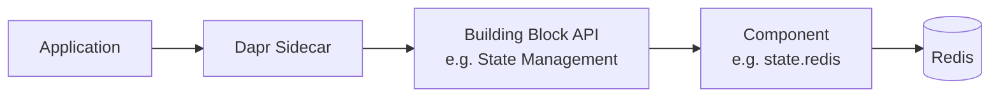
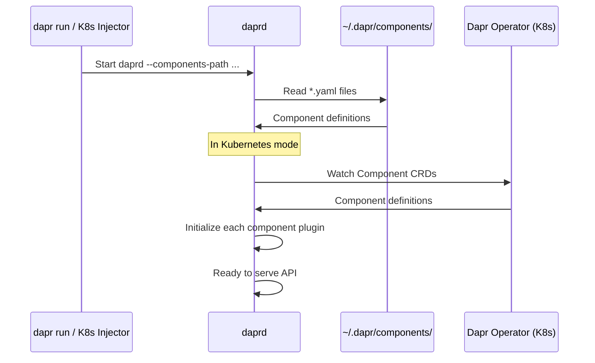

# How to Understand Dapr Components and How They Work

Author: [nawazdhandala](https://www.github.com/nawazdhandala)

Tags: Dapr, Component, Configuration, Microservice, Architecture

Description: Learn what Dapr components are, how they are defined in YAML, how the sidecar loads them, and how to scope them to specific applications.

---

## What Are Dapr Components?

Dapr components are the pluggable infrastructure backends that power Dapr building blocks. A building block is the API (e.g., state management); a component is the concrete implementation (e.g., Redis, PostgreSQL, CosmosDB). You declare components in YAML files, and the Dapr sidecar loads them at startup.



## Component YAML Structure

Every Dapr component follows the same YAML schema:

```yaml
apiVersion: dapr.io/v1alpha1
kind: Component
metadata:
  name: <component-name>        # referenced in API calls
  namespace: default            # Kubernetes namespace (optional in self-hosted)
spec:
  type: <type>.<subtype>        # e.g. state.redis, pubsub.kafka
  version: v1
  metadata:
  - name: <key>
    value: <value>
  - name: <secret-key>
    secretKeyRef:
      name: <secret-name>
      key: <secret-key>
auth:
  secretStore: <secret-store-name>  # optional: where to resolve secrets
scopes:
- app-id-1
- app-id-2
```

## Component Types

Dapr supports multiple component categories:

| Category | Example Types |
|----------|--------------|
| State store | `state.redis`, `state.postgresql`, `state.azure.cosmosdb` |
| Pub/Sub | `pubsub.redis`, `pubsub.kafka`, `pubsub.azure.servicebus` |
| Bindings | `bindings.cron`, `bindings.aws.s3`, `bindings.http` |
| Secret store | `secretstores.kubernetes`, `secretstores.hashicorp.vault` |
| Configuration | `configuration.redis` |
| Lock | `lock.redis` |
| Cryptography | `crypto.dapr.jwks` |
| Name resolution | `nameresolution.mdns`, `nameresolution.consul` |

## How the Sidecar Loads Components

On startup, `daprd` reads all component YAML files from the configured components directory and registers them in memory.



In self-hosted mode, components are YAML files in `~/.dapr/components/` or a path specified with `--resources-path`.

In Kubernetes mode, components are Custom Resources (CRDs) applied with `kubectl`:

```bash
kubectl apply -f statestore.yaml -n default
```

## A Real State Store Component

```yaml
apiVersion: dapr.io/v1alpha1
kind: Component
metadata:
  name: statestore
  namespace: production
spec:
  type: state.redis
  version: v1
  metadata:
  - name: redisHost
    value: redis-master.cache.svc.cluster.local:6379
  - name: redisPassword
    secretKeyRef:
      name: redis-secret
      key: password
  - name: enableTLS
    value: "true"
  - name: maxRetries
    value: "3"
auth:
  secretStore: kubernetes
```

## A Real Pub/Sub Component

```yaml
apiVersion: dapr.io/v1alpha1
kind: Component
metadata:
  name: orders-pubsub
  namespace: production
spec:
  type: pubsub.kafka
  version: v1
  metadata:
  - name: brokers
    value: kafka-broker-1:9092,kafka-broker-2:9092
  - name: consumerGroup
    value: order-consumers
  - name: authType
    value: oidc
  - name: oidcTokenEndpoint
    value: https://auth.example.com/oauth/token
  - name: oidcClientID
    secretKeyRef:
      name: kafka-oidc
      key: client-id
  - name: oidcClientSecret
    secretKeyRef:
      name: kafka-oidc
      key: client-secret
```

## Component Scoping

By default, a component is available to all applications in a namespace. You can restrict a component to specific app IDs using the `scopes` field:

```yaml
apiVersion: dapr.io/v1alpha1
kind: Component
metadata:
  name: sensitive-statestore
spec:
  type: state.postgresql
  version: v1
  metadata:
  - name: connectionString
    secretKeyRef:
      name: pg-secret
      key: conn
scopes:
- payments-service
- audit-service
```

Only `payments-service` and `audit-service` can use this component.

## Component Versioning

The `version` field in the spec refers to the component implementation version, not the Dapr version. Most components use `v1`. When a new major version of a component is released, you can pin to `v1` or upgrade to `v2`:

```yaml
spec:
  type: state.redis
  version: v1
```

## Referencing Secrets Inside Components

Instead of putting credentials in plain text, reference a secret store:

```yaml
spec:
  type: state.postgresql
  version: v1
  metadata:
  - name: connectionString
    secretKeyRef:
      name: pg-credentials
      key: connection-string
auth:
  secretStore: vault
```

The sidecar resolves the secret from the named secret store before initializing the component.

## Hot-Reloading Components

In Kubernetes, Dapr can hot-reload components when their CRDs change. Enable this in the Dapr configuration:

```yaml
apiVersion: dapr.io/v1alpha1
kind: Configuration
metadata:
  name: appconfig
spec:
  features:
  - name: HotReload
    enabled: true
```

## Validating a Component

```bash
# Check that a component loaded successfully
dapr components --app-id myapp
```

On Kubernetes:

```bash
kubectl get components -n default
kubectl describe component statestore -n default
```

## Summary

Dapr components are YAML declarations that connect building block APIs to real infrastructure backends. They are loaded at sidecar startup from files (self-hosted) or Kubernetes CRDs (Kubernetes mode), support secret references to avoid plain-text credentials, and can be scoped to specific application IDs. The component type field determines which plugin the sidecar loads, making it straightforward to swap backends without changing application code.
