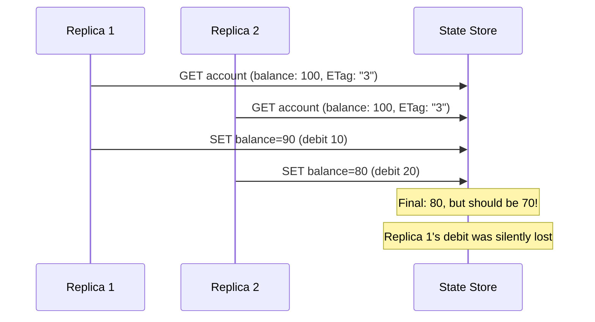

# How to Handle Concurrent State Updates in Dapr

Author: [OneUptime](https://oneuptime.com)

Tags: Dapr, State Management, Concurrency, ETag, Microservice

Description: Learn how to handle concurrent state updates in Dapr using optimistic and pessimistic concurrency strategies, retry patterns, and conflict resolution techniques.

---

## Introduction

Concurrent state updates happen when multiple service replicas or multiple requests try to modify the same key simultaneously. Without proper handling, the last writer silently wins and earlier updates are lost. Dapr provides ETags for optimistic concurrency and integrates with Distributed Lock for pessimistic control. This guide covers both approaches and when to use each.

## The Lost Update Problem



Without concurrency control, the final value is `80` instead of `70` because Replica 1's update was overwritten.

## Solution 1: Optimistic Concurrency with ETags

```python
# concurrent_state.py
import json
import time
from dapr.clients import DaprClient
from dapr.clients.grpc._state import StateOptions, Concurrency, Consistency

STORE = "statestore"

class ConcurrentStateManager:
    def update_with_retry(self, key: str, transform_fn, max_retries: int = 10) -> dict:
        """
        Read-modify-write with ETag-based optimistic concurrency.
        transform_fn takes the current value and returns the new value.
        """
        last_error = None
        for attempt in range(max_retries):
            with DaprClient() as client:
                # Read current state with ETag
                result = client.get_state(
                    STORE, key,
                    state_options=StateOptions(consistency=Consistency.strong)
                )
                current = json.loads(result.data) if result.data else {}

                # Apply transformation
                new_value = transform_fn(current)

                try:
                    client.save_state(
                        store_name=STORE,
                        key=key,
                        value=json.dumps(new_value),
                        etag=result.etag,
                        options=StateOptions(
                            concurrency=Concurrency.first_write,
                            consistency=Consistency.strong
                        )
                    )
                    return new_value
                except Exception as e:
                    last_error = e
                    if "etag" in str(e).lower() or "409" in str(e):
                        backoff = min(0.1 * (2 ** attempt), 2.0)
                        time.sleep(backoff)
                        continue
                    raise

        raise Exception(f"Failed after {max_retries} retries: {last_error}")
```

## Applying the Pattern for Account Operations

```python
manager = ConcurrentStateManager()

def debit_account(account_id: str, amount: float) -> dict:
    def apply_debit(current: dict) -> dict:
        balance = current.get("balance", 0)
        if balance < amount:
            raise ValueError(f"Insufficient balance: {balance} < {amount}")
        return {**current, "balance": balance - amount}

    return manager.update_with_retry(f"account:{account_id}", apply_debit)


def credit_account(account_id: str, amount: float) -> dict:
    def apply_credit(current: dict) -> dict:
        return {**current, "balance": current.get("balance", 0) + amount}

    return manager.update_with_retry(f"account:{account_id}", apply_credit)
```

## Solution 2: Pessimistic Locking with Dapr Distributed Lock

For operations where retries are expensive or unacceptable, use Dapr Distributed Lock to hold an exclusive lock during the read-modify-write cycle:

```python
import contextlib
from dapr.clients import DaprClient

LOCK_STORE = "redislock"
LOCK_TTL = 30  # seconds

@contextlib.contextmanager
def distributed_lock(resource_id: str):
    lock_owner = f"owner-{time.time()}"
    with DaprClient() as client:
        resp = client.try_lock(LOCK_STORE, resource_id, lock_owner, LOCK_TTL)
        if not resp.success:
            raise Exception(f"Could not acquire lock on {resource_id}")
        try:
            yield
        finally:
            client.unlock(LOCK_STORE, resource_id, lock_owner)


def transfer_funds(from_id: str, to_id: str, amount: float):
    # Lock both accounts (sort to avoid deadlock)
    accounts = sorted([from_id, to_id])
    with distributed_lock(accounts[0]), distributed_lock(accounts[1]):
        with DaprClient() as client:
            from_result = client.get_state(STORE, f"account:{from_id}")
            to_result = client.get_state(STORE, f"account:{to_id}")

            from_acct = json.loads(from_result.data)
            to_acct = json.loads(to_result.data)

            if from_acct["balance"] < amount:
                raise ValueError("Insufficient funds")

            from_acct["balance"] -= amount
            to_acct["balance"] += amount

            client.execute_state_transaction(
                store_name=STORE,
                operations=[
                    {"operation": "upsert", "request": {
                        "key": f"account:{from_id}",
                        "value": json.dumps(from_acct)
                    }},
                    {"operation": "upsert", "request": {
                        "key": f"account:{to_id}",
                        "value": json.dumps(to_acct)
                    }}
                ]
            )
```

## Conflict Resolution Strategies

| Strategy | When to Use | Dapr Support |
|----------|-------------|-------------|
| Last-write-wins | Non-critical, high-throughput | Default (no ETag) |
| First-write-wins (OCC) | Financial, inventory | ETag + `first-write` |
| Pessimistic locking | Complex multi-key operations | Distributed Lock |
| Merge conflicts | CRDT-style data (sets, counters) | Application logic |

## Custom Conflict Resolution (Merge Strategy)

For collaborative data (like shared documents or sets), merge rather than reject:

```python
def add_to_set(key: str, new_item: str, max_retries: int = 5) -> list:
    """Add to a set, merging concurrent additions rather than conflicting."""
    for attempt in range(max_retries):
        with DaprClient() as client:
            result = client.get_state(STORE, key)
            items = set(json.loads(result.data) if result.data else [])
            items.add(new_item)
            sorted_items = sorted(items)

            try:
                client.save_state(
                    STORE, key, json.dumps(sorted_items),
                    etag=result.etag,
                    options=StateOptions(concurrency=Concurrency.first_write)
                )
                return sorted_items
            except Exception as e:
                if "etag" in str(e).lower() and attempt < max_retries - 1:
                    time.sleep(0.05)
                    continue
                raise
```

## Testing Concurrent Updates

```python
import threading

def test_concurrent_debits():
    # Initialize account with balance 1000
    with DaprClient() as client:
        client.save_state(STORE, "account:test", json.dumps({"balance": 1000}))

    errors = []
    threads = []

    def do_debit():
        try:
            debit_account("test", 10)
        except Exception as e:
            errors.append(str(e))

    # 50 concurrent debits of 10 each
    for _ in range(50):
        t = threading.Thread(target=do_debit)
        threads.append(t)
        t.start()

    for t in threads:
        t.join()

    with DaprClient() as client:
        result = client.get_state(STORE, "account:test")
        final = json.loads(result.data)
        print(f"Final balance: {final['balance']}")
        print(f"Errors: {len(errors)}")
        # Expected: 500 (1000 - 50*10), 0 errors
```

## Summary

Dapr handles concurrent state updates through two complementary mechanisms. Optimistic concurrency (ETag + `first-write` mode) detects conflicts at write time and uses a retry loop to resolve them, ideal for most microservice scenarios. Pessimistic locking with Dapr Distributed Lock holds an exclusive lock during the entire read-modify-write cycle, suitable for complex multi-key operations. Choose based on conflict frequency: low conflict favours optimistic (lower overhead), high conflict or complex operations favour pessimistic (avoids wasted retries). Always test concurrent scenarios explicitly to verify your chosen strategy handles the expected load.
