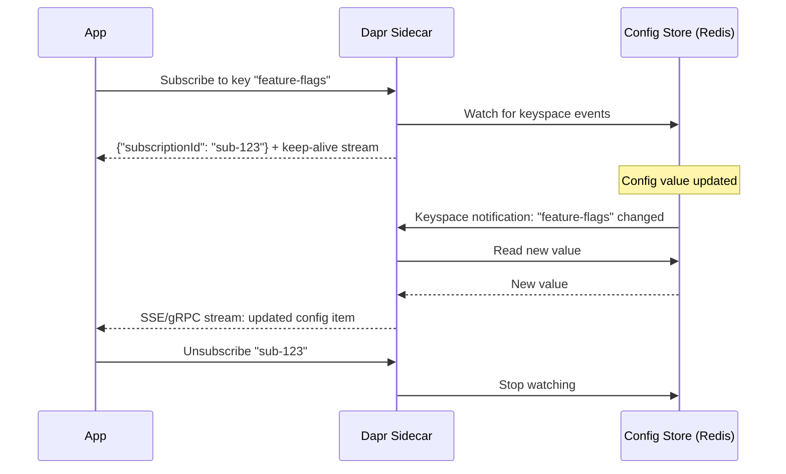

# How to Use Dapr Configuration API Subscriptions

Author: [nawazdhandala](https://www.github.com/nawazdhandala)

Tags: Dapr, Configuration, Subscription, Real-Time, Dynamic Config

Description: Learn how to subscribe to Dapr Configuration API updates using HTTP SSE and gRPC streaming to receive real-time config changes in your application.

---

## Introduction

Dapr Configuration API subscriptions allow your application to receive real-time notifications when configuration values change in the backing store. Instead of polling, your app opens a streaming connection to the Dapr sidecar, which pushes updates as soon as changes are detected in the configuration store (via Redis keyspace notifications or other store-specific mechanisms).

## How Subscriptions Work



## Prerequisites

- Dapr v1.7 or later
- Configuration store with subscriptions enabled (Redis with keyspace notifications)
- See the Redis configuration setup guide for Redis keyspace notification setup

## HTTP Subscription (Server-Sent Events)

### Subscribe

Open a streaming SSE connection:

```bash
curl -N "http://localhost:3500/v1.0-alpha1/configuration/configstore/subscribe?key=feature-flags&key=app-config"
```

The first message returns the subscription ID:

```json
{"subscriptionId":"sub-abc123"}
```

Subsequent messages contain updates:

```json
{
  "items": {
    "feature-flags": {
      "value": "{\"darkMode\":true,\"betaFeatures\":true}",
      "version": "2",
      "metadata": {}
    }
  }
}
```

### Unsubscribe

```bash
curl "http://localhost:3500/v1.0-alpha1/configuration/configstore/sub-abc123/unsubscribe"
```

## Node.js Subscription Example

```javascript
const axios = require('axios');
const EventSource = require('eventsource');

const DAPR_PORT = process.env.DAPR_HTTP_PORT || '3500';
const CONFIG_STORE = 'configstore';

class ConfigSubscriber {
  constructor() {
    this.config = {};
    this.subscriptionId = null;
    this.eventSource = null;
  }

  async subscribe(keys) {
    const keyParams = keys.map(k => `key=${k}`).join('&');
    const url = `http://localhost:${DAPR_PORT}/v1.0-alpha1/configuration/${CONFIG_STORE}/subscribe?${keyParams}`;

    this.eventSource = new EventSource(url);
    let firstMessage = true;

    this.eventSource.onmessage = (event) => {
      const data = JSON.parse(event.data);

      if (firstMessage) {
        this.subscriptionId = data.subscriptionId;
        console.log(`Subscribed with ID: ${this.subscriptionId}`);
        firstMessage = false;
        return;
      }

      if (data.items) {
        for (const [key, item] of Object.entries(data.items)) {
          const oldValue = this.config[key];
          this.config[key] = JSON.parse(item.value);
          console.log(`Config '${key}' updated:`, {
            old: oldValue,
            new: this.config[key]
          });
          this.onConfigChange(key, this.config[key]);
        }
      }
    };

    this.eventSource.onerror = (err) => {
      console.error('SSE error:', err);
    };
  }

  onConfigChange(key, newValue) {
    // Override this method or attach listeners
    console.log(`Handler: config '${key}' is now`, newValue);
  }

  async unsubscribe() {
    if (this.subscriptionId) {
      await axios.get(
        `http://localhost:${DAPR_PORT}/v1.0-alpha1/configuration/${CONFIG_STORE}/${this.subscriptionId}/unsubscribe`
      );
      this.eventSource.close();
      console.log('Unsubscribed');
    }
  }
}

// Usage
const subscriber = new ConfigSubscriber();
subscriber.subscribe(['feature-flags', 'rate-limits', 'app-config'])
  .then(() => console.log('Subscription started'));

// Graceful shutdown
process.on('SIGTERM', async () => {
  await subscriber.unsubscribe();
  process.exit(0);
});
```

## Go SDK Subscription Example

```go
package main

import (
    "context"
    "fmt"
    "log"
    "os"
    "os/signal"
    "syscall"

    dapr "github.com/dapr/go-sdk/client"
)

func main() {
    client, err := dapr.NewClient()
    if err != nil {
        log.Fatal(err)
    }
    defer client.Close()

    ctx, cancel := context.WithCancel(context.Background())
    defer cancel()

    // Subscribe to config keys
    keys := []string{"feature-flags", "app-config", "rate-limits"}
    sub, err := client.SubscribeConfigurationItems(ctx, "configstore", keys, nil)
    if err != nil {
        log.Fatalf("Failed to subscribe: %v", err)
    }

    fmt.Printf("Subscribed to config keys: %v\n", keys)

    // Handle updates in background
    go func() {
        for {
            select {
            case update, ok := <-sub.DataChannel():
                if !ok {
                    return
                }
                fmt.Printf("Config update received:\n")
                for key, item := range update {
                    fmt.Printf("  %s = %s (version: %s)\n", key, item.Value, item.Version)
                }
            case err := <-sub.ErrorChannel():
                log.Printf("Subscription error: %v", err)
                return
            case <-ctx.Done():
                return
            }
        }
    }()

    // Wait for signal
    sigCh := make(chan os.Signal, 1)
    signal.Notify(sigCh, syscall.SIGTERM, syscall.SIGINT)
    <-sigCh

    fmt.Println("Unsubscribing and shutting down...")
    sub.Unsubscribe()
}
```

## Python SDK Subscription Example

```python
import json
import signal
import sys
from dapr.clients import DaprClient

def on_config_update(key: str, value: dict):
    print(f"Config '{key}' updated: {value}")

def main():
    with DaprClient() as client:
        keys = ['feature-flags', 'app-config', 'rate-limits']
        config = {}

        def handle_update(update):
            for key, item in update.items():
                config[key] = json.loads(item.value)
                on_config_update(key, config[key])

        subscription = client.subscribe_configuration(
            store_name='configstore',
            keys=keys
        )

        print(f"Subscribed to keys: {keys}")

        def shutdown(signum, frame):
            print("Unsubscribing...")
            subscription.close()
            sys.exit(0)

        signal.signal(signal.SIGTERM, shutdown)
        signal.signal(signal.SIGINT, shutdown)

        for update in subscription:
            handle_update(update.items)

if __name__ == '__main__':
    main()
```

## Triggering Config Updates

Update a configuration value in Redis to test your subscription:

```bash
redis-cli SET "feature-flags||version||2" '{"darkMode":true,"betaFeatures":true}'
```

Your subscribed application receives the update immediately.

## Best Practices

- Always unsubscribe on graceful shutdown to release server-side resources
- Keep a local cache and use subscriptions only for updates (read initial values on startup)
- Handle subscription errors and reconnect with backoff in production
- Subscribe only to the keys your application actually uses

## Summary

Dapr Configuration API subscriptions allow applications to receive real-time config changes via SSE (HTTP) or gRPC streams without polling. Subscribe to specific keys at startup, handle update events to refresh in-memory config, and always unsubscribe during graceful shutdown. This pattern enables dynamic feature flags, runtime tuning, and zero-downtime configuration changes across your microservices fleet.
