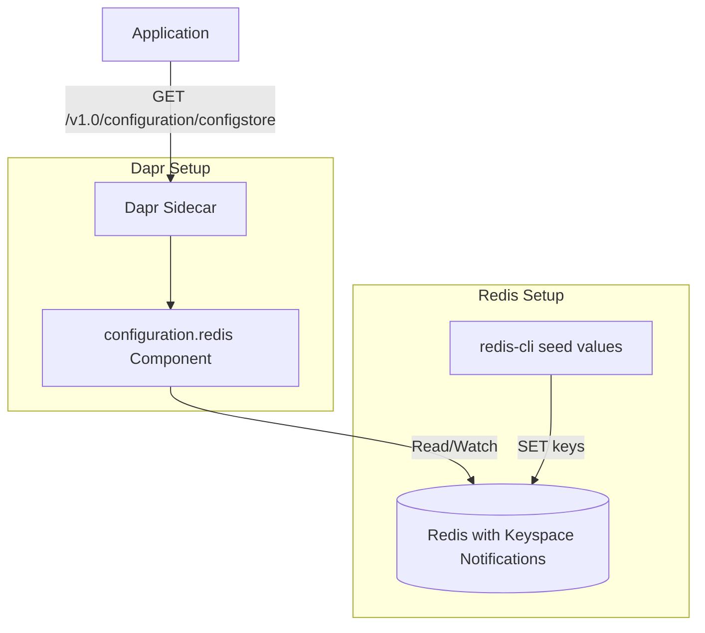

# How to Set Up Dapr Configuration with Redis

Author: [nawazdhandala](https://www.github.com/nawazdhandala)

Tags: Dapr, Configuration, Redis, Setup, Dynamic Config

Description: Step-by-step guide to setting up the Dapr configuration store component with Redis, seeding configuration values, and reading them from your application.

---

## Introduction

Redis is the most commonly used backend for Dapr's Configuration API. Dapr uses Redis keyspace notifications to detect configuration changes and deliver them to subscribed applications in real time. This guide walks through the complete setup: deploying Redis with keyspace notifications enabled, configuring the Dapr component, seeding config values, and reading them from an application.

## Architecture



## Prerequisites

- Redis 6.2+ deployed locally or on Kubernetes
- Dapr CLI installed
- Access to configure Redis (for keyspace notifications)

## Step 1: Deploy Redis with Keyspace Notifications

Redis keyspace notifications are required for Dapr configuration subscriptions. Enable them by setting the `notify-keyspace-events` configuration.

### Kubernetes (Helm)

Install Redis with custom configuration:

```bash
helm repo add bitnami https://charts.bitnami.com/bitnami
helm install redis bitnami/redis \
  --set auth.enabled=false \
  --set master.configuration="notify-keyspace-events KEA"
```

The `KEA` flags enable:
- `K` - Keyspace events (published in `__keyspace@db__` channel)
- `E` - Keyevent events (published in `__keyevent@db__` channel)
- `A` - Alias for all event types

### Local Development (Docker)

```bash
docker run -d \
  --name redis-config \
  -p 6379:6379 \
  redis:7 \
  redis-server --notify-keyspace-events KEA
```

### Verify Keyspace Notifications

```bash
redis-cli config get notify-keyspace-events
```

Expected output: `notify-keyspace-events KEA` (or a non-empty value).

## Step 2: Create the Dapr Configuration Component

Save the following as `components/configstore.yaml`:

```yaml
apiVersion: dapr.io/v1alpha1
kind: Component
metadata:
  name: configstore
  namespace: default
spec:
  type: configuration.redis
  version: v1
  metadata:
  - name: redisHost
    value: "redis-master.default.svc.cluster.local:6379"
  - name: redisPassword
    value: ""
  - name: enableTLS
    value: "false"
  - name: failover
    value: "false"
  - name: redisType
    value: "node"
```

For Kubernetes:

```bash
kubectl apply -f components/configstore.yaml
```

For local development (with Dapr CLI):

```bash
# Place the file in ./components/ and pass --components-path to dapr run
```

## Step 3: Seed Configuration Values

Dapr Redis configuration keys use the format: `{keyName}||version||{versionNumber}`.

```bash
# Connect to Redis
redis-cli -h localhost -p 6379

# Seed configuration values
SET "app-config||version||1" '{"logLevel":"info","maxConnections":100,"enableMetrics":true}'
SET "feature-flags||version||1" '{"darkMode":false,"newDashboard":true,"betaFeatures":false}'
SET "rate-limits||version||1" '{"requestsPerSecond":1000,"burstSize":50}'
SET "db-pool-settings||version||1" '{"maxPoolSize":20,"connectionTimeout":30,"idleTimeout":600}'
```

Verify:

```bash
redis-cli KEYS "*||version||*"
redis-cli GET "app-config||version||1"
```

## Step 4: Read Config via HTTP API

Start your app with Dapr:

```bash
dapr run \
  --app-id myapp \
  --app-port 3000 \
  --dapr-http-port 3500 \
  --components-path ./components \
  -- node app.js
```

Read a configuration item:

```bash
curl "http://localhost:3500/v1.0/configuration/configstore?key=app-config"
```

Response:

```json
{
  "items": {
    "app-config": {
      "value": "{\"logLevel\":\"info\",\"maxConnections\":100,\"enableMetrics\":true}",
      "version": "1",
      "metadata": {}
    }
  }
}
```

Read multiple keys:

```bash
curl "http://localhost:3500/v1.0/configuration/configstore?key=app-config&key=feature-flags"
```

## Step 5: Application Code Example

### Node.js

```javascript
const express = require('express');
const axios = require('axios');
const app = express();

const DAPR_PORT = process.env.DAPR_HTTP_PORT || '3500';
const CONFIG_STORE = 'configstore';
let cachedConfig = {};

async function loadConfig() {
  const response = await axios.get(
    `http://localhost:${DAPR_PORT}/v1.0/configuration/${CONFIG_STORE}`,
    { params: { key: ['app-config', 'feature-flags', 'rate-limits'] } }
  );
  const items = response.data.items;
  for (const [key, item] of Object.entries(items)) {
    cachedConfig[key] = JSON.parse(item.value);
  }
  console.log('Config loaded:', cachedConfig);
}

// Subscribe to changes
async function subscribeToConfig() {
  const response = await axios.get(
    `http://localhost:${DAPR_PORT}/v1.0-alpha1/configuration/${CONFIG_STORE}/subscribe`,
    { params: { key: ['app-config', 'feature-flags'] }, responseType: 'stream' }
  );
  response.data.on('data', (chunk) => {
    const update = JSON.parse(chunk.toString());
    for (const [key, item] of Object.entries(update.items || {})) {
      cachedConfig[key] = JSON.parse(item.value);
      console.log(`Config updated: ${key}`, cachedConfig[key]);
    }
  });
}

app.get('/config', (req, res) => res.json(cachedConfig));

app.listen(3000, async () => {
  await loadConfig();
  await subscribeToConfig();
  console.log('App running on :3000');
});
```

## Step 6: Update Config at Runtime

To update a configuration value, write a new version to Redis:

```bash
redis-cli SET "feature-flags||version||2" '{"darkMode":true,"newDashboard":true,"betaFeatures":true}'
```

Subscribed applications receive the update immediately via the keyspace notification.

## Summary

Setting up Dapr Configuration with Redis requires enabling keyspace notifications on your Redis instance, creating a `configuration.redis` Dapr component, and seeding values using the `{key}||version||{number}` key format. Applications read config via `GET /v1.0/configuration/{store}` and subscribe to real-time updates. Update values by writing new versions to Redis - subscribed applications receive changes without restarts.
