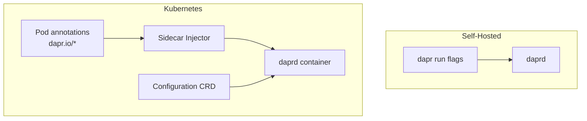

# How to Configure the Dapr Sidecar for Your Application

Author: [nawazdhandala](https://www.github.com/nawazdhandala)

Tags: Dapr, Sidecar, Configuration, Kubernetes, Annotation

Description: Learn how to configure the Dapr sidecar using CLI flags in self-hosted mode and pod annotations in Kubernetes, including ports, logging, and resource limits.

---

## Overview

The Dapr sidecar (`daprd`) accepts configuration through two mechanisms: CLI flags when running locally and pod annotations when running on Kubernetes. The sidecar also reads a `Configuration` custom resource for runtime behavior such as tracing, middleware, and resiliency.



## Self-Hosted: dapr run Flags

```bash
dapr run \
  --app-id order-service \
  --app-port 3000 \
  --app-protocol http \
  --dapr-http-port 3500 \
  --dapr-grpc-port 50001 \
  --resources-path ./components \
  --config ./config.yaml \
  --log-level debug \
  --enable-api-logging \
  -- node app.js
```

Key flags:

| Flag | Default | Description |
|------|---------|-------------|
| `--app-id` | required | Unique application identifier |
| `--app-port` | (none) | Port your app listens on |
| `--app-protocol` | http | Protocol the sidecar uses to call your app (http, grpc, https, grpcs) |
| `--dapr-http-port` | 3500 | Dapr HTTP API port |
| `--dapr-grpc-port` | 50001 | Dapr gRPC API port |
| `--resources-path` | `~/.dapr/components` | Directory of component YAML files |
| `--config` | `~/.dapr/config.yaml` | Dapr configuration file |
| `--log-level` | info | Log verbosity (debug, info, warn, error) |
| `--enable-api-logging` | false | Log every Dapr API call |

## Kubernetes: Pod Annotations

On Kubernetes, the sidecar injector reads annotations from your pod spec:

```yaml
apiVersion: apps/v1
kind: Deployment
metadata:
  name: order-service
spec:
  selector:
    matchLabels:
      app: order-service
  template:
    metadata:
      labels:
        app: order-service
      annotations:
        dapr.io/enabled: "true"
        dapr.io/app-id: "order-service"
        dapr.io/app-port: "3000"
        dapr.io/app-protocol: "http"
        dapr.io/dapr-http-port: "3500"
        dapr.io/dapr-grpc-port: "50001"
        dapr.io/log-level: "info"
        dapr.io/enable-api-logging: "false"
        dapr.io/config: "tracing-config"
        dapr.io/sidecar-cpu-request: "100m"
        dapr.io/sidecar-memory-request: "64Mi"
        dapr.io/sidecar-cpu-limit: "500m"
        dapr.io/sidecar-memory-limit: "256Mi"
    spec:
      containers:
      - name: order-service
        image: myregistry/order-service:latest
        ports:
        - containerPort: 3000
```

## Full Annotation Reference

### Identity and Protocol

```yaml
dapr.io/enabled: "true"                    # inject sidecar
dapr.io/app-id: "my-service"               # unique app ID
dapr.io/app-port: "8080"                   # port your app listens on
dapr.io/app-protocol: "http"               # http | grpc | https | grpcs | h2c
dapr.io/http-max-request-size: "4"         # max request body size in MB
dapr.io/http-read-buffer-size: "4"         # HTTP read buffer in KB
```

### API Ports

```yaml
dapr.io/dapr-http-port: "3500"
dapr.io/dapr-grpc-port: "50001"
dapr.io/metrics-port: "9090"
dapr.io/profile-port: "7777"
```

### Health and Startup

```yaml
dapr.io/app-health-check-path: "/healthz"
dapr.io/app-health-probe-interval: "3"       # seconds between health checks
dapr.io/app-health-probe-timeout: "500"      # milliseconds
dapr.io/app-health-threshold: "3"            # consecutive failures before unhealthy
dapr.io/wait-for-sidecar-before-app-start: "false"
dapr.io/sidecar-listen-address: "0.0.0.0"
```

### Resources

```yaml
dapr.io/sidecar-cpu-request: "100m"
dapr.io/sidecar-memory-request: "64Mi"
dapr.io/sidecar-cpu-limit: "500m"
dapr.io/sidecar-memory-limit: "256Mi"
```

### Security and mTLS

```yaml
dapr.io/app-token-secret: "my-app-token"    # token used by sidecar to call app
dapr.io/disable-builtin-k8s-secret-store: "false"
dapr.io/volume-mounts: "myvolume:/mnt/data" # mount volumes into sidecar
```

### Logging and Observability

```yaml
dapr.io/log-level: "info"
dapr.io/log-as-json: "true"
dapr.io/enable-api-logging: "true"
dapr.io/enable-metrics: "true"
dapr.io/metrics-port: "9090"
dapr.io/enable-profiling: "false"
```

### Configuration Reference

```yaml
dapr.io/config: "tracing-config"  # name of a Configuration CRD
```

## Dapr Configuration CRD

The `Configuration` CRD controls runtime behavior beyond the sidecar startup parameters:

```yaml
apiVersion: dapr.io/v1alpha1
kind: Configuration
metadata:
  name: tracing-config
  namespace: default
spec:
  tracing:
    samplingRate: "1"
    otel:
      endpointAddress: http://otel-collector:4317
      isSecure: false
      protocol: grpc
  metric:
    enabled: true
  logging:
    apiLogging:
      enabled: true
      obfuscateURLs: false
      omitHealthChecks: true
  httpPipeline:
    handlers:
    - name: oauth2
      type: middleware.http.oauth2
  features:
  - name: HotReload
    enabled: true
```

## Configuring the App Channel (gRPC)

If your application speaks gRPC, configure the app protocol and port accordingly:

```yaml
annotations:
  dapr.io/app-port: "50051"
  dapr.io/app-protocol: "grpc"
```

The sidecar then forwards incoming service invocation calls over gRPC to your app.

## Verifying Sidecar Configuration

Check the loaded configuration from the sidecar metadata endpoint:

```bash
curl http://localhost:3500/v1.0/metadata | jq '.runtimeMetadata'
```

On Kubernetes, inspect the injected sidecar container:

```bash
kubectl get pod <pod-name> -o jsonpath='{.spec.containers[?(@.name=="daprd")].args}'
```

## Summary

The Dapr sidecar is configured through `dapr run` flags in self-hosted mode and through `dapr.io/*` pod annotations in Kubernetes. Annotations control the app ID, ports, protocol, resource limits, health probes, logging, and tracing. A `Configuration` CRD provides additional runtime controls including distributed tracing, HTTP middleware, metrics, and hot-reload of components. These two layers together give you fine-grained control over how each sidecar instance behaves.
