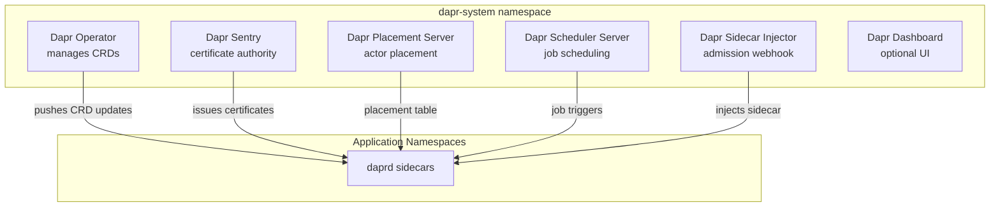
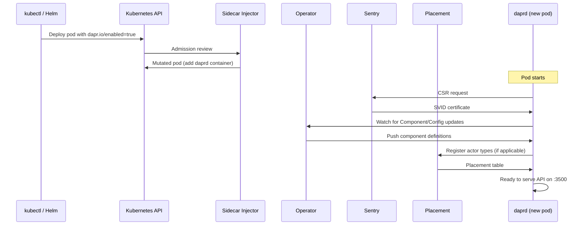

# How to Understand the Dapr Control Plane Components

Author: [nawazdhandala](https://www.github.com/nawazdhandala)

Tags: Dapr, Control Plane, Kubernetes, Architecture, Operation

Description: Understand all five Dapr control plane components - Operator, Sentry, Placement, Scheduler, and Sidecar Injector - their roles, ports, and how they interact with sidecars.

---

## What Is the Dapr Control Plane?

The Dapr control plane is a set of services that manage the lifecycle and configuration of Dapr sidecars in a Kubernetes cluster. These services run in the `dapr-system` namespace and are installed when you run `dapr init --kubernetes` or deploy via Helm.



## Checking the Control Plane

```bash
# Kubernetes
kubectl get pods -n dapr-system
dapr status -k

# Self-hosted
dapr status
```

Kubernetes output:

```text
NAME                                    READY   STATUS
dapr-operator-7f9d8f9b7c-xxxxx          1/1     Running
dapr-sentry-6d9f7b8c6b-xxxxx            1/1     Running
dapr-placement-server-0                 1/1     Running
dapr-scheduler-server-0                 1/1     Running
dapr-sidecar-injector-6c5f7d9b8f-xxxxx  1/1     Running
dapr-dashboard-5b6c7d8f9b-xxxxx         1/1     Running
```

## 1 - Dapr Operator

**Role:** Kubernetes controller that manages Dapr CRDs and delivers component/configuration updates to running sidecars without pod restarts.

**Port:** `6500` (gRPC, sidecars connect to receive updates)

**CRDs managed:**
- `Component`
- `Configuration`
- `Resiliency`
- `Subscription`
- `HTTPEndpoint`

**Key behavior:**
- Watches all Dapr CRDs across all namespaces
- Pushes updates to relevant sidecars when CRDs change
- Resolves secret references in component specs

```bash
kubectl logs -n dapr-system -l app=dapr-operator --tail=50
kubectl describe deployment dapr-operator -n dapr-system
```

## 2 - Dapr Sentry

**Role:** Internal Certificate Authority. Issues SPIFFE X.509 certificates (SVIDs) to every sidecar for mTLS authentication.

**Port:** `50001` (gRPC, sidecars send CSRs)

**Key behavior:**
- Generates root CA on first startup (or uses provided CA)
- Issues workload certificates with 24-hour TTL by default
- Rotates certificates automatically before expiry
- Validates sidecar identity using Kubernetes Service Account tokens

```bash
kubectl logs -n dapr-system -l app=dapr-sentry --tail=50
kubectl get secret dapr-trust-bundle -n dapr-system
```

## 3 - Dapr Placement Server

**Role:** Distributed hash ring service that tracks which sidecar hosts which virtual actor instances.

**Port:** `50005` (gRPC streaming, sidecars register and receive placement tables)

**Key behavior:**
- Sidecars hosting actors register their actor types on startup
- Placement distributes a consistent hash table to all sidecars
- When a pod is added or removed, only a minimal fraction of actors are rehashed
- Supports Raft-based leader election for HA (3-node cluster)

```bash
kubectl logs -n dapr-system -l app=dapr-placement-server --tail=50
kubectl get statefulset dapr-placement-server -n dapr-system
```

## 4 - Dapr Scheduler Server

**Role:** Durable job scheduling backend for the Jobs API building block.

**Port:** `50006` (gRPC, sidecars submit and retrieve job triggers)

**Key behavior:**
- Embeds etcd for persistent job storage
- Supports one-time and recurring schedules (cron and `@every` syntax)
- Triggers job callbacks to sidecars at scheduled times
- Survives pod restarts (jobs are persisted in etcd)

```bash
kubectl logs -n dapr-system -l app=dapr-scheduler-server --tail=50
kubectl get statefulset dapr-scheduler-server -n dapr-system
```

## 5 - Dapr Sidecar Injector

**Role:** Kubernetes Mutating Admission Webhook that automatically adds the `daprd` container to pods with `dapr.io/enabled: "true"`.

**Port:** `4000` (HTTPS, Kubernetes API server sends admission requests)

**Key behavior:**
- Intercepts pod CREATE operations
- Reads `dapr.io/*` annotations from pod spec
- Mutates pod to add `daprd` container with all required configuration
- Does not affect pods without the `dapr.io/enabled: "true"` annotation

```bash
kubectl logs -n dapr-system -l app=dapr-sidecar-injector --tail=50
kubectl get mutatingwebhookconfiguration dapr-sidecar-injector
```

## Control Plane Interaction Diagram



## Control Plane Port Summary

| Component | Port | Protocol | Purpose |
|-----------|------|----------|---------|
| Operator | 6500 | gRPC | Component/config delivery to sidecars |
| Sentry | 50001 | gRPC | Certificate issuance |
| Placement | 50005 | gRPC streaming | Actor placement table distribution |
| Scheduler | 50006 | gRPC | Job scheduling and triggering |
| Sidecar Injector | 4000 | HTTPS | Admission webhook |

## High Availability Configuration

For production clusters, run each control plane component with at least 2 replicas (3 for stateful components):

```yaml
# helm values for HA
dapr_operator:
  replicaCount: 2

dapr_sentry:
  replicaCount: 2

dapr_sidecar_injector:
  replicaCount: 2

dapr_placement:
  replicaCount: 3      # odd number required for Raft
  ha:
    enabled: true

dapr_scheduler:
  replicaCount: 3      # odd number required for etcd Raft
  ha:
    enabled: true
```

```bash
helm upgrade dapr dapr/dapr \
  --namespace dapr-system \
  -f ha-values.yaml
```

## Installing and Upgrading the Control Plane

```bash
# Install
helm repo add dapr https://dapr.github.io/helm-charts/
helm install dapr dapr/dapr --namespace dapr-system --create-namespace

# Check installed version
dapr version -k

# Upgrade
helm upgrade dapr dapr/dapr --namespace dapr-system --version 1.15.0
```

## Summary

The Dapr control plane consists of five components: the Operator (CRD management and hot-reload), Sentry (certificate authority for mTLS), Placement (actor location tracking with consistent hashing), Scheduler (durable job storage and triggering), and Sidecar Injector (admission webhook for automatic sidecar injection). In production, run all components with multiple replicas and use Raft-based HA for Placement and Scheduler.
