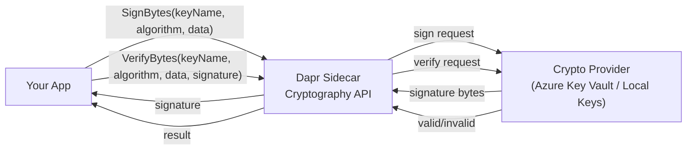

# How to Use Dapr Crypto API for Digital Signatures

Author: [nawazdhandala](https://www.github.com/nawazdhandala)

Tags: Dapr, Cryptography, Digital Signature, Security, API

Description: Use Dapr's Cryptography API to sign data and verify digital signatures using managed asymmetric keys without handling private key material in application code.

---

## Overview

Dapr's Cryptography API supports digital signature operations (sign and verify) using asymmetric key pairs stored in a crypto provider. Application code never handles the private key material. Supported algorithms include RSA-PSS, RSA-PKCS1, ECDSA, and Ed25519.

## Architecture



## Step 1: Configure a Crypto Component

### Local File-Based Keys (Development)

```yaml
# components/crypto.yaml
apiVersion: dapr.io/v1alpha1
kind: Component
metadata:
  name: localstorecrypto
  namespace: default
spec:
  type: crypto.dapr.localstorage
  version: v1
  metadata:
  - name: path
    value: "./keys"
```

Generate an ECDSA key pair for signing:

```bash
mkdir -p ./keys

# Generate EC private key (P-256 curve)
openssl ecparam -name prime256v1 -genkey -noout -out ./keys/signing-key.pem

# Generate the corresponding public key
openssl ec -in ./keys/signing-key.pem -pubout -out ./keys/signing-key.pub.pem
```

### Azure Key Vault

```yaml
# components/crypto-akv.yaml
apiVersion: dapr.io/v1alpha1
kind: Component
metadata:
  name: akvCrypto
  namespace: default
spec:
  type: crypto.azure.keyvault
  version: v1
  metadata:
  - name: vaultName
    value: "my-keyvault"
  - name: azureClientId
    secretKeyRef:
      name: azure-credentials
      key: clientId
  - name: azureClientSecret
    secretKeyRef:
      name: azure-credentials
      key: clientSecret
  - name: azureTenantId
    secretKeyRef:
      name: azure-credentials
      key: tenantId
```

## Step 2: Sign Data

### Go SDK

```go
package main

import (
    "context"
    "encoding/base64"
    "fmt"
    "log"

    dapr "github.com/dapr/go-sdk/client"
)

func main() {
    client, err := dapr.NewClient()
    if err != nil {
        log.Fatal(err)
    }
    defer client.Close()

    ctx := context.Background()

    payload := []byte(`{"orderId":"order-1","amount":99.95,"timestamp":"2026-03-31T10:00:00Z"}`)

    // Sign the payload using the ECDSA key
    sigResp, err := client.Crypto().SignBytes(ctx, dapr.SignBytesOptions{
        ComponentName: "localstorecrypto",
        KeyName:       "signing-key",
        Algorithm:     "ES256",  // ECDSA with SHA-256
        Value:         payload,
    })
    if err != nil {
        log.Fatalf("Sign failed: %v", err)
    }

    signature := sigResp.Signature
    fmt.Printf("Signature (base64): %s\n", base64.StdEncoding.EncodeToString(signature))

    // Verify the signature
    verifyResp, err := client.Crypto().VerifyBytes(ctx, dapr.VerifyBytesOptions{
        ComponentName: "localstorecrypto",
        KeyName:       "signing-key",
        Algorithm:     "ES256",
        Value:         payload,
        Signature:     signature,
    })
    if err != nil {
        log.Fatalf("Verify call failed: %v", err)
    }

    if verifyResp.Valid {
        fmt.Println("Signature is VALID")
    } else {
        fmt.Println("Signature is INVALID")
    }
}
```

### Python SDK

```python
import asyncio
import base64
from dapr.clients import DaprClient

async def main():
    async with DaprClient() as client:
        payload = b'{"orderId":"order-1","amount":99.95}'

        # Sign
        sign_resp = await client.sign_bytes(
            component_name="localstorecrypto",
            key_name="signing-key",
            algorithm="ES256",
            value=payload,
        )
        signature = sign_resp.signature
        print(f"Signature: {base64.b64encode(signature).decode()}")

        # Verify
        verify_resp = await client.verify_bytes(
            component_name="localstorecrypto",
            key_name="signing-key",
            algorithm="ES256",
            value=payload,
            signature=signature,
        )
        print(f"Valid: {verify_resp.valid}")

asyncio.run(main())
```

## Step 3: Sign Using HTTP API (No SDK)

```bash
# Sign data (base64-encoded payload)
PAYLOAD=$(echo -n '{"orderId":"order-1"}' | base64)

curl -X POST http://localhost:3500/v1.0-alpha1/crypto/localstorecrypto/sign \
  -H "Content-Type: application/json" \
  -d "{
    \"keyName\": \"signing-key\",
    \"algorithm\": \"ES256\",
    \"value\": \"${PAYLOAD}\"
  }"
# Response: {"signature":"<base64-signature>"}

# Verify signature
curl -X POST http://localhost:3500/v1.0-alpha1/crypto/localstorecrypto/verify \
  -H "Content-Type: application/json" \
  -d "{
    \"keyName\": \"signing-key\",
    \"algorithm\": \"ES256\",
    \"value\": \"${PAYLOAD}\",
    \"signature\": \"<base64-signature-from-above>\"
  }"
# Response: {"valid":true}
```

## Step 4: Signing JWT Payloads

```go
import (
    "encoding/base64"
    "encoding/json"
    "strings"
)

type JWTHeader struct {
    Alg string `json:"alg"`
    Typ string `json:"typ"`
}

type JWTClaims struct {
    Sub string `json:"sub"`
    Iss string `json:"iss"`
    Exp int64  `json:"exp"`
    Iat int64  `json:"iat"`
}

func buildJWT(ctx context.Context, client dapr.Client, claims JWTClaims) (string, error) {
    headerJSON, _ := json.Marshal(JWTHeader{Alg: "ES256", Typ: "JWT"})
    claimsJSON, _ := json.Marshal(claims)

    headerB64 := base64.RawURLEncoding.EncodeToString(headerJSON)
    claimsB64 := base64.RawURLEncoding.EncodeToString(claimsJSON)
    signingInput := []byte(headerB64 + "." + claimsB64)

    sigResp, err := client.Crypto().SignBytes(ctx, dapr.SignBytesOptions{
        ComponentName: "localstorecrypto",
        KeyName:       "signing-key",
        Algorithm:     "ES256",
        Value:         signingInput,
    })
    if err != nil {
        return "", err
    }

    sigB64 := base64.RawURLEncoding.EncodeToString(sigResp.Signature)
    return strings.Join([]string{headerB64, claimsB64, sigB64}, "."), nil
}
```

## Step 5: Supported Algorithms

| Algorithm | Key Type | Use Case |
|---|---|---|
| `ES256` | EC P-256 | ECDSA with SHA-256 (JWT, general signing) |
| `ES384` | EC P-384 | ECDSA with SHA-384 |
| `ES512` | EC P-521 | ECDSA with SHA-512 |
| `PS256` | RSA 2048+ | RSA-PSS with SHA-256 |
| `PS384` | RSA 2048+ | RSA-PSS with SHA-384 |
| `PS512` | RSA 2048+ | RSA-PSS with SHA-512 |
| `RS256` | RSA 2048+ | RSA-PKCS1 with SHA-256 |
| `EdDSA` | Ed25519 | High-performance signatures |

## Step 6: Signing Dapr State Values (Integrity Protection)

```go
func saveSignedState(ctx context.Context, client dapr.Client, key string, value []byte) error {
    // Sign the value
    sigResp, err := client.Crypto().SignBytes(ctx, dapr.SignBytesOptions{
        ComponentName: "localstorecrypto",
        KeyName:       "signing-key",
        Algorithm:     "ES256",
        Value:         value,
    })
    if err != nil {
        return err
    }

    // Store value and signature together
    envelope := map[string]string{
        "data":      base64.StdEncoding.EncodeToString(value),
        "signature": base64.StdEncoding.EncodeToString(sigResp.Signature),
    }
    envelopeJSON, _ := json.Marshal(envelope)
    return client.SaveState(ctx, "statestore", key, envelopeJSON, nil)
}
```

## Summary

Dapr's Cryptography API provides `SignBytes` and `VerifyBytes` operations for digital signatures without exposing private key material to application code. Keys are managed by a crypto provider (local files for development, Azure Key Vault or HashiCorp Vault for production). Supported algorithms include ECDSA (ES256/384/512), RSA-PSS (PS256/384/512), RSA-PKCS1 (RS256/384/512), and Ed25519. Use the sign/verify API to protect data integrity, sign JWTs, or create audit trails.
