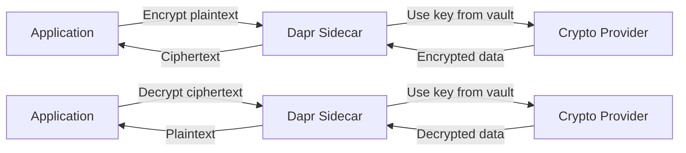

# How to Use Dapr Cryptography API for Encryption

Author: [nawazdhandala](https://www.github.com/nawazdhandala)

Tags: Dapr, Cryptography, Encryption, Security, API

Description: Learn how to use Dapr's Cryptography API to encrypt and decrypt data using managed keys stored in a crypto provider, without handling key material in your application code.

---

## Introduction

Dapr's Cryptography API (alpha) provides a building block for encrypting and decrypting data using keys managed by a backing crypto provider (such as Azure Key Vault or a local key store). Your application never handles raw key material - it sends plaintext to the Dapr sidecar, which performs the cryptographic operation using the managed key and returns the result.

Benefits:
- No key material in application code
- Consistent encryption API across providers
- Key rotation without application changes
- Audit trail in the key management service

## How the Cryptography API Works



## Prerequisites

- Dapr v1.11 or later (Cryptography API is alpha)
- A supported crypto provider (Azure Key Vault or local key store)
- Keys pre-created in the provider

## Step 1: Configure the Crypto Provider Component

### Azure Key Vault Crypto Provider

```yaml
apiVersion: dapr.io/v1alpha1
kind: Component
metadata:
  name: myvault
  namespace: default
spec:
  type: crypto.azure.keyvault
  version: v1
  metadata:
  - name: vaultName
    value: "my-crypto-vault"
  - name: azureTenantId
    value: "<tenant-id>"
  - name: azureClientId
    value: "<client-id>"
  - name: azureClientSecret
    secretKeyRef:
      name: azure-sp-creds
      key: clientSecret
```

Create a key in Azure Key Vault:

```bash
az keyvault key create \
  --vault-name my-crypto-vault \
  --name my-encryption-key \
  --kty RSA \
  --size 2048
```

### Local File-Based Crypto Provider (Development)

```yaml
apiVersion: dapr.io/v1alpha1
kind: Component
metadata:
  name: localcrypto
  namespace: default
spec:
  type: crypto.dapr.localstorage
  version: v1
  metadata:
  - name: path
    value: "./keys"
```

Generate a local key:

```bash
# Install dapr crypto tool or use openssl
openssl genrsa -out ./keys/my-key.pem 2048
```

## Step 2: Encrypt Data

### Via HTTP API

Encrypt a string value:

```bash
curl -X PUT \
  "http://localhost:3500/v1.0-alpha1/crypto/myvault/encrypt" \
  -H "Content-Type: application/json" \
  -d '{
    "plaintext": "Hello, secret world!",
    "keyName": "my-encryption-key",
    "algorithm": "RSA-OAEP-256"
  }'
```

Response:

```json
{
  "ciphertext": "base64encodedciphertext..."
}
```

### Via Go SDK

```go
package main

import (
    "context"
    "fmt"
    "log"

    dapr "github.com/dapr/go-sdk/client"
)

func main() {
    client, err := dapr.NewClient()
    if err != nil {
        log.Fatal(err)
    }
    defer client.Close()

    ctx := context.Background()
    plaintext := []byte("Hello, secret world!")

    // Encrypt
    encryptResp, err := client.Encrypt(ctx, &dapr.EncryptRequest{
        ComponentName: "myvault",
        KeyName:       "my-encryption-key",
        Algorithm:     "RSA-OAEP-256",
        PlaintextReader: func() ([]byte, error) {
            return plaintext, nil
        },
    })
    if err != nil {
        log.Fatalf("Encryption failed: %v", err)
    }

    ciphertext := encryptResp.Ciphertext
    fmt.Printf("Encrypted (%d bytes)\n", len(ciphertext))

    // Decrypt
    decryptResp, err := client.Decrypt(ctx, &dapr.DecryptRequest{
        ComponentName: "myvault",
        KeyName:       "my-encryption-key",
        Algorithm:     "RSA-OAEP-256",
        CiphertextReader: func() ([]byte, error) {
            return ciphertext, nil
        },
    })
    if err != nil {
        log.Fatalf("Decryption failed: %v", err)
    }

    fmt.Printf("Decrypted: %s\n", string(decryptResp.Plaintext))
}
```

### Via Python SDK

```python
from dapr.clients import DaprClient
import base64

with DaprClient() as client:
    plaintext = b"Hello, secret world!"

    # Encrypt
    encrypt_response = client.encrypt(
        component_name='myvault',
        plaintext=plaintext,
        key_name='my-encryption-key',
        key_wrap_algorithm='RSA-OAEP-256'
    )
    ciphertext = encrypt_response.ciphertext
    print(f"Encrypted: {base64.b64encode(ciphertext).decode()}")

    # Decrypt
    decrypt_response = client.decrypt(
        component_name='myvault',
        ciphertext=ciphertext,
        key_name='my-encryption-key',
        key_wrap_algorithm='RSA-OAEP-256'
    )
    recovered = decrypt_response.plaintext
    print(f"Decrypted: {recovered.decode()}")
```

## Supported Algorithms

| Algorithm | Type | Use Case |
|---|---|---|
| `RSA-OAEP` | Asymmetric | Encrypt small payloads with RSA public key |
| `RSA-OAEP-256` | Asymmetric | RSA-OAEP with SHA-256 |
| `A256GCM` | Symmetric (AES-GCM) | Encrypt data with AES 256-bit key |
| `A128CBC-HS256` | Symmetric (AES-CBC + HMAC) | Symmetric encryption with integrity |

## Stream Encryption for Large Data

For large files or streams, use the streaming encrypt/decrypt API:

```go
// Go - streaming encrypt
encryptOpts := &dapr.EncryptOptions{
    ComponentName:     "myvault",
    KeyName:          "my-encryption-key",
    Algorithm:        "A256GCM",
    DataEncryptionKey: "my-data-key",
}

// Pass io.Reader and io.Writer for streaming
err = client.EncryptStream(ctx, inputReader, outputWriter, encryptOpts)
```

## Step 3: Decrypt Data

```bash
curl -X PUT \
  "http://localhost:3500/v1.0-alpha1/crypto/myvault/decrypt" \
  -H "Content-Type: application/json" \
  -d '{
    "ciphertext": "base64encodedciphertext...",
    "keyName": "my-encryption-key",
    "algorithm": "RSA-OAEP-256"
  }'
```

## Summary

Dapr's Cryptography API provides a key-management-as-a-service approach to encryption. Your application sends plaintext and receives ciphertext - it never touches the actual key material. Configure a crypto provider component pointing to Azure Key Vault or a local key store, create your keys in the provider, and use the `encrypt`/`decrypt` API endpoints or SDK methods. This is ideal for applications that need to encrypt sensitive data (PII, payment info) without the complexity of managing cryptographic keys directly.
