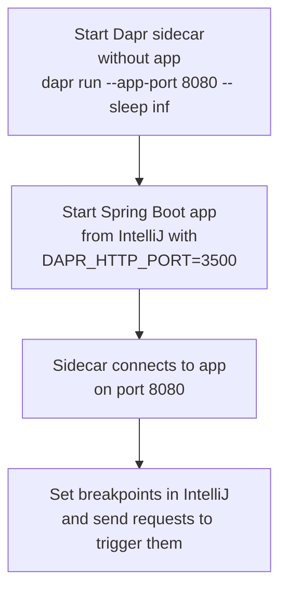

# How to Debug Dapr Applications in IntelliJ IDEA

Author: [nawazdhandala](https://www.github.com/nawazdhandala)

Tags: Dapr, IntelliJ, Debugging, Java, Developer Tool

Description: Configure IntelliJ IDEA to debug Java or Kotlin Dapr applications with breakpoints by starting the Dapr sidecar separately and attaching the IntelliJ debugger to your JVM process.

---

## Debugging Strategy for IntelliJ

IntelliJ IDEA runs your application directly from the IDE. To use Dapr with it, start the Dapr sidecar separately (without launching your app), then run your app from IntelliJ with the `DAPR_HTTP_PORT` environment variable set. The sidecar and app will connect because the sidecar waits for the app to respond on the configured port.



## Sample Spring Boot Application

```java
// src/main/java/com/example/OrderController.java
package com.example;

import org.springframework.web.bind.annotation.*;
import org.springframework.http.*;
import org.springframework.web.client.RestTemplate;
import java.util.*;

@RestController
public class OrderController {

    private final String daprHttpPort = System.getenv().getOrDefault("DAPR_HTTP_PORT", "3500");
    private final String stateUrl = "http://localhost:" + daprHttpPort + "/v1.0/state/statestore";

    @PostMapping("/orders")
    public ResponseEntity<Map<String, Object>> placeOrder(@RequestBody Map<String, Object> order) {
        String orderId = (String) order.get("orderId");

        // Save state via Dapr
        RestTemplate rest = new RestTemplate();
        List<Map<String, Object>> stateItems = List.of(
            Map.of("key", orderId, "value", order)
        );
        rest.postForEntity(stateUrl, stateItems, Void.class);

        Map<String, Object> response = new HashMap<>();
        response.put("success", true);
        response.put("orderId", orderId);
        return ResponseEntity.ok(response);
    }

    @GetMapping("/orders/{id}")
    public ResponseEntity<Object> getOrder(@PathVariable String id) {
        RestTemplate rest = new RestTemplate();
        ResponseEntity<Object> stateResponse = rest.getForEntity(
            stateUrl + "/" + id, Object.class
        );
        return ResponseEntity.ok(stateResponse.getBody());
    }
}
```

## Step 1 - Start the Dapr Sidecar

Open a terminal and start the sidecar without your app:

```bash
dapr run \
  --app-id order-service \
  --app-port 8080 \
  --dapr-http-port 3500 \
  --dapr-grpc-port 50001 \
  -- sleep infinity
```

On Windows:

```powershell
dapr run `
  --app-id order-service `
  --app-port 8080 `
  --dapr-http-port 3500 `
  --dapr-grpc-port 50001 `
  -- ping -t localhost
```

The sidecar starts but there is no app listening on port 8080 yet. It will connect when your app starts.

## Step 2 - Configure IntelliJ Run/Debug Configuration

1. Open **Run > Edit Configurations** in IntelliJ
2. Click **+** and select **Spring Boot** (or **Application** for non-Spring apps)
3. Set **Main class** to your application entry point
4. Click **Modify options > Environment variables**
5. Add:

```text
DAPR_HTTP_PORT=3500
DAPR_GRPC_PORT=50001
SERVER_PORT=8080
```

Or in the environment variables field:

```text
DAPR_HTTP_PORT=3500;DAPR_GRPC_PORT=50001;SERVER_PORT=8080
```

6. Set the **Working directory** to your project root
7. Click **OK**

## Step 3 - Debug from IntelliJ

1. Set breakpoints in your controller or service classes (click in the left gutter)
2. Click the **Debug** button (green bug icon) or press `Shift+F9`
3. IntelliJ starts your app in debug mode on port 8080
4. The Dapr sidecar connects to your app

Test with a request:

```bash
curl -X POST http://localhost:8080/orders \
  -H "Content-Type: application/json" \
  -d '{"orderId": "ord-001", "item": "widget", "total": 99.99}'
```

IntelliJ pauses at your breakpoint. Inspect variables with `F8` (step over), `F7` (step into), `F9` (resume).

## Spring Boot VM Options

For more verbose JVM debugging options:

```text
VM options: -Xmx512m -Dlogging.level.root=DEBUG
```

Add these in the **VM options** field of the run configuration.

## Using Remote Debug (Attach to Running Process)

Start your app with the JVM debug port open, then attach IntelliJ:

### Start app with debug port

```bash
dapr run \
  --app-id order-service \
  --app-port 8080 \
  --dapr-http-port 3500 \
  -- java -agentlib:jdwp=transport=dt_socket,server=y,suspend=n,address=*:5005 \
     -jar target/order-service.jar
```

### Create Remote Debug Configuration in IntelliJ

1. **Run > Edit Configurations > + > Remote JVM Debug**
2. Set **Host**: `localhost`
3. Set **Port**: `5005`
4. Click **OK**

Press `Shift+F9` to attach. IntelliJ connects to the running JVM.

## Kotlin Application Setup

The same configuration works for Kotlin Spring Boot apps. Your Kotlin controller:

```kotlin
// src/main/kotlin/com/example/OrderController.kt
package com.example

import org.springframework.http.ResponseEntity
import org.springframework.web.bind.annotation.*
import org.springframework.web.client.RestTemplate

@RestController
class OrderController {

    private val daprHttpPort = System.getenv("DAPR_HTTP_PORT") ?: "3500"
    private val stateUrl = "http://localhost:$daprHttpPort/v1.0/state/statestore"

    @PostMapping("/orders")
    fun placeOrder(@RequestBody order: Map<String, Any>): ResponseEntity<Map<String, Any>> {
        val rest = RestTemplate()
        rest.postForEntity(stateUrl, listOf(mapOf("key" to order["orderId"], "value" to order)), Void::class.java)
        return ResponseEntity.ok(mapOf("success" to true, "orderId" to order["orderId"]!!))
    }
}
```

## Gradle Run Configuration

For Gradle-based projects:

1. **Run > Edit Configurations > + > Gradle**
2. **Gradle project**: select your project
3. **Tasks**: `bootRun`
4. **Environment variables**: `DAPR_HTTP_PORT=3500;SERVER_PORT=8080`

## Stopping the Debug Session

1. Stop the app in IntelliJ (click the red stop button)
2. Stop the sidecar in the terminal (`Ctrl+C`)

Or use `dapr stop`:

```bash
dapr stop --app-id order-service
```

## Debugging Multiple Services

For debugging multiple services simultaneously, start each sidecar on a different port and create a separate IntelliJ run configuration for each:

```bash
# Terminal 1: order-service sidecar
dapr run \
  --app-id order-service \
  --app-port 8080 \
  --dapr-http-port 3500 \
  -- sleep infinity

# Terminal 2: payment-service sidecar
dapr run \
  --app-id payment-service \
  --app-port 8081 \
  --dapr-http-port 3501 \
  -- sleep infinity
```

Run/debug each IntelliJ configuration independently.

## Summary

Debugging Dapr applications in IntelliJ IDEA requires starting the Dapr sidecar in a separate terminal using `sleep infinity` as a placeholder, then running or debugging your application from IntelliJ with `DAPR_HTTP_PORT` set in the environment variables. For remote attach scenarios, add the JVM debug agent flag to the `dapr run` command and use IntelliJ's Remote JVM Debug configuration. Breakpoints, variable inspection, and step-through debugging all work as with any standard Java/Kotlin application.
