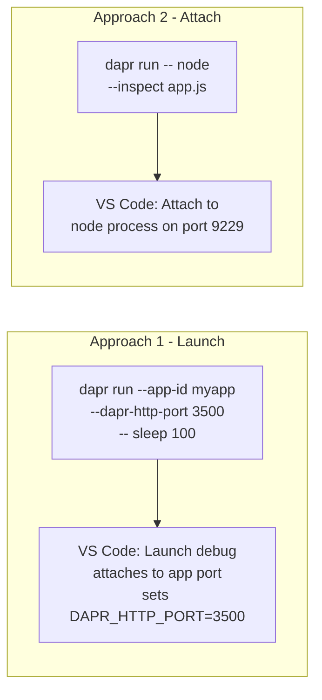

# How to Debug Dapr Applications in Visual Studio Code

Author: [nawazdhandala](https://www.github.com/nawazdhandala)

Tags: Dapr, VS Code, Debugging, Developer Tool, Local Development

Description: Configure Visual Studio Code to debug Dapr applications with breakpoints by starting the Dapr sidecar separately and attaching the VS Code debugger to your application process.

---

## Debugging Strategy

You cannot run `dapr run` inside VS Code's built-in debugger because `dapr run` wraps your process. Instead, use one of two approaches:

1. **Launch approach**: Start the sidecar separately, then use VS Code to launch your app in debug mode
2. **Attach approach**: Start both sidecar and app together, then attach VS Code to the running process



## Prerequisites

- Dapr CLI installed and `dapr init` run
- VS Code with language-specific debugger extension installed
- A Dapr application to debug

## Approach 1 - Node.js Launch Configuration

### Step 1 - Start the Sidecar Without Your App

```bash
dapr run \
  --app-id order-service \
  --app-port 3001 \
  --dapr-http-port 3500 \
  --dapr-grpc-port 50001 \
  -- node -e "setInterval(() => {}, 1000)"
```

This starts the sidecar and keeps it alive with a dummy Node.js process.

### Step 2 - VS Code launch.json

```json
{
  "version": "0.2.0",
  "configurations": [
    {
      "name": "Debug Order Service (Dapr)",
      "type": "node",
      "request": "launch",
      "program": "${workspaceFolder}/order-service/app.js",
      "cwd": "${workspaceFolder}/order-service",
      "env": {
        "DAPR_HTTP_PORT": "3500",
        "DAPR_GRPC_PORT": "50001",
        "PORT": "3001",
        "NODE_ENV": "development"
      },
      "runtimeArgs": ["--inspect"],
      "console": "integratedTerminal",
      "skipFiles": ["<node_internals>/**"]
    }
  ]
}
```

Press `F5` to start debugging. Set breakpoints in your code. The app runs on port 3001 with the sidecar already listening on 3500.

## Approach 2 - Node.js Attach Configuration

### dapr.yaml with Debug Flags

```yaml
# dapr.yaml
version: 1
apps:
- appID: order-service
  appDirPath: ./order-service/
  appPort: 3001
  daprHTTPPort: 3500
  command: ["node", "--inspect=9229", "app.js"]
  env:
    PORT: "3001"
```

```bash
dapr run -f dapr.yaml
```

### VS Code launch.json (Attach)

```json
{
  "version": "0.2.0",
  "configurations": [
    {
      "name": "Attach to Order Service",
      "type": "node",
      "request": "attach",
      "port": 9229,
      "localRoot": "${workspaceFolder}/order-service",
      "remoteRoot": "${workspaceFolder}/order-service",
      "restart": true,
      "skipFiles": ["<node_internals>/**"]
    }
  ]
}
```

Press `F5` while the app is running. VS Code attaches to port 9229.

## Python Debugging

### launch.json for Python

```json
{
  "version": "0.2.0",
  "configurations": [
    {
      "name": "Debug Python Dapr App",
      "type": "debugpy",
      "request": "launch",
      "program": "${workspaceFolder}/app.py",
      "cwd": "${workspaceFolder}",
      "env": {
        "DAPR_HTTP_PORT": "3500",
        "DAPR_GRPC_PORT": "50001",
        "FLASK_ENV": "development"
      },
      "justMyCode": true
    }
  ]
}
```

Start the sidecar first:

```bash
dapr run \
  --app-id python-service \
  --app-port 5001 \
  --dapr-http-port 3500 \
  -- python3 -c "import time; [time.sleep(1) for _ in iter(int, 1)]"
```

Then press `F5` in VS Code.

## Go Debugging

```json
{
  "version": "0.2.0",
  "configurations": [
    {
      "name": "Debug Go Dapr App",
      "type": "go",
      "request": "launch",
      "mode": "debug",
      "program": "${workspaceFolder}/main.go",
      "env": {
        "DAPR_HTTP_PORT": "3500",
        "DAPR_GRPC_PORT": "50001",
        "APP_PORT": "8080"
      },
      "args": []
    }
  ]
}
```

## Using the Dapr VS Code Extension

Install the official Dapr extension from the VS Code marketplace:

```text
Extension ID: ms-azuretools.vscode-dapr
```

The extension provides:
- A Dapr panel showing running applications
- One-click start/stop of Dapr applications
- Component and configuration visualization
- Log streaming in VS Code output panels

With the extension installed, the Dapr panel appears in the Explorer sidebar. Right-click on an app to debug it with the Dapr extension's scaffolded launch configuration.

## Compound Launch Configuration (Sidecar + App)

Start both the sidecar and your app in a single `F5` press using a compound configuration:

```json
{
  "version": "0.2.0",
  "configurations": [
    {
      "name": "Start Dapr Sidecar",
      "type": "node",
      "request": "launch",
      "runtimeExecutable": "dapr",
      "runtimeArgs": [
        "run",
        "--app-id", "order-service",
        "--app-port", "3001",
        "--dapr-http-port", "3500",
        "--",
        "node",
        "-e",
        "setInterval(() => {}, 1000)"
      ],
      "cwd": "${workspaceFolder}",
      "console": "integratedTerminal"
    },
    {
      "name": "Debug Order Service",
      "type": "node",
      "request": "launch",
      "program": "${workspaceFolder}/order-service/app.js",
      "cwd": "${workspaceFolder}/order-service",
      "env": {
        "DAPR_HTTP_PORT": "3500",
        "PORT": "3001"
      }
    }
  ],
  "compounds": [
    {
      "name": "Debug with Dapr",
      "configurations": ["Start Dapr Sidecar", "Debug Order Service"],
      "stopAll": true
    }
  ]
}
```

Press `F5` and select "Debug with Dapr" from the dropdown.

## Debugging Tips

- Set `DAPR_HTTP_PORT` in the VS Code `env` block to match the sidecar's `--dapr-http-port`
- Use conditional breakpoints for high-frequency endpoints (right-click on breakpoint)
- The sidecar logs appear in the terminal, not in the VS Code debug console
- Use the Dapr metadata endpoint to verify the sidecar is connected to your debug session:

```bash
curl http://localhost:3500/v1.0/metadata | jq '.appConnectionProperties'
```

## Summary

Debugging Dapr applications in VS Code requires starting the sidecar separately and launching or attaching the VS Code debugger to your application process. The `launch.json` configuration sets `DAPR_HTTP_PORT` so your app knows where to find the sidecar. The official Dapr VS Code extension provides a panel for managing running applications and simplifies launch configuration setup. Compound configurations let you start both sidecar and app with a single `F5` press.
