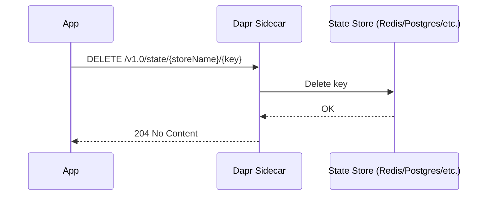

# How to Delete State Using the Dapr State Management API

Author: [nawazdhandala](https://www.github.com/nawazdhandala)

Tags: Dapr, State Management, API, Microservice

Description: Learn how to delete individual and bulk state entries using the Dapr State Management HTTP and gRPC APIs, including conditional deletes with ETags.

---

## Introduction

Deleting state is a common operation in distributed applications: expiring sessions, removing completed orders, clearing cache entries. Dapr's State Management API provides a straightforward HTTP `DELETE` endpoint and SDK methods for removing key-value entries from any configured state store. This guide covers individual deletes, conditional deletes with ETags, and bulk deletions using transactions.

## Delete State Flow



## Prerequisites

A running Dapr state store component. Example using Redis:

```yaml
apiVersion: dapr.io/v1alpha1
kind: Component
metadata:
  name: statestore
  namespace: default
spec:
  type: state.redis
  version: v1
  metadata:
    - name: redisHost
      value: redis-master:6379
    - name: redisPassword
      secretKeyRef:
        name: redis-secret
        key: redis-password
```

## Deleting a Single State Entry

```bash
# Delete a key
curl -X DELETE \
  http://localhost:3500/v1.0/state/statestore/order-123

# Returns: 204 No Content on success
```

If the key does not exist, Dapr still returns `204 No Content` (idempotent by default).

## Conditional Delete Using an ETag

An ETag-conditional delete ensures you only remove the entry if it has not been modified since you last read it. This prevents race conditions.

```bash
# Step 1: Get the current state and note the ETag
curl -v http://localhost:3500/v1.0/state/statestore/order-123
# Response headers include: ETag: "3"

# Step 2: Delete only if ETag matches
curl -X DELETE \
  http://localhost:3500/v1.0/state/statestore/order-123 \
  -H "If-Match: 3"

# If the ETag no longer matches: 409 Conflict
```

## Delete with Concurrency Options

Pass query parameters to control concurrency behaviour:

```bash
# First-write-wins: delete fails if another write happened since last read
curl -X DELETE \
  "http://localhost:3500/v1.0/state/statestore/order-123?concurrency=first-write" \
  -H "If-Match: 3"

# Last-write-wins: always delete regardless of concurrent writes
curl -X DELETE \
  "http://localhost:3500/v1.0/state/statestore/order-123?concurrency=last-write"
```

## Deleting State Using Dapr SDKs

### Python

```python
from dapr.clients import DaprClient

with DaprClient() as client:
    client.delete_state(
        store_name="statestore",
        key="order-123"
    )
    print("State deleted")
```

### Go

```go
package main

import (
    "context"
    dapr "github.com/dapr/go-sdk/client"
)

func main() {
    client, _ := dapr.NewClient()
    defer client.Close()

    err := client.DeleteState(context.Background(), "statestore", "order-123", nil)
    if err != nil {
        panic(err)
    }
}
```

### JavaScript / TypeScript

```typescript
import { DaprClient } from "@dapr/dapr";

const client = new DaprClient();

await client.state.delete("statestore", "order-123");
console.log("State deleted");
```

## Bulk Delete via Transactions

Dapr does not expose a dedicated bulk-delete HTTP endpoint, but you can delete multiple keys atomically using the transactional state API:

```bash
curl -X POST \
  http://localhost:3500/v1.0/state/statestore/transaction \
  -H "Content-Type: application/json" \
  -d '{
    "operations": [
      { "operation": "delete", "request": { "key": "order-100" } },
      { "operation": "delete", "request": { "key": "order-101" } },
      { "operation": "delete", "request": { "key": "order-102" } }
    ]
  }'
```

All deletions succeed or none do, depending on the state store's transaction support.

## Handling Delete Errors

```bash
# 409 Conflict - ETag mismatch (first-write-wins mode)
# Re-read the state, get the new ETag, and retry

# 500 Internal Server Error - state store unreachable
# Check the Dapr sidecar logs
kubectl logs deployment/myapp -c daprd | grep "state"
```

## Verifying Deletion

```bash
# After delete, a GET should return 204 No Content (key not found)
curl -v http://localhost:3500/v1.0/state/statestore/order-123
# Response: 204 No Content
```

## Summary

The Dapr State Management API makes deleting state simple and consistent across all supported backends. Use `DELETE /v1.0/state/{store}/{key}` for individual deletes, add an `If-Match` header with an ETag for conditional deletes, and use the transactional state API when you need to delete multiple keys atomically. All Dapr SDKs expose matching `delete_state` / `DeleteState` methods for language-native access.
