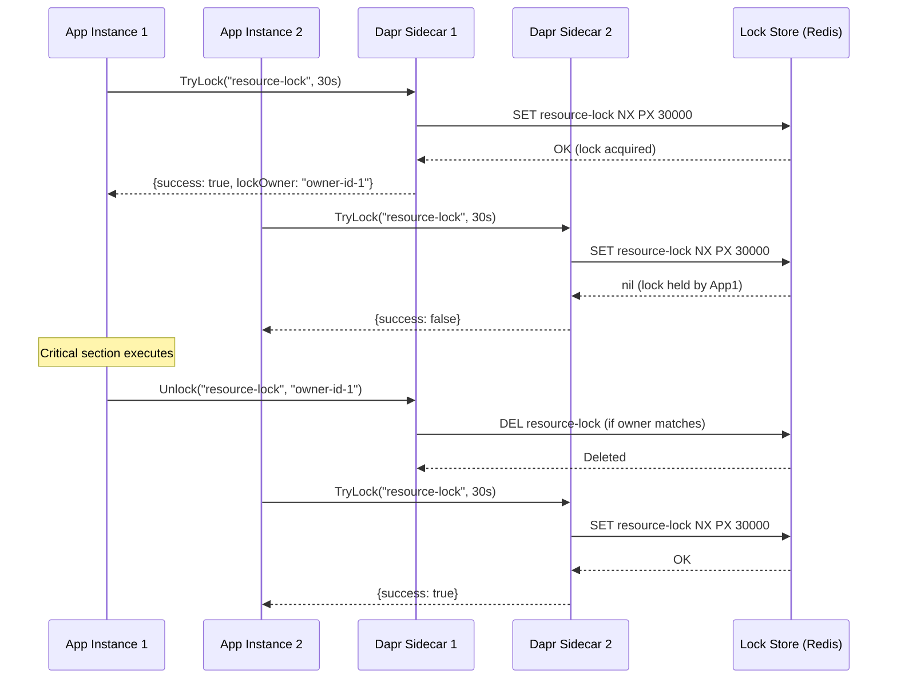
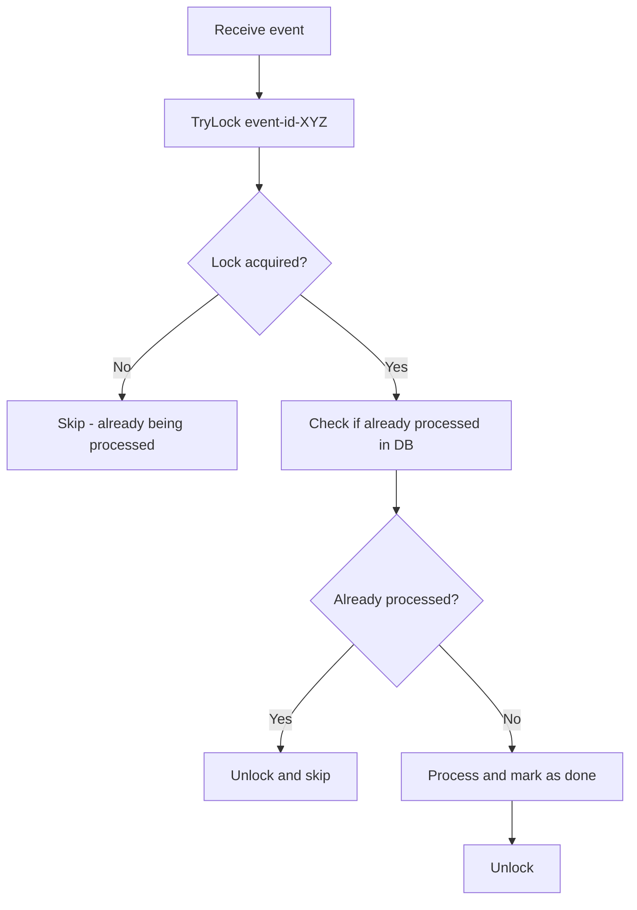

# How to Use Dapr Distributed Lock for Mutual Exclusion

Author: [nawazdhandala](https://www.github.com/nawazdhandala)

Tags: Dapr, Distributed Lock, Concurrency, Mutual Exclusion, Microservice

Description: Learn how to use Dapr's Distributed Lock API to implement mutual exclusion across distributed microservice instances, preventing race conditions in shared resource access.

---

## Introduction

In distributed systems, multiple instances of the same service may attempt to access or modify a shared resource simultaneously. Dapr's Distributed Lock API provides a building block for implementing mutual exclusion across service instances using a backing lock store (such as Redis). Unlike local in-process locks, Dapr distributed locks work across pods and processes.

Common use cases:
- Prevent duplicate cron job execution across multiple pods
- Serialize writes to a shared external resource
- Implement leader election for single-writer patterns
- Protect idempotency logic for critical sections

## How Distributed Locks Work



## Prerequisites

- Dapr v1.8 or later
- A lock store component configured (Redis recommended)
- Dapr initialized locally or on Kubernetes

## Step 1: Configure the Lock Store Component

```yaml
apiVersion: dapr.io/v1alpha1
kind: Component
metadata:
  name: redislock
  namespace: default
spec:
  type: lock.redis
  version: v1
  metadata:
  - name: redisHost
    value: "redis-master:6379"
  - name: redisPassword
    value: ""
  - name: enableTLS
    value: "false"
```

```bash
kubectl apply -f redislock.yaml
```

## Step 2: Acquire and Release Locks

### Via HTTP API

Acquire a lock:

```bash
curl -X POST \
  http://localhost:3500/v1.0-beta1/lock/redislock \
  -H "Content-Type: application/json" \
  -d '{
    "resourceId": "invoice-processor",
    "lockOwner": "pod-instance-01",
    "expiryInSeconds": 30
  }'
```

Response when acquired:

```json
{"success": true}
```

Response when failed (already held):

```json
{"success": false}
```

Release the lock:

```bash
curl -X POST \
  http://localhost:3500/v1.0-beta1/unlock/redislock \
  -H "Content-Type: application/json" \
  -d '{
    "resourceId": "invoice-processor",
    "lockOwner": "pod-instance-01"
  }'
```

Response:

```json
{"status": "SUCCESS"}
```

### Via Go SDK

```go
package main

import (
    "context"
    "fmt"
    "log"
    "time"

    dapr "github.com/dapr/go-sdk/client"
)

func processInvoices(client dapr.Client, instanceID string) error {
    ctx := context.Background()

    // Try to acquire the lock
    lockResp, err := client.TryLockAlpha1(ctx, "redislock", &dapr.LockRequest{
        LockOwner:         instanceID,
        ResourceID:        "invoice-processor",
        ExpiryInSeconds:   30,
    })
    if err != nil {
        return fmt.Errorf("lock request failed: %w", err)
    }

    if !lockResp.Success {
        fmt.Println("Another instance is processing invoices. Skipping.")
        return nil
    }

    fmt.Println("Lock acquired - processing invoices...")

    // Ensure lock is released when done
    defer func() {
        unlockResp, unlockErr := client.UnlockAlpha1(ctx, "redislock", &dapr.UnlockRequest{
            LockOwner:  instanceID,
            ResourceID: "invoice-processor",
        })
        if unlockErr != nil || unlockResp.Status != dapr.LockStatusSuccess {
            log.Printf("Warning: failed to release lock: %v %v", unlockErr, unlockResp)
        } else {
            fmt.Println("Lock released")
        }
    }()

    // --- Critical section ---
    time.Sleep(5 * time.Second) // Simulate processing
    fmt.Println("Invoice processing complete")
    // --- End critical section ---

    return nil
}

func main() {
    client, err := dapr.NewClient()
    if err != nil {
        log.Fatal(err)
    }
    defer client.Close()

    if err := processInvoices(client, "pod-instance-01"); err != nil {
        log.Fatal(err)
    }
}
```

### Via Python SDK

```python
import uuid
import time
from dapr.clients import DaprClient

def process_with_lock(resource_id: str, work_fn):
    owner_id = str(uuid.uuid4())

    with DaprClient() as client:
        # Try to acquire lock
        lock_response = client.try_lock(
            store_name='redislock',
            resource_id=resource_id,
            lock_owner=owner_id,
            expiry_in_seconds=30
        )

        if not lock_response.success:
            print(f"Could not acquire lock for '{resource_id}'. Another instance is active.")
            return

        print(f"Lock acquired for '{resource_id}'")
        try:
            work_fn()
        finally:
            unlock_response = client.unlock(
                store_name='redislock',
                resource_id=resource_id,
                lock_owner=owner_id
            )
            print(f"Lock released: {unlock_response.status}")

def invoice_processor():
    print("Processing invoices...")
    time.sleep(5)
    print("Done.")

process_with_lock('invoice-processor', invoice_processor)
```

## Lock Expiry and Automatic Release

The `expiryInSeconds` parameter ensures the lock is automatically released if the holder crashes before calling unlock. This prevents deadlocks where a crashed holder blocks all other instances forever.

Choose `expiryInSeconds` carefully:
- Too short: the holder may lose the lock mid-operation
- Too long: a crashed holder blocks others for too long

For long-running operations, implement lock renewal (refresh before expiry).

## Idempotency Pattern



## Summary

Dapr's Distributed Lock API provides a straightforward mechanism for mutual exclusion across distributed service instances. Acquire locks via `TryLock` with a resource ID and expiry, execute your critical section, and release with `Unlock`. The lock owner token ensures only the lock holder can release it. Lock expiry prevents deadlocks from crashed holders. Use distributed locks for cron deduplication, shared resource protection, and leader election in multi-instance deployments.
