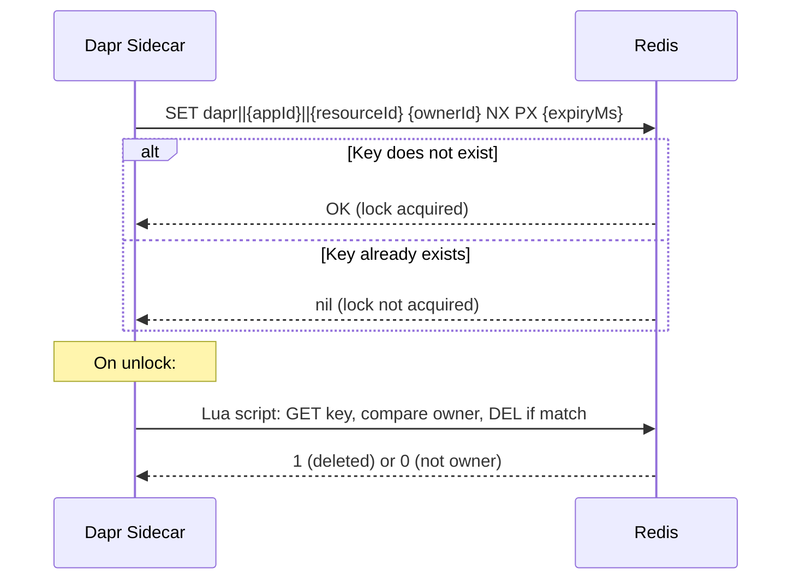

# How to Set Up Dapr Distributed Lock with Redis

Author: [nawazdhandala](https://www.github.com/nawazdhandala)

Tags: Dapr, Distributed Lock, Redis, Setup, Concurrency

Description: Learn how to configure the Dapr Redis distributed lock component, understand the underlying Redis locking mechanism, and tune it for production use.

---

## Introduction

Dapr's `lock.redis` component implements distributed locking using Redis's atomic `SET NX PX` command (set-if-not-exists with expiry). This leverages Redis's single-threaded command processing to guarantee at most one lock holder at a time. This guide covers the complete setup, configuration options, and production tuning for the Redis lock component.

## How Redis Locking Works in Dapr



Dapr uses a Lua script for atomic owner-verified unlock to prevent a scenario where one owner accidentally releases another owner's lock.

## Prerequisites

- Redis 6.x or higher
- Dapr v1.8 or later
- Dapr initialized locally or on Kubernetes

## Step 1: Deploy Redis

### Kubernetes (Helm)

```bash
helm repo add bitnami https://charts.bitnami.com/bitnami
helm install redis bitnami/redis \
  --namespace default \
  --set auth.enabled=false \
  --set master.persistence.enabled=true \
  --set master.persistence.size=1Gi
```

With authentication:

```bash
helm install redis bitnami/redis \
  --namespace default \
  --set auth.password=MyRedisPassword \
  --set master.persistence.enabled=true
```

### Local Docker

```bash
docker run -d \
  --name redis-lock \
  -p 6379:6379 \
  redis:7 \
  redis-server --save "" --appendonly no
```

## Step 2: Configure the Lock Component

### Without Authentication

```yaml
apiVersion: dapr.io/v1alpha1
kind: Component
metadata:
  name: redislock
  namespace: default
spec:
  type: lock.redis
  version: v1
  metadata:
  - name: redisHost
    value: "redis-master.default.svc.cluster.local:6379"
  - name: redisPassword
    value: ""
  - name: enableTLS
    value: "false"
  - name: redisMaxRetries
    value: "3"
  - name: redisMinRetryInterval
    value: "8ms"
  - name: redisMaxRetryInterval
    value: "512ms"
  - name: dialTimeout
    value: "5s"
  - name: readTimeout
    value: "3s"
  - name: writeTimeout
    value: "3s"
```

### With Authentication (Using secretKeyRef)

```yaml
apiVersion: dapr.io/v1alpha1
kind: Component
metadata:
  name: redislock
  namespace: default
spec:
  type: lock.redis
  version: v1
  metadata:
  - name: redisHost
    value: "redis-master.default.svc.cluster.local:6379"
  - name: redisPassword
    secretKeyRef:
      name: redis-secret
      key: password
  - name: enableTLS
    value: "false"
```

### Redis Sentinel (High Availability)

```yaml
apiVersion: dapr.io/v1alpha1
kind: Component
metadata:
  name: redislock
  namespace: default
spec:
  type: lock.redis
  version: v1
  metadata:
  - name: redisHost
    value: "redis-sentinel.default.svc.cluster.local:26379"
  - name: sentinelMasterName
    value: "mymaster"
  - name: redisPassword
    value: ""
  - name: failover
    value: "true"
```

## Step 3: Apply and Verify

```bash
kubectl apply -f redislock.yaml

# Verify the component loaded correctly
kubectl logs deployment/your-app -c daprd | grep -i lock
```

You should see:

```
level=info msg="Component loaded: redislock (lock.redis/v1)"
```

## Step 4: Test the Lock Component

Use the Dapr HTTP API to test manually:

```bash
# Start a test app with Dapr
dapr run --app-id test-app --dapr-http-port 3500 --components-path ./components -- sleep 300 &

# Acquire lock
curl -X POST http://localhost:3500/v1.0-beta1/lock/redislock \
  -H "Content-Type: application/json" \
  -d '{"resourceId": "test-resource", "lockOwner": "test-owner-1", "expiryInSeconds": 60}'

# Verify in Redis
redis-cli KEYS "dapr*"
redis-cli TTL "dapr||test-app||test-resource"

# Release lock
curl -X POST http://localhost:3500/v1.0-beta1/unlock/redislock \
  -H "Content-Type: application/json" \
  -d '{"resourceId": "test-resource", "lockOwner": "test-owner-1"}'
```

## Component Configuration Reference

| Metadata Key | Description | Default |
|---|---|---|
| `redisHost` | Redis host:port | `localhost:6379` |
| `redisPassword` | Redis password | (empty) |
| `enableTLS` | Enable TLS connection | `false` |
| `failover` | Enable Sentinel failover | `false` |
| `sentinelMasterName` | Sentinel master name | (required if failover=true) |
| `redisMaxRetries` | Max retry attempts | `3` |
| `redisMinRetryInterval` | Min backoff between retries | `8ms` |
| `redisMaxRetryInterval` | Max backoff between retries | `512ms` |
| `dialTimeout` | Timeout for new connections | `5s` |
| `readTimeout` | Timeout for read operations | `3s` |
| `writeTimeout` | Timeout for write operations | `3s` |

## Production Tuning

For production, use Redis with persistence and replication. Note that Redlock (the distributed lock algorithm for multi-node Redis) is not currently supported by Dapr's Redis lock component - Dapr uses single-node Redis locks. For stronger guarantees, use Redis Sentinel or Redis Cluster with appropriate timeout settings.

```yaml
# Redis key naming in Dapr lock component
# dapr||{appId}||{resourceId}
# TTL is set per the expiryInSeconds parameter
```

Monitor lock contention:

```bash
redis-cli MONITOR | grep "dapr||"
```

## Summary

The Dapr Redis lock component uses Redis's atomic `SET NX PX` command to implement distributed locking. Configure it with your Redis host, optional authentication, and timeout settings. For production, use Redis Sentinel for high availability. Test lock acquisition and release with the HTTP API before integrating into your application. Set `expiryInSeconds` conservatively to balance safety (auto-release on crash) with durability (enough time for the critical section to complete).
