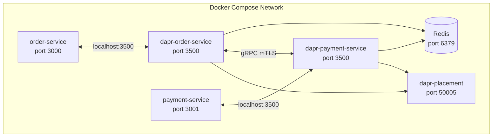

# How to Use Dapr with Docker Compose

Author: [nawazdhandala](https://www.github.com/nawazdhandala)

Tags: Dapr, Docker Compose, Local Development, Self-Hosted, Container

Description: Configure Dapr sidecars alongside your application containers in Docker Compose for local multi-service development without Kubernetes.

---

## Why Docker Compose with Dapr?

Docker Compose lets you run multiple services locally in containers. Adding Dapr sidecars to a Compose setup gives you the full Dapr building block API surface (state, pub/sub, service invocation) for local integration testing that closely mirrors production.



## Project Structure

```text
my-app/
  components/
    statestore.yaml
    pubsub.yaml
  config.yaml
  docker-compose.yaml
  order-service/
    Dockerfile
    app.py
  payment-service/
    Dockerfile
    app.py
```

## Component Files

```yaml
# components/statestore.yaml
apiVersion: dapr.io/v1alpha1
kind: Component
metadata:
  name: statestore
spec:
  type: state.redis
  version: v1
  metadata:
  - name: redisHost
    value: redis:6379
  - name: redisPassword
    value: ""
  - name: actorStateStore
    value: "true"
```

```yaml
# components/pubsub.yaml
apiVersion: dapr.io/v1alpha1
kind: Component
metadata:
  name: pubsub
spec:
  type: pubsub.redis
  version: v1
  metadata:
  - name: redisHost
    value: redis:6379
  - name: redisPassword
    value: ""
```

```yaml
# config.yaml
apiVersion: dapr.io/v1alpha1
kind: Configuration
metadata:
  name: appconfig
spec:
  tracing:
    samplingRate: "1"
    zipkin:
      endpointAddress: http://zipkin:9411/api/v2/spans
```

## docker-compose.yaml

```yaml
version: "3.8"

services:
  # Infrastructure
  redis:
    image: redis:7-alpine
    ports:
    - "6379:6379"
    healthcheck:
      test: ["CMD", "redis-cli", "ping"]
      interval: 5s
      timeout: 3s
      retries: 5

  zipkin:
    image: openzipkin/zipkin:latest
    ports:
    - "9411:9411"

  dapr-placement:
    image: daprio/dapr:1.14.0
    command: ["./placement", "-port", "50005", "-log-level", "warn"]
    ports:
    - "50005:50005"

  # Order Service
  order-service:
    build: ./order-service
    ports:
    - "3000:3000"
    environment:
    - DAPR_HTTP_PORT=3500
    - DAPR_GRPC_PORT=50001
    depends_on:
      redis:
        condition: service_healthy
    healthcheck:
      test: ["CMD", "curl", "-f", "http://localhost:3000/health"]
      interval: 10s
      timeout: 5s
      retries: 3

  dapr-order-service:
    image: daprio/daprd:1.14.0
    command: [
      "./daprd",
      "--app-id", "order-service",
      "--app-port", "3000",
      "--dapr-http-port", "3500",
      "--dapr-grpc-port", "50001",
      "--resources-path", "/components",
      "--config", "/config/config.yaml",
      "--placement-host-address", "dapr-placement:50005",
      "--log-level", "info"
    ]
    volumes:
    - ./components:/components
    - ./config:/config
    network_mode: "service:order-service"  # share network namespace
    depends_on:
    - order-service
    - dapr-placement

  # Payment Service
  payment-service:
    build: ./payment-service
    ports:
    - "3001:3001"
    environment:
    - DAPR_HTTP_PORT=3500
    - DAPR_GRPC_PORT=50001
    depends_on:
      redis:
        condition: service_healthy

  dapr-payment-service:
    image: daprio/daprd:1.14.0
    command: [
      "./daprd",
      "--app-id", "payment-service",
      "--app-port", "3001",
      "--dapr-http-port", "3500",
      "--dapr-grpc-port", "50001",
      "--resources-path", "/components",
      "--config", "/config/config.yaml",
      "--placement-host-address", "dapr-placement:50005",
      "--log-level", "info"
    ]
    volumes:
    - ./components:/components
    - ./config:/config
    network_mode: "service:payment-service"
    depends_on:
    - payment-service
    - dapr-placement
```

The key pattern is `network_mode: "service:<app-service>"`. This makes the sidecar share the same network namespace as the application container, so the app can call `localhost:3500` and reach the Dapr sidecar.

## Application Code

```python
# order-service/app.py
from flask import Flask, request, jsonify
import requests, os

app = Flask(__name__)
DAPR_PORT = os.getenv('DAPR_HTTP_PORT', '3500')

@app.route('/health')
def health():
    return '', 200

@app.route('/place-order', methods=['POST'])
def place_order():
    order = request.get_json()

    # Save state
    requests.post(
        f"http://localhost:{DAPR_PORT}/v1.0/state/statestore",
        json=[{"key": f"order-{order['id']}", "value": order}]
    )

    # Call payment service
    payment_resp = requests.post(
        f"http://localhost:{DAPR_PORT}/v1.0/invoke/payment-service/method/pay",
        json={"orderId": order['id'], "amount": order['total']}
    )

    return jsonify({"success": True, "payment": payment_resp.json()})

app.run(host='0.0.0.0', port=3000)
```

## Running the Stack

```bash
docker compose up --build
```

Test:

```bash
curl -X POST http://localhost:3000/place-order \
  -H "Content-Type: application/json" \
  -d '{"id": "ord-1", "total": 99.99}'
```

## Stopping and Cleaning Up

```bash
docker compose down
docker compose down -v   # also remove volumes
```

## Health Check for Dapr Sidecar

Add a depends_on condition to ensure the sidecar is healthy before the app starts consuming it:

```yaml
order-service:
  depends_on:
    dapr-order-service:
      condition: service_started
```

Or poll the sidecar health endpoint in your app startup:

```python
import time
def wait_for_sidecar():
    for _ in range(30):
        try:
            r = requests.get(f"http://localhost:{DAPR_PORT}/v1.0/healthz", timeout=1)
            if r.status_code == 204:
                return
        except:
            pass
        time.sleep(1)
    raise Exception("Sidecar not ready")

wait_for_sidecar()
```

## Summary

Running Dapr with Docker Compose requires a sidecar container (`daprio/daprd`) per application service, configured with `network_mode: "service:<app>"` to share the application's network namespace. This lets your app call `localhost:3500` to reach the sidecar. Infrastructure services (Redis, placement, Zipkin) are also defined in Compose. Components and configuration are mounted as volumes into the sidecar containers.
