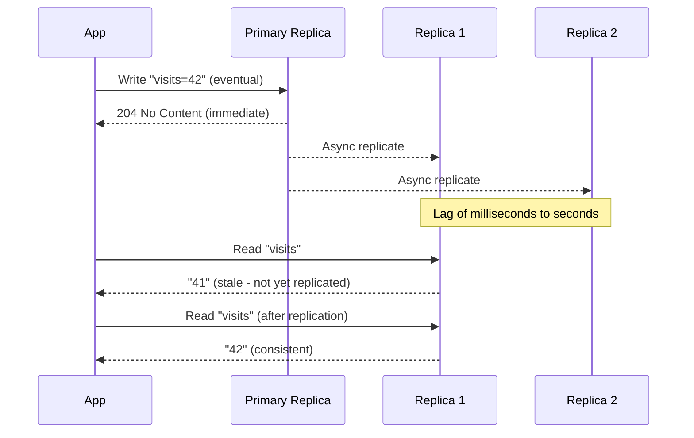

# How to Use Eventual Consistency for Dapr State Operations

Author: [OneUptime](https://oneuptime.com)

Tags: Dapr, State Management, Consistency, Microservice, Performance

Description: Learn when and how to use eventual consistency mode in Dapr State Management to maximise throughput and availability for workloads that tolerate briefly stale reads.

---

## Introduction

Eventual consistency trades read freshness for lower latency and higher availability. In Dapr, it is the default consistency mode for most state stores. Writes are acknowledged as soon as the primary node commits the data; replicas catch up asynchronously. This makes it ideal for user sessions, caches, counters, and other workloads where briefly stale data is acceptable.

## How Eventual Consistency Works



## Setting Eventual Consistency on Save

### HTTP API

```bash
curl -X POST http://localhost:3500/v1.0/state/statestore \
  -H "Content-Type: application/json" \
  -d '[{
    "key": "page-views-home",
    "value": {"count": 10042},
    "options": {
      "consistency": "eventual",
      "concurrency": "last-write"
    }
  }]'
```

Since eventual consistency is the default, you can omit the `options` object entirely for most use cases:

```bash
curl -X POST http://localhost:3500/v1.0/state/statestore \
  -H "Content-Type: application/json" \
  -d '[{"key": "page-views-home", "value": {"count": 10042}}]'
```

### Python SDK

```python
from dapr.clients import DaprClient
from dapr.clients.grpc._state import StateOptions, Consistency, Concurrency
import json

with DaprClient() as client:
    client.save_state(
        store_name="statestore",
        key="page-views-home",
        value=json.dumps({"count": 10042}),
        options=StateOptions(
            consistency=Consistency.eventual,
            concurrency=Concurrency.last_write
        )
    )
```

## Setting Eventual Consistency on Read

```bash
curl "http://localhost:3500/v1.0/state/statestore/page-views-home?consistency=eventual"
```

The sidecar may route the read to any replica, potentially returning a slightly stale value but responding faster.

## High-Throughput Counter Pattern

Eventual consistency pairs well with last-write-wins concurrency for counters:

```python
def increment_page_view(page_id: str):
    with DaprClient() as client:
        result = client.get_state("statestore", f"views-{page_id}")
        count = json.loads(result.data).get("count", 0) if result.data else 0

        client.save_state(
            store_name="statestore",
            key=f"views-{page_id}",
            value=json.dumps({"count": count + 1}),
            options=StateOptions(
                consistency=Consistency.eventual,
                concurrency=Concurrency.last_write
            )
        )
```

With last-write-wins and eventual consistency, the system accepts every write without conflict, maximising throughput. Individual increments may be lost in concurrent scenarios, but this is acceptable for approximate counters (page views, like counts).

## Session State with Eventual Consistency

User sessions are a perfect fit for eventual consistency:

```python
def save_session(session_id: str, user_data: dict):
    with DaprClient() as client:
        client.save_state(
            store_name="statestore",
            key=f"session-{session_id}",
            value=json.dumps(user_data)
            # No options = eventual consistency by default
        )

def get_session(session_id: str) -> dict:
    with DaprClient() as client:
        result = client.get_state("statestore", f"session-{session_id}")
        return json.loads(result.data) if result.data else {}
```

## Redis Configuration for Eventual Consistency

Redis with replication uses eventual consistency by default. The Dapr component does not require special settings:

```yaml
apiVersion: dapr.io/v1alpha1
kind: Component
metadata:
  name: statestore
spec:
  type: state.redis
  version: v1
  metadata:
    - name: redisHost
      value: redis-master:6379
    - name: redisPassword
      secretKeyRef:
        name: redis-secret
        key: redis-password
    # No consistency override needed - eventual is the default
```

## When Not to Use Eventual Consistency

Avoid eventual consistency when:

- You need read-after-write guarantees (e.g., "show the user their just-submitted order").
- The application involves financial transactions or inventory deductions.
- Stale reads would cause incorrect business logic.

For these cases use `consistency: strong` as documented in the strong consistency guide.

## Latency Comparison

```bash
# Benchmark eventual vs strong consistency
for mode in eventual strong; do
  echo "=== $mode ==="
  for i in $(seq 1 5); do
    time curl -s -X POST http://localhost:3500/v1.0/state/statestore \
      -H "Content-Type: application/json" \
      -d "[{\"key\":\"bench-$i\",\"value\":\"v\",\"options\":{\"consistency\":\"$mode\"}}]" \
      > /dev/null
  done
done
```

Typical results show eventual consistency responding 20-50% faster in replicated configurations.

## Summary

Eventual consistency is the default mode in Dapr State Management and the right choice for high-throughput, latency-sensitive workloads where brief staleness is tolerable: page-view counters, session data, caches, and approximate metrics. Explicitly set it with `consistency: eventual` in your request options or simply omit the options to accept the default. Combine with `concurrency: last-write` for maximum write throughput, and switch to strong consistency only when correctness requires the latest committed value.
