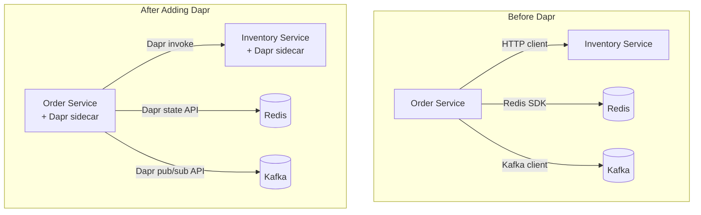
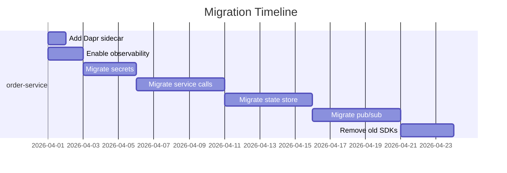

# How to Use Dapr with an Existing Microservices Application

Author: [nawazdhandala](https://www.github.com/nawazdhandala)

Tags: Dapr, Microservice, Migration, Integration, Kubernetes

Description: Learn how to incrementally add Dapr to an existing microservices application without rewriting services, covering sidecar injection, gradual adoption, and SDK integration strategies.

---

## The Challenge of Adding Dapr to Existing Services

Existing microservices already have their own communication patterns, SDKs, and infrastructure integrations. Adding Dapr should be incremental - you do not need to rewrite all services or adopt every building block at once.



## Step 1 - Add Dapr Without Changing Code

The first step is purely operational: add a Dapr sidecar to your existing pods. Your services continue to use their existing SDKs.

```yaml
# Add these annotations to your existing Deployment
metadata:
  annotations:
    dapr.io/enabled: "true"
    dapr.io/app-id: "order-service"
    dapr.io/app-port: "8080"
    dapr.io/app-protocol: "http"
```

Your application code does not change. The sidecar runs alongside it and does nothing until you call its APIs.

Verify the sidecar was injected:

```bash
kubectl get pod <pod-name> -o jsonpath='{.spec.containers[*].name}'
# output: order-service daprd
```

## Step 2 - Enable Observability First

The quickest win when adding Dapr is enabling distributed tracing and metrics with zero code changes.

```yaml
# tracing-config.yaml
apiVersion: dapr.io/v1alpha1
kind: Configuration
metadata:
  name: tracing-config
  namespace: default
spec:
  tracing:
    samplingRate: "1"
    otel:
      endpointAddress: http://otel-collector.monitoring:4317
      isSecure: false
      protocol: grpc
  metric:
    enabled: true
```

```bash
kubectl apply -f tracing-config.yaml
```

Reference it from your deployment:

```yaml
annotations:
  dapr.io/config: "tracing-config"
```

Now every Dapr API call is traced and Prometheus metrics are available at port `9090`.

## Step 3 - Migrate One Integration at a Time

Do not migrate everything at once. Choose the integration with the most operational pain:

### Migrating Secret Retrieval

Before:

```python
import boto3
client = boto3.client('secretsmanager')
secret = client.get_secret_value(SecretId='db-password')['SecretString']
```

After (using Dapr secrets API):

```python
import requests, os

def get_secret(name, store='aws-secrets-manager'):
    port = os.getenv('DAPR_HTTP_PORT', '3500')
    r = requests.get(f"http://localhost:{port}/v1.0/secrets/{store}/{name}")
    return r.json()[name]

secret = get_secret('db-password')
```

Secret store component:

```yaml
apiVersion: dapr.io/v1alpha1
kind: Component
metadata:
  name: aws-secrets-manager
spec:
  type: secretstores.aws.secretmanager
  version: v1
  metadata:
  - name: region
    value: us-east-1
```

### Migrating Service-to-Service Calls

Before (using HTTP client with hardcoded hostname):

```go
resp, err := http.Get("http://inventory-service.default.svc.cluster.local:8080/stock/123")
```

After (using Dapr service invocation):

```go
daprPort := os.Getenv("DAPR_HTTP_PORT")
resp, err := http.Get(fmt.Sprintf("http://localhost:%s/v1.0/invoke/inventory-service/method/stock/123", daprPort))
```

This automatically adds mTLS, retries, and distributed traces.

### Migrating State Management

Before (using Redis SDK directly):

```javascript
const redis = require('redis');
const client = redis.createClient({ url: 'redis://redis:6379' });
await client.set('session:user1', JSON.stringify(sessionData));
```

After (using Dapr state API):

```javascript
const axios = require('axios');
const DAPR_PORT = process.env.DAPR_HTTP_PORT || 3500;

await axios.post(`http://localhost:${DAPR_PORT}/v1.0/state/statestore`, [
  { key: 'session:user1', value: sessionData }
]);
```

Now you can swap Redis for another backend by changing a YAML file.

### Migrating Pub/Sub

Before (using Kafka SDK):

```java
ProducerRecord<String, String> record = new ProducerRecord<>("orders", orderId, payload);
producer.send(record);
```

After (using Dapr pub/sub API):

```java
String daprPort = System.getenv("DAPR_HTTP_PORT");
HttpClient.newHttpClient().send(
    HttpRequest.newBuilder()
        .uri(URI.create("http://localhost:" + daprPort + "/v1.0/publish/pubsub/orders"))
        .header("Content-Type", "application/json")
        .POST(HttpRequest.BodyPublishers.ofString(payload))
        .build(),
    HttpResponse.BodyHandlers.ofString()
);
```

## Handling Subscription Registration

For pub/sub, your app must expose a `/dapr/subscribe` endpoint:

```python
@app.route('/dapr/subscribe', methods=['GET'])
def subscribe():
    return jsonify([{
        "pubsubname": "pubsub",
        "topic": "orders",
        "route": "/handle-order"
    }])
```

Or use a declarative subscription CRD (no code change required):

```yaml
apiVersion: dapr.io/v2alpha1
kind: Subscription
metadata:
  name: order-sub
spec:
  topic: orders
  routes:
    default: /handle-order
  pubsubname: pubsub
  scopes:
  - order-processor
```

## Coexistence Strategy

During migration, services can use both their old SDKs and Dapr APIs simultaneously:



## Using the Dapr SDK for Cleaner Code

Once you are comfortable with the HTTP API, optionally adopt a Dapr SDK:

```bash
# Python
pip install dapr

# JavaScript/TypeScript
npm install @dapr/dapr

# Java
# Add to pom.xml
# <dependency>
#   <groupId>io.dapr</groupId>
#   <artifactId>dapr-sdk</artifactId>
# </dependency>

# Go
go get github.com/dapr/go-sdk/client
```

The SDKs are thin wrappers over the HTTP/gRPC API and do not lock you in.

## Verifying Migration

```bash
# Check all loaded components
curl http://localhost:3500/v1.0/metadata | jq '.registeredComponents'

# Check active subscriptions
curl http://localhost:3500/v1.0/metadata | jq '.subscriptions'

# Run a test state write
curl -X POST http://localhost:3500/v1.0/state/statestore \
  -H "Content-Type: application/json" \
  -d '[{"key": "test", "value": "hello"}]'
```

## Summary

Adding Dapr to existing microservices starts with injecting sidecars via pod annotations and enabling distributed tracing without code changes. From there, migrate one integration at a time - secrets, service calls, state management, and pub/sub - replacing SDK calls with Dapr HTTP API calls. Declarative subscriptions allow pub/sub adoption with no application code changes. Old SDKs can coexist with Dapr APIs during the transition, and Dapr SDKs provide a cleaner interface once the migration is complete.
