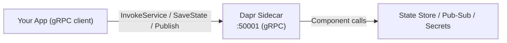

# How to Understand Dapr gRPC Interface for SDK Development

Author: [nawazdhandala](https://www.github.com/nawazdhandala)

Tags: Dapr, gRPC, SDK, Protobuf, Microservice

Description: Explore the Dapr gRPC interface used by official SDKs, including proto definitions, runtime API calls, and how to build a custom SDK client from scratch.

---

## Overview

Dapr exposes its runtime API through both HTTP and gRPC. All official Dapr SDKs (Go, Python, Java, .NET, JavaScript) communicate with the Dapr sidecar over gRPC under the hood. Understanding this interface lets you build custom SDKs, debug SDK behaviour, and make direct gRPC calls without relying on a published SDK.

## Dapr gRPC Architecture



## Core Proto Files

Dapr's gRPC interface is defined in the `dapr/proto` repository. The two main service definitions are:

| Proto file | Service | Purpose |
|---|---|---|
| `dapr/proto/runtime/v1/dapr.proto` | `Dapr` | Client calls into the sidecar (state, pub/sub, secrets, actors) |
| `dapr/proto/runtime/v1/appcallback.proto` | `AppCallback` | Sidecar calls back into your app (invoke, subscribe) |

Clone the protos:

```bash
git clone https://github.com/dapr/dapr.git
ls dapr/dapr/proto/runtime/v1/
# dapr.proto  appcallback.proto
```

## Key RPC Methods in dapr.proto

```protobuf
service Dapr {
  // Service invocation
  rpc InvokeService(InvokeServiceRequest) returns (InvokeResponse);

  // State management
  rpc GetState(GetStateRequest) returns (GetStateResponse);
  rpc SaveState(SaveStateRequest) returns (google.protobuf.Empty);
  rpc DeleteState(DeleteStateRequest) returns (google.protobuf.Empty);
  rpc ExecuteStateTransaction(ExecuteStateTransactionRequest) returns (google.protobuf.Empty);
  rpc QueryStateAlpha1(QueryStateRequest) returns (QueryStateResponse);

  // Publish / Subscribe
  rpc PublishEvent(PublishEventRequest) returns (google.protobuf.Empty);
  rpc BulkPublishEventAlpha1(BulkPublishRequest) returns (BulkPublishResponse);

  // Secrets
  rpc GetSecret(GetSecretRequest) returns (GetSecretResponse);
  rpc GetBulkSecret(GetBulkSecretRequest) returns (GetBulkSecretResponse);

  // Actors
  rpc RegisterActorTimer(RegisterActorTimerRequest) returns (google.protobuf.Empty);
  rpc UnregisterActorTimer(UnregisterActorTimerRequest) returns (google.protobuf.Empty);
  rpc RegisterActorReminder(RegisterActorReminderRequest) returns (google.protobuf.Empty);

  // Workflow
  rpc StartWorkflowAlpha1(StartWorkflowRequest) returns (StartWorkflowResponse);
  rpc GetWorkflowAlpha1(GetWorkflowRequest) returns (GetWorkflowResponse);

  // Cryptography
  rpc EncryptAlpha1(stream EncryptRequest) returns (stream EncryptResponse);
  rpc DecryptAlpha1(stream DecryptRequest) returns (stream DecryptResponse);
}
```

## AppCallback RPC Methods

Your app must implement the `AppCallback` service so the sidecar can deliver invocations and pub/sub messages:

```protobuf
service AppCallback {
  // Called when another service invokes your app
  rpc OnInvoke(InvokeRequest) returns (InvokeResponse);

  // Called to retrieve pub/sub subscriptions
  rpc ListTopicSubscriptions(google.protobuf.Empty) returns (ListTopicSubscriptionsResponse);

  // Called when a pub/sub message arrives
  rpc OnTopicEvent(TopicEventRequest) returns (TopicEventResponse);

  // Called to retrieve actor configurations
  rpc GetConfigurationAlpha1(ConfigurationItem) returns (ConfigurationResponse);
}
```

## Step 1: Generate Go Code from the Protos

```bash
# Install code generation tools
go install google.golang.org/protobuf/cmd/protoc-gen-go@latest
go install google.golang.org/grpc/cmd/protoc-gen-go-grpc@latest

# Generate
protoc \
  --go_out=./gen --go_opt=paths=source_relative \
  --go-grpc_out=./gen --go-grpc_opt=paths=source_relative \
  -I dapr/dapr/proto \
  dapr/dapr/proto/runtime/v1/dapr.proto \
  dapr/dapr/proto/common/v1/common.proto
```

## Step 2: Connect to the Dapr Sidecar

The Dapr sidecar listens on `DAPR_GRPC_PORT` (default `50001`):

```go
package main

import (
    "context"
    "fmt"
    "log"
    "os"

    "google.golang.org/grpc"
    "google.golang.org/grpc/credentials/insecure"

    pb "github.com/example/dapr-custom-sdk/gen/runtime/v1"
    commonpb "github.com/example/dapr-custom-sdk/gen/common/v1"
)

func daprPort() string {
    p := os.Getenv("DAPR_GRPC_PORT")
    if p == "" {
        return "50001"
    }
    return p
}

func main() {
    conn, err := grpc.Dial(
        "localhost:"+daprPort(),
        grpc.WithTransportCredentials(insecure.NewCredentials()),
    )
    if err != nil {
        log.Fatalf("failed to connect to Dapr sidecar: %v", err)
    }
    defer conn.Close()

    client := pb.NewDaprClient(conn)

    // Save state
    _, err = client.SaveState(context.Background(), &pb.SaveStateRequest{
        StoreName: "statestore",
        States: []*commonpb.StateItem{
            {
                Key:   "mykey",
                Value: []byte(`"hello from custom SDK"`),
            },
        },
    })
    if err != nil {
        log.Fatalf("SaveState failed: %v", err)
    }

    // Get state
    resp, err := client.GetState(context.Background(), &pb.GetStateRequest{
        StoreName: "statestore",
        Key:       "mykey",
    })
    if err != nil {
        log.Fatalf("GetState failed: %v", err)
    }

    fmt.Printf("Value: %s\n", resp.Data)
}
```

## Step 3: Implement AppCallback for Invocation and Pub/Sub

```go
package main

import (
    "context"
    "fmt"
    "net"

    "google.golang.org/grpc"
    "google.golang.org/protobuf/types/known/anypb"
    "google.golang.org/protobuf/types/known/emptypb"

    runtimepb "github.com/example/dapr-custom-sdk/gen/runtime/v1"
    commonpb "github.com/example/dapr-custom-sdk/gen/common/v1"
)

type appCallbackServer struct {
    runtimepb.UnimplementedAppCallbackServer
}

func (s *appCallbackServer) OnInvoke(
    ctx context.Context, req *commonpb.InvokeRequest,
) (*commonpb.InvokeResponse, error) {
    fmt.Printf("OnInvoke: method=%s data=%s\n", req.Method, req.Data.Value)
    return &commonpb.InvokeResponse{
        Data: &anypb.Any{Value: []byte(`{"status":"ok"}`)},
    }, nil
}

func (s *appCallbackServer) ListTopicSubscriptions(
    ctx context.Context, _ *emptypb.Empty,
) (*runtimepb.ListTopicSubscriptionsResponse, error) {
    return &runtimepb.ListTopicSubscriptionsResponse{
        Subscriptions: []*runtimepb.TopicSubscription{
            {PubsubName: "pubsub", Topic: "orders"},
        },
    }, nil
}

func (s *appCallbackServer) OnTopicEvent(
    ctx context.Context, req *runtimepb.TopicEventRequest,
) (*runtimepb.TopicEventResponse, error) {
    fmt.Printf("OnTopicEvent: topic=%s data=%s\n", req.Topic, req.Data)
    return &runtimepb.TopicEventResponse{
        Status: runtimepb.TopicEventResponse_SUCCESS,
    }, nil
}

func main() {
    lis, _ := net.Listen("tcp", ":6000")
    s := grpc.NewServer()
    runtimepb.RegisterAppCallbackServer(s, &appCallbackServer{})
    s.Serve(lis)
}
```

## Step 4: Invoke a Remote Service via gRPC

```go
resp, err := client.InvokeService(context.Background(), &pb.InvokeServiceRequest{
    Id: "target-app-id",
    Message: &commonpb.InvokeRequest{
        Method:      "myMethod",
        ContentType: "application/json",
        Data:        &anypb.Any{Value: []byte(`{"key":"value"}`)},
        HttpExtension: &commonpb.HTTPExtension{
            Verb: commonpb.HTTPExtension_POST,
        },
    },
})
```

## Step 5: Publish an Event via gRPC

```go
_, err = client.PublishEvent(context.Background(), &pb.PublishEventRequest{
    PubsubName:      "pubsub",
    Topic:           "orders",
    Data:            []byte(`{"orderId": 42}`),
    DataContentType: "application/json",
})
```

## Message Envelope Reference

Key proto message types used across SDK calls:

| Message | Fields | Used by |
|---|---|---|
| `StateItem` | `key`, `value`, `etag`, `options` | SaveState |
| `InvokeRequest` | `method`, `data`, `content_type`, `http_extension` | InvokeService |
| `PublishEventRequest` | `pubsub_name`, `topic`, `data`, `data_content_type`, `metadata` | PublishEvent |
| `GetSecretRequest` | `store_name`, `key`, `metadata` | GetSecret |

## gRPC Metadata Headers

The Dapr sidecar uses gRPC metadata for cross-cutting concerns:

```go
import "google.golang.org/grpc/metadata"

md := metadata.Pairs(
    "dapr-app-id", "target-service",  // for service invocation routing
    "traceparent", "00-...",           // W3C trace context
)
ctx := metadata.NewOutgoingContext(context.Background(), md)
```

## Summary

Dapr's gRPC interface is defined in two proto services: `Dapr` (for app-to-sidecar calls) and `AppCallback` (for sidecar-to-app callbacks). By generating code from these protos you can build a custom SDK in any language that supports gRPC. The sidecar listens on `DAPR_GRPC_PORT` (default `50001`) and your app must expose `AppCallback` for invocation and pub/sub delivery. Understanding this contract is the foundation for writing any Dapr SDK or debugging unexpected SDK behaviour.
