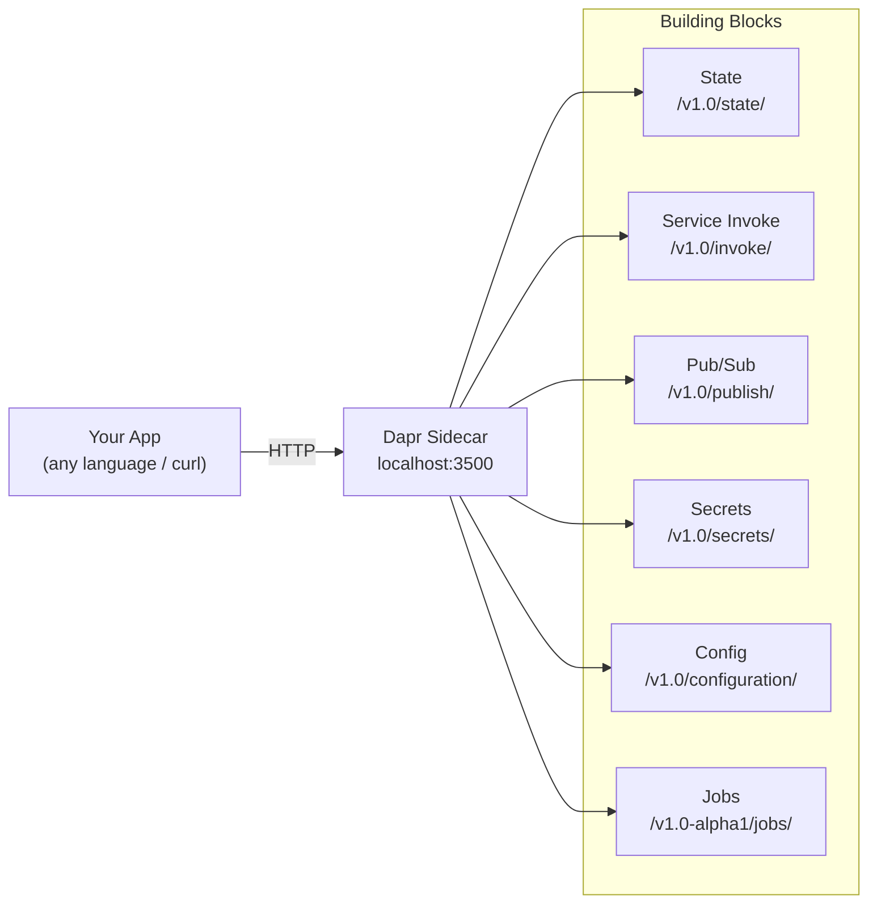

# How to Use Dapr HTTP API Directly Without SDK

Author: [nawazdhandala](https://www.github.com/nawazdhandala)

Tags: Dapr, HTTP, API, Microservice, REST

Description: Interact with the Dapr sidecar HTTP API directly using curl or any HTTP client without relying on a language-specific Dapr SDK.

---

## Overview

Every Dapr capability is exposed through a local HTTP API on port `3500` (configurable via `--dapr-http-port`). Any language or tool that can make HTTP requests can use Dapr without an official SDK. This is useful for polyglot environments, shells scripts, or languages without an official SDK.

## Dapr HTTP API Surface



## Base URL

All calls are made to `http://localhost:${DAPR_HTTP_PORT}` from within the same pod or process.

```bash
export DAPR_HTTP_PORT=3500
export DAPR_BASE=http://localhost:${DAPR_HTTP_PORT}
```

## State Management

### Save State

```bash
curl -X POST ${DAPR_BASE}/v1.0/state/statestore \
  -H "Content-Type: application/json" \
  -d '[
    {
      "key": "order-1",
      "value": {"id": "order-1", "total": 99.95}
    }
  ]'
```

### Get State

```bash
curl ${DAPR_BASE}/v1.0/state/statestore/order-1
```

### Get State with ETag

```bash
curl -I ${DAPR_BASE}/v1.0/state/statestore/order-1
# Response headers include:
# ETag: "abc123"
```

### Save with ETag (Optimistic Concurrency)

```bash
curl -X POST ${DAPR_BASE}/v1.0/state/statestore \
  -H "Content-Type: application/json" \
  -d '[
    {
      "key": "order-1",
      "value": {"id": "order-1", "total": 149.00},
      "etag": "abc123",
      "options": {"concurrency": "first-write", "consistency": "strong"}
    }
  ]'
```

### Delete State

```bash
curl -X DELETE ${DAPR_BASE}/v1.0/state/statestore/order-1
```

### Bulk Get State

```bash
curl -X POST ${DAPR_BASE}/v1.0/state/statestore/bulk \
  -H "Content-Type: application/json" \
  -d '{"keys": ["order-1", "order-2"], "parallelism": 10}'
```

### State Transaction

```bash
curl -X POST ${DAPR_BASE}/v1.0/state/statestore/transaction \
  -H "Content-Type: application/json" \
  -d '{
    "operations": [
      {"operation": "upsert", "request": {"key": "order-2", "value": {"total": 49.99}}},
      {"operation": "delete", "request": {"key": "order-1"}}
    ]
  }'
```

## Service Invocation

```bash
# POST to another service
curl -X POST ${DAPR_BASE}/v1.0/invoke/inventory-service/method/checkStock \
  -H "Content-Type: application/json" \
  -d '{"productId": "sku-100"}'

# GET from another service
curl ${DAPR_BASE}/v1.0/invoke/inventory-service/method/getStock/sku-100
```

## Publish Events

```bash
curl -X POST ${DAPR_BASE}/v1.0/publish/pubsub/orders \
  -H "Content-Type: application/json" \
  -d '{"orderId": "order-1", "total": 99.95}'
```

Publish with metadata:

```bash
curl -X POST "${DAPR_BASE}/v1.0/publish/pubsub/orders?metadata.ttlInSeconds=60" \
  -H "Content-Type: application/json" \
  -d '{"orderId": "order-2"}'
```

## Retrieve Secrets

```bash
# Single secret
curl ${DAPR_BASE}/v1.0/secrets/secretstore/db-password

# Bulk secrets
curl ${DAPR_BASE}/v1.0/secrets/secretstore/bulk
```

## Receive Subscriptions (Your App Exposes These Endpoints)

Your app must expose these endpoints so the sidecar can call it:

```bash
# List subscriptions - called by the sidecar at startup
GET /dapr/subscribe
# Response:
# [{"pubsubname":"pubsub","topic":"orders","route":"/orders"}]

# Receive a pub/sub message
POST /orders
# Body: CloudEvent envelope with your data

# Receive service invocations
POST /processOrder
# Body: your payload
```

## Configuration API

```bash
# Get a configuration item
curl "${DAPR_BASE}/v1.0/configuration/configstore?key=feature-flags"

# Subscribe to configuration changes
curl "${DAPR_BASE}/v1.0/configuration/configstore/subscribe?key=feature-flags"
```

## Distributed Lock API

```bash
# Acquire lock
curl -X POST ${DAPR_BASE}/v1.0-beta1/lock/lockstore \
  -H "Content-Type: application/json" \
  -d '{"resourceId": "resource1", "lockOwner": "app-instance-1", "expiryInSeconds": 60}'

# Release lock
curl -X POST ${DAPR_BASE}/v1.0-beta1/unlock/lockstore \
  -H "Content-Type: application/json" \
  -d '{"resourceId": "resource1", "lockOwner": "app-instance-1"}'
```

## Health Check

```bash
# Sidecar health
curl ${DAPR_BASE}/v1.0/healthz

# Outbound health (component connectivity)
curl ${DAPR_BASE}/v1.0/healthz/outbound
```

## Metadata API

```bash
# Get sidecar metadata (app ID, active actors, components)
curl ${DAPR_BASE}/v1.0/metadata
```

## Example: Minimal Python Client Using requests

```python
import os
import json
import requests

BASE = f"http://localhost:{os.environ.get('DAPR_HTTP_PORT', 3500)}"

def save_state(store, key, value):
    requests.post(
        f"{BASE}/v1.0/state/{store}",
        json=[{"key": key, "value": value}],
    ).raise_for_status()

def get_state(store, key):
    r = requests.get(f"{BASE}/v1.0/state/{store}/{key}")
    r.raise_for_status()
    return r.json()

def publish(pubsub, topic, data):
    requests.post(
        f"{BASE}/v1.0/publish/{pubsub}/{topic}",
        json=data,
        headers={"Content-Type": "application/json"},
    ).raise_for_status()

save_state("statestore", "order-1", {"id": "order-1", "total": 99.95})
print(get_state("statestore", "order-1"))
publish("pubsub", "orders", {"orderId": "order-1"})
```

## Summary

The Dapr HTTP API on `localhost:3500` exposes every Dapr building block through REST endpoints. You do not need a Dapr SDK to interact with the sidecar; any HTTP client works. Key endpoints cover state (`/v1.0/state/`), service invocation (`/v1.0/invoke/`), pub/sub (`/v1.0/publish/`), secrets (`/v1.0/secrets/`), configuration (`/v1.0/configuration/`), and health (`/v1.0/healthz`). Your app must also expose `/dapr/subscribe` and named route handlers for the sidecar to call back in.
