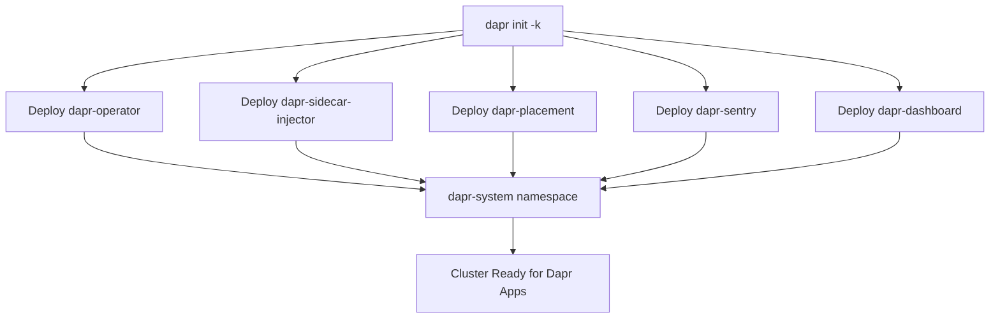

# How to Initialize Dapr on a Kubernetes Cluster

Author: [nawazdhandala](https://www.github.com/nawazdhandala)

Tags: Dapr, Kubernetes, Initialization, Cluster Setup, Getting Started

Description: Learn how to install and initialize Dapr on a Kubernetes cluster using the Dapr CLI, including control plane setup and sidecar injection configuration.

---

## What Is Dapr on Kubernetes?

Running Dapr on Kubernetes deploys the Dapr control plane as a set of pods in the `dapr-system` namespace. Applications then receive Dapr sidecars via automatic injection when annotated correctly. This is the recommended mode for production workloads.

## Prerequisites

- Dapr CLI installed
- A running Kubernetes cluster (kind, minikube, AKS, EKS, GKE, etc.)
- `kubectl` configured to connect to the cluster
- Helm 3 (optional, for Helm-based install)

## How Dapr Kubernetes Initialization Works



## Installing Dapr on Kubernetes with the CLI

```bash
dapr init -k
```

Expected output:

```yaml
Making the jump to hyperspace...
Note: To install Dapr using Helm, see here: https://docs.dapr.io/getting-started/install-dapr-kubernetes/

Deploying the Dapr control plane with latest version to your cluster...
Success! Dapr has been installed to namespace dapr-system. To verify, run `dapr status -k` in your terminal.
```

## Installing Dapr with Helm

For production use, Helm gives you full control over configuration values.

Add the Dapr Helm chart repository:

```bash
helm repo add dapr https://dapr.github.io/helm-charts/
helm repo update
```

Install Dapr into the `dapr-system` namespace:

```bash
helm upgrade --install dapr dapr/dapr \
  --version=1.14 \
  --namespace dapr-system \
  --create-namespace \
  --wait
```

## Verifying the Installation

Check the status of all Dapr control plane components:

```bash
dapr status -k
```

Expected output:

```text
NAME                   NAMESPACE    HEALTHY  STATUS    REPLICAS  VERSION
dapr-sentry            dapr-system  True     Running   1         1.14.x
dapr-operator          dapr-system  True     Running   1         1.14.x
dapr-placement-server  dapr-system  True     Running   1         1.14.x
dapr-sidecar-injector  dapr-system  True     Running   1         1.14.x
dapr-dashboard         dapr-system  True     Running   1         0.14.x
```

Check the pods directly:

```bash
kubectl get pods -n dapr-system
```

## Enabling Dapr Sidecar Injection

To enable Dapr for an application, add annotations to your pod spec:

```yaml
apiVersion: apps/v1
kind: Deployment
metadata:
  name: myapp
spec:
  replicas: 1
  selector:
    matchLabels:
      app: myapp
  template:
    metadata:
      labels:
        app: myapp
      annotations:
        dapr.io/enabled: "true"
        dapr.io/app-id: "myapp"
        dapr.io/app-port: "3000"
    spec:
      containers:
      - name: myapp
        image: myapp:latest
        ports:
        - containerPort: 3000
```

The `dapr-sidecar-injector` detects the `dapr.io/enabled: "true"` annotation and automatically injects the `daprd` container into the pod.

## Useful Sidecar Annotations

The following annotations control sidecar behavior:

```yaml
annotations:
  dapr.io/enabled: "true"
  dapr.io/app-id: "myapp"
  dapr.io/app-port: "3000"
  dapr.io/app-protocol: "http"       # or grpc
  dapr.io/log-level: "info"
  dapr.io/config: "tracing"          # references a Dapr Configuration resource
  dapr.io/sidecar-cpu-request: "100m"
  dapr.io/sidecar-memory-request: "50Mi"
```

## Deploying a Dapr Component on Kubernetes

Components are deployed as Kubernetes Custom Resources:

```yaml
apiVersion: dapr.io/v1alpha1
kind: Component
metadata:
  name: statestore
  namespace: default
spec:
  type: state.redis
  version: v1
  metadata:
  - name: redisHost
    value: redis-master.default.svc.cluster.local:6379
  - name: redisPassword
    secretKeyRef:
      name: redis
      key: redis-password
```

Apply it with:

```bash
kubectl apply -f statestore.yaml
```

## Accessing the Dapr Dashboard

```bash
dapr dashboard -k
```

This opens the Dapr dashboard at http://localhost:8080 where you can inspect components, configurations, and running applications.

## Upgrading Dapr on Kubernetes

```bash
dapr upgrade -k --runtime-version 1.14.0
```

Or with Helm:

```bash
helm upgrade dapr dapr/dapr --namespace dapr-system --version=1.14.0
```

## Uninstalling Dapr from Kubernetes

```bash
dapr uninstall -k
```

Or with Helm:

```bash
helm uninstall dapr --namespace dapr-system
```

## Summary

Initializing Dapr on Kubernetes deploys five control plane components into the `dapr-system` namespace: operator, sidecar injector, placement server, sentry (mTLS certificate authority), and dashboard. Applications opt in to Dapr by adding annotations to their pod specs, which triggers automatic sidecar injection. Helm is recommended for production deployments since it provides fine-grained configuration control.
