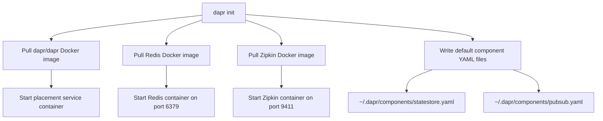

# How to Initialize Dapr in Self-Hosted Mode

Author: [nawazdhandala](https://www.github.com/nawazdhandala)

Tags: Dapr, Self-Hosted, Initialization, Local Development, Getting Started

Description: Learn how to initialize Dapr in self-hosted mode to run microservices locally with a sidecar, Redis state store, and Zipkin tracing out of the box.

---

## What Is Dapr Self-Hosted Mode?

Self-hosted mode lets you run Dapr on your local machine without Kubernetes. Each service runs as a process, and Dapr launches a sidecar process alongside it. The `dapr init` command sets up the entire local environment automatically.

## Prerequisites

- Dapr CLI installed (`dapr --version` should work)
- Docker installed and running (for Redis and Zipkin containers)
- Ports 6379 (Redis), 9411 (Zipkin), and 3500 (Dapr HTTP) available

## How Self-Hosted Initialization Works

When you run `dapr init`, the CLI performs the following steps:



## Running dapr init

```bash
dapr init
```

Expected output:

```text
Making the jump to hyperspace...
Installing runtime version 1.14.x
Downloading binaries and setting up components...
Downloaded & verified dapr binary and placed it in /usr/local/bin.
Installing placement service...
✅ Success! Dapr is up and running. To get started, go here: https://aka.ms/dapr-getting-started
```

## What Gets Installed

After `dapr init`, the following are available on your machine:

- `~/.dapr/bin/daprd` - the Dapr runtime binary
- `~/.dapr/components/` - default component YAML files
- `~/.dapr/config.yaml` - default configuration file
- Docker containers: `dapr_redis`, `dapr_placement`, `dapr_zipkin`

Check the running containers:

```bash
docker ps
```

You should see:

```text
CONTAINER ID   IMAGE                    PORTS
...            daprio/dapr              0.0.0.0:50005->50005/tcp
...            redis:6                  0.0.0.0:6379->6379/tcp
...            openzipkin/zipkin        0.0.0.0:9411->9411/tcp
```

## Default Component Files

The default state store component uses Redis:

```yaml
# ~/.dapr/components/statestore.yaml
apiVersion: dapr.io/v1alpha1
kind: Component
metadata:
  name: statestore
spec:
  type: state.redis
  version: v1
  metadata:
  - name: redisHost
    value: localhost:6379
  - name: redisPassword
    value: ""
  - name: actorStateStore
    value: "true"
```

The default pub/sub component also uses Redis:

```yaml
# ~/.dapr/components/pubsub.yaml
apiVersion: dapr.io/v1alpha1
kind: Component
metadata:
  name: pubsub
spec:
  type: pubsub.redis
  version: v1
  metadata:
  - name: redisHost
    value: localhost:6379
  - name: redisPassword
    value: ""
```

## Initializing Without Docker

If Docker is not available, use the slim init flag:

```bash
dapr init --slim
```

This installs only the `daprd` binary and the placement service binary without pulling container images. You will need to provide your own state store and pub/sub brokers.

## Initializing a Specific Runtime Version

```bash
dapr init --runtime-version 1.13.0
```

## Verifying the Installation

```bash
dapr status
```

Expected output:

```text
NAME            NAMESPACE  HEALTHY  STATUS   REPLICAS  VERSION  AGE
dapr_placement  dapr       True     Running  1         1.14.x   1m
```

## Running Your First App

Use `dapr run` to start an application with a sidecar:

```bash
dapr run --app-id myapp --app-port 3000 --dapr-http-port 3500 -- node app.js
```

## Uninstalling

To remove all Dapr containers and binaries:

```bash
dapr uninstall
```

To also remove Docker containers and images:

```bash
dapr uninstall --all
```

## Summary

`dapr init` bootstraps a complete local Dapr environment in seconds by pulling Docker containers for Redis and Zipkin, writing default component YAML files, and installing the Dapr runtime binary. This self-hosted mode is ideal for local development and testing before deploying to Kubernetes.
