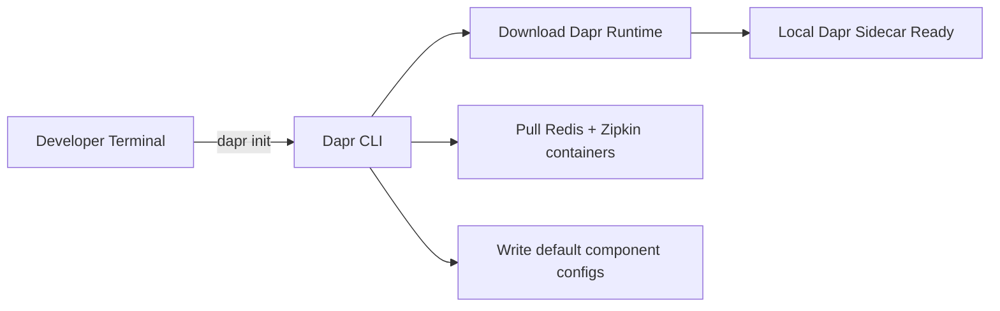

# How to Install the Dapr CLI on Windows, macOS, and Linux

Author: [nawazdhandala](https://www.github.com/nawazdhandala)

Tags: Dapr, CLI, Installation, Developer Tool, Getting Started

Description: Step-by-step guide to installing the Dapr CLI on Windows, macOS, and Linux so you can initialize and manage Dapr environments locally and on Kubernetes.

---

## What Is the Dapr CLI?

The Dapr CLI is the primary tool for interacting with Dapr from the command line. It lets you initialize Dapr in self-hosted or Kubernetes mode, run services with a Dapr sidecar, manage components, and view logs and dashboards.

Before you can use Dapr in any project, the CLI must be installed on your machine.

## Prerequisites

- A terminal (PowerShell, bash, or zsh)
- Internet access to download the binary
- On Windows: optionally winget or Chocolatey
- On macOS: optionally Homebrew
- On Linux: curl or wget

## How the Dapr CLI Works

The CLI communicates with the Dapr runtime. Once initialized, it downloads the Dapr binaries and container images, then manages the lifecycle of Dapr-enabled services on your local machine or cluster.



## Installing on Windows

### Option 1: PowerShell (recommended)

Run the following command in a PowerShell terminal with administrator privileges:

```powershell
powershell -Command "iwr -useb https://raw.githubusercontent.com/dapr/cli/master/install/install.ps1 | iex"
```

This script downloads the latest Dapr CLI binary and adds it to `C:\dapr` and your PATH.

### Option 2: Winget

```powershell
winget install Dapr.CLI
```

### Option 3: Chocolatey

```powershell
choco install dapr-cli
```

After installation, open a new PowerShell window and verify:

```powershell
dapr --version
```

## Installing on macOS

### Option 1: Homebrew (recommended)

```bash
brew install dapr/tap/dapr-cli
```

### Option 2: Script install

```bash
curl -fsSL https://raw.githubusercontent.com/dapr/cli/master/install/install.sh | /bin/bash
```

Verify the installation:

```bash
dapr --version
```

Expected output:

```
CLI version: 1.14.x
Runtime version: n/a
```

## Installing on Linux

Use the install script with curl:

```bash
wget -q https://raw.githubusercontent.com/dapr/cli/master/install/install.sh -O - | /bin/bash
```

Or with wget:

```bash
wget -q https://raw.githubusercontent.com/dapr/cli/master/install/install.sh && bash install.sh
```

The binary is installed to `/usr/local/bin/dapr`.

Verify:

```bash
dapr --version
```

## Installing a Specific Version

To install a pinned version, set the `DAPR_CLI_VERSION` environment variable before running the install script:

```bash
export DAPR_CLI_VERSION=1.13.0
curl -fsSL https://raw.githubusercontent.com/dapr/cli/master/install/install.sh | /bin/bash
```

## Upgrading the Dapr CLI

On macOS with Homebrew:

```bash
brew upgrade dapr-cli
```

On Linux/Windows with the install script, re-running the script installs the latest version over the existing one.

## Verifying the Installation

After installation, run:

```bash
dapr --help
```

You should see a list of available commands including `init`, `run`, `stop`, `invoke`, `publish`, `components`, `configurations`, and `dashboard`.

## Next Steps

After installing the CLI, initialize Dapr in self-hosted mode with:

```bash
dapr init
```

Or initialize on Kubernetes with:

```bash
dapr init -k
```

Refer to the official Dapr documentation at https://docs.dapr.io for further guidance.

## Summary

The Dapr CLI is a prerequisite for working with Dapr locally or on Kubernetes. It is available via package managers like Homebrew, Winget, and Chocolatey, or via a one-line install script that works across all major operating systems. Once installed, you can verify it with `dapr --version` and immediately begin initializing your Dapr environment.
