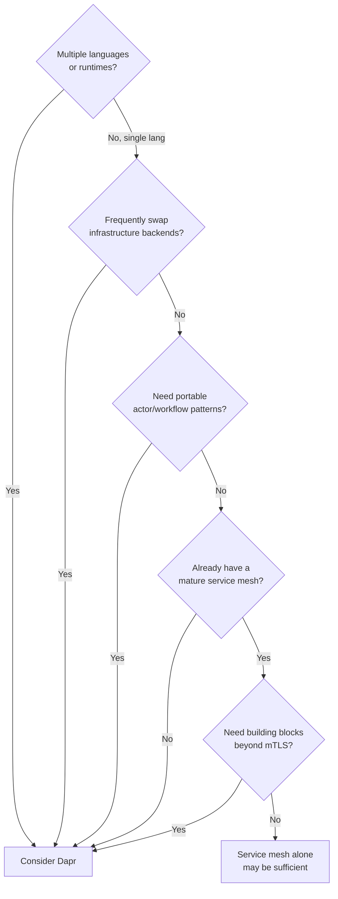
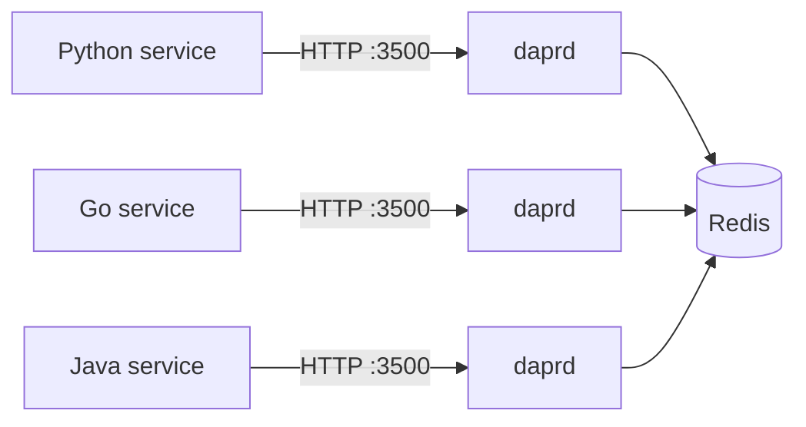

# How to Decide If Dapr Is Right for Your Microservices Architecture

Author: [nawazdhandala](https://www.github.com/nawazdhandala)

Tags: Dapr, Architecture, Microservice, Decision Making, Best Practice

Description: A practical guide to evaluating whether Dapr fits your microservices architecture, covering trade-offs, use cases, and scenarios where Dapr adds or reduces value.

---

## What Dapr Offers

Dapr is a runtime that abstracts common distributed systems concerns into portable, language-agnostic APIs. Before deciding whether to adopt it, understand what it provides and what it trades away.

**Dapr provides:**
- Portable state management across Redis, PostgreSQL, CosmosDB, DynamoDB, and 20+ others
- Pub/sub messaging across Kafka, RabbitMQ, Azure Service Bus, AWS SNS/SQS, and more
- Service-to-service invocation with mTLS and retries
- Secret management without SDK coupling
- Declarative resiliency (retries, timeouts, circuit breakers)
- Virtual actors
- Durable workflow orchestration
- Automatic distributed tracing, metrics, and logs

**Dapr trades away:**
- Some performance (sidecar adds ~1ms per hop for in-cluster calls)
- Full control over connection pooling and protocol details
- The ability to use database-specific features (complex queries, JOINs) through the state API

## Decision Framework



## When Dapr Adds the Most Value

### 1 - Polyglot Microservices

If your organization has services in Python, Go, Java, and Node.js, Dapr lets all of them share the same infrastructure backends and security model without each team implementing SDK integrations.



### 2 - Cloud-Agnostic or Multi-Cloud Architectures

Dapr lets you swap from AWS DynamoDB to Azure CosmosDB to PostgreSQL by changing one YAML file. No application code changes.

### 3 - Teams Building Their First Microservices

Dapr removes the burden of implementing retries, mTLS, distributed tracing, and secret management from scratch.

### 4 - Event-Driven Systems with Broker Flexibility

If you want to start with Redis pub/sub locally and use Kafka or Azure Service Bus in production, Dapr handles the abstraction.

### 5 - Applications That Need Durable Workflows or Actors

If you have long-running business processes or entity-centric stateful patterns, Dapr's workflow and actor building blocks provide a tested implementation.

## When Dapr May Not Be the Right Fit

### 1 - High-Frequency, Low-Latency Service Calls

If your p99 latency budget is under 5ms for inter-service calls, the sidecar hop (~1ms additional) may be unacceptable. Direct gRPC between services may be preferable.

### 2 - Simple Monolith-to-Microservice Extraction

If you are splitting a single monolith into 2-3 services, the operational overhead of installing and managing a Dapr control plane may outweigh the benefits.

### 3 - Heavy Relational Database Use

Dapr's state management API is a key-value interface. If your service relies heavily on JOINs, aggregations, and complex SQL queries, the state API will not replace your ORM. You can use Dapr alongside a traditional database, but not instead of it.

### 4 - You Already Have an Opinionated Platform

If your platform team has already invested in Istio for mTLS, a specific secret management solution like HashiCorp Vault directly in the app, and a custom retry library, adopting Dapr may create duplication.

## Performance Considerations

Benchmark from the Dapr project (v1.13, intra-cluster gRPC):

| Scenario | Without Dapr | With Dapr |
|----------|-------------|-----------|
| Service invocation (p50) | 0.5ms | 1.3ms |
| State store write (p50) | 1ms | 1.8ms |
| Pub/sub publish (p50) | 2ms | 3ms |

The overhead is proportional - if your current calls take 50ms due to business logic, 1ms extra is negligible.

## Operational Overhead

Running Dapr in Kubernetes adds these control plane pods to `dapr-system`:

```bash
kubectl get pods -n dapr-system
```

```text
NAME                                     READY
dapr-operator-xxx                        1/1
dapr-sentry-xxx                          1/1
dapr-placement-server-xxx                1/1
dapr-scheduler-server-xxx                1/1
dapr-sidecar-injector-xxx                1/1
dapr-dashboard-xxx                       1/1
```

Each pod is lightweight (<256Mi memory), but your team needs to understand how to:
- Upgrade Dapr (`helm upgrade`)
- Rotate certificates
- Debug sidecar injection issues
- Monitor the control plane

## Combining Dapr with a Service Mesh

Dapr and service meshes like Istio or Linkerd solve overlapping but distinct problems:

| Capability | Dapr | Service Mesh |
|-----------|------|-------------|
| mTLS | Yes | Yes |
| Retries | Yes | Yes (L7) |
| Traffic splitting | No | Yes |
| State management | Yes | No |
| Pub/sub | Yes | No |
| Actors/Workflow | Yes | No |
| Secret management | Yes | No |

You can run both. Disable Dapr mTLS when Istio handles it to avoid double-encryption overhead.

## Adoption Strategies

**Start small:** Add Dapr to one new service and use only the state management building block. Evaluate the experience before expanding.

**Incremental adoption:** Dapr supports adding sidecars to existing services without code changes. The app can continue calling its existing SDKs while you gradually migrate to Dapr APIs.

**Sidecar-first, SDK-second:** Use the HTTP API or a Dapr SDK. The SDKs are thin wrappers - you are not locked in.

## Summary

Dapr is most valuable when you have polyglot services, need infrastructure portability, want built-in security and observability, or are building event-driven systems. It adds the most complexity when your latency budget is extremely tight, your services are few, or your team is already invested in equivalent tools. The operational overhead of the Dapr control plane is modest, and incremental adoption is supported - you do not need to commit to every building block at once.
