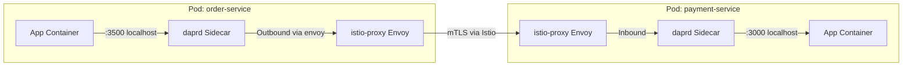

# How to Set Up Dapr with Istio Service Mesh

Author: [nawazdhandala](https://www.github.com/nawazdhandala)

Tags: Dapr, Istio, Service Mesh, Kubernetes, Security

Description: Learn how to run Dapr alongside Istio service mesh on Kubernetes, handling sidecar coexistence, mTLS configuration, and traffic policy integration.

---

## Introduction

Dapr and Istio can run together on the same Kubernetes cluster. Dapr provides application-level building blocks (state, pub/sub, actors, etc.), while Istio provides network-level traffic management, mTLS, and advanced routing policies. Understanding how their sidecars coexist and interact is key to a successful deployment.

Key considerations:
- Both Dapr and Istio inject sidecars - pods get 3 containers (app, daprd, istio-proxy)
- mTLS from both can conflict - typically you disable Dapr mTLS and let Istio handle it
- Dapr-to-Dapr traffic goes through Istio's envoy proxies

## Architecture



## Prerequisites

- Kubernetes cluster (1.22+)
- Istio installed (`istioctl install --set profile=default`)
- Dapr installed on Kubernetes

## Step 1: Install Istio

```bash
# Download Istio
curl -L https://istio.io/downloadIstio | sh -
export PATH=$PWD/istio-1.x.x/bin:$PATH

# Install Istio with default profile
istioctl install --set profile=default -y

# Verify
kubectl get pods -n istio-system
```

## Step 2: Install Dapr

Install Dapr on the same cluster:

```bash
dapr init -k
```

## Step 3: Configure Dapr to Disable mTLS

When Istio handles mTLS, disable Dapr's built-in mTLS to avoid conflicts:

```bash
dapr mtls disable -k
```

Or via Helm:

```bash
helm upgrade dapr dapr/dapr \
  --namespace dapr-system \
  --set global.mtls.enabled=false
```

Alternatively, keep Dapr mTLS enabled and configure Istio to exclude Dapr ports from its mTLS policy (more complex but provides layered security).

## Step 4: Enable Istio Sidecar Injection

Enable automatic Istio sidecar injection for your namespace:

```bash
kubectl label namespace default istio-injection=enabled
```

## Step 5: Handle Sidecar Port Conflicts

Dapr and Istio both need to handle traffic carefully. Configure Istio to exclude Dapr's ports from interception:

```yaml
apiVersion: apps/v1
kind: Deployment
metadata:
  name: order-service
  namespace: default
spec:
  template:
    metadata:
      annotations:
        # Dapr annotations
        dapr.io/enabled: "true"
        dapr.io/app-id: "order-service"
        dapr.io/app-port: "3000"
        # Istio: exclude Dapr ports from Envoy interception
        traffic.sidecar.istio.io/excludeInboundPorts: "3500,50001"
        traffic.sidecar.istio.io/excludeOutboundPorts: "3500,50001"
```

This tells Istio's iptables rules to not intercept Dapr's own internal ports (HTTP API 3500, gRPC 50001), preventing double-proxy issues.

## Step 6: Configure Istio PeerAuthentication

If you want Istio mTLS to protect Dapr sidecar-to-sidecar communication, apply a PeerAuthentication policy:

```yaml
apiVersion: security.istio.io/v1beta1
kind: PeerAuthentication
metadata:
  name: default
  namespace: default
spec:
  mtls:
    mode: STRICT
```

This enforces mTLS on all traffic within the namespace, including Dapr sidecar connections.

## Step 7: Configure Istio AuthorizationPolicy for Dapr

Use Istio AuthorizationPolicy to control which services can communicate:

```yaml
apiVersion: security.istio.io/v1beta1
kind: AuthorizationPolicy
metadata:
  name: payment-service-policy
  namespace: default
spec:
  selector:
    matchLabels:
      app: payment-service
  action: ALLOW
  rules:
  - from:
    - source:
        principals:
        - "cluster.local/ns/default/sa/order-service-sa"
    to:
    - operation:
        methods: ["POST"]
        paths: ["/v1.0/invoke/payment-service/method/charge"]
```

## Step 8: Dapr Placement Service Connectivity

The Dapr Placement Service uses port 50005 for actor placement. Allow this port through Istio:

```yaml
apiVersion: security.istio.io/v1beta1
kind: AuthorizationPolicy
metadata:
  name: allow-dapr-placement
  namespace: dapr-system
spec:
  selector:
    matchLabels:
      app: dapr-placement-server
  action: ALLOW
  rules:
  - from:
    - source:
        namespaces: ["default"]
    to:
    - operation:
        ports: ["50005"]
```

## Verifying the Setup

Check that both sidecars are running in your pods:

```bash
kubectl get pods -l app=order-service
# Should show 3/3 READY (app, daprd, istio-proxy)

kubectl describe pod -l app=order-service | grep -A 5 "Containers:"
```

Test service-to-service call:

```bash
kubectl exec -it deployment/order-service -c order-service -- \
  curl http://localhost:3500/v1.0/invoke/payment-service/method/health
```

## Common Issues

**Issue**: Dapr sidecar cannot connect to Placement Service

**Fix**: Exclude Placement Service port from Istio iptables:

```yaml
traffic.sidecar.istio.io/excludeOutboundPorts: "50005"
```

**Issue**: Pod stuck in Init:0/1

**Fix**: Istio init container and Dapr sidecar ordering issue. Set Istio to not hold traffic until Dapr is ready:

```yaml
proxy.istio.io/config: '{"holdApplicationUntilProxyStarts": false}'
```

## Summary

Running Dapr with Istio requires careful port exclusion configuration to avoid sidecar conflicts. Disable Dapr mTLS when Istio handles encryption, or configure Istio to exclude Dapr's internal ports. Use Istio PeerAuthentication for network-level mTLS and AuthorizationPolicy for fine-grained traffic control. Annotate your Deployments to exclude Dapr ports from Istio's iptables interception, and verify pods show 3 ready containers after deployment.
