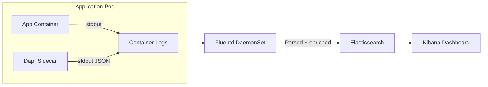

# How to Use Dapr Logging with Fluentd

Author: [nawazdhandala](https://www.github.com/nawazdhandala)

Tags: Dapr, Logging, Fluentd, Observability, Kubernetes

Description: Learn how to configure Dapr sidecar logging in JSON format and collect, parse, and forward logs to centralized storage using Fluentd on Kubernetes.

---

## Introduction

Dapr sidecar logs contain valuable information about service invocations, component operations, errors, and trace context. By configuring Dapr to emit structured JSON logs and routing them through Fluentd, you can centralize logs in Elasticsearch, Splunk, or any other log aggregation backend. This guide covers Dapr log configuration, Fluentd DaemonSet deployment, and parsing Dapr's structured log format.

## Log Architecture



## Prerequisites

- Kubernetes cluster with Dapr installed
- Fluentd or Fluent Bit DaemonSet deployed
- Log storage backend (Elasticsearch, Splunk, etc.)

## Step 1: Configure Dapr Sidecar Logging

Enable JSON structured logging via Dapr sidecar annotations:

```yaml
metadata:
  annotations:
    dapr.io/enabled: "true"
    dapr.io/app-id: "order-service"
    dapr.io/app-port: "3000"
    dapr.io/log-as-json: "true"
    dapr.io/log-level: "info"
```

Available log levels: `debug`, `info`, `warn`, `error`, `fatal`

### Example Dapr JSON Log Line

```json
{
  "time": "2026-03-31T10:00:00Z",
  "level": "info",
  "type": "log",
  "msg": "Executing state transaction",
  "scope": "dapr.runtime",
  "ver": "1.13.0",
  "app_id": "order-service",
  "instance": "order-service-7c9f4d-kxp2b"
}
```

For trace-correlated logs:

```json
{
  "time": "2026-03-31T10:00:01Z",
  "level": "info",
  "type": "log",
  "msg": "service invocation called",
  "app_id": "order-service",
  "traceid": "abc123def456",
  "spanid": "789xyz",
  "traceFlags": "01"
}
```

## Step 2: Deploy Fluentd as a DaemonSet

Create the Fluentd ServiceAccount and ClusterRole:

```yaml
apiVersion: v1
kind: ServiceAccount
metadata:
  name: fluentd
  namespace: kube-system
---
apiVersion: rbac.authorization.k8s.io/v1
kind: ClusterRole
metadata:
  name: fluentd
rules:
- apiGroups: [""]
  resources: ["pods", "namespaces"]
  verbs: ["get", "list", "watch"]
---
apiVersion: rbac.authorization.k8s.io/v1
kind: ClusterRoleBinding
metadata:
  name: fluentd
roleRef:
  apiGroup: rbac.authorization.k8s.io
  kind: ClusterRole
  name: fluentd
subjects:
- kind: ServiceAccount
  name: fluentd
  namespace: kube-system
```

## Step 3: Configure Fluentd for Dapr Logs

Create a ConfigMap with Fluentd configuration to parse Dapr JSON logs:

```yaml
apiVersion: v1
kind: ConfigMap
metadata:
  name: fluentd-config
  namespace: kube-system
data:
  fluent.conf: |
    <source>
      @type tail
      path /var/log/containers/*.log
      pos_file /var/log/fluentd-containers.log.pos
      tag kubernetes.*
      read_from_head true
      <parse>
        @type cri
      </parse>
    </source>

    # Add Kubernetes metadata
    <filter kubernetes.**>
      @type kubernetes_metadata
    </filter>

    # Parse Dapr sidecar JSON logs
    <filter kubernetes.**>
      @type parser
      key_name log
      reserve_data true
      remove_key_name_field true
      <parse>
        @type multi_format
        <pattern>
          format json
        </pattern>
        <pattern>
          format none
        </pattern>
      </parse>
    </filter>

    # Filter only Dapr sidecar container logs
    <match kubernetes.**>
      @type rewrite_tag_filter
      <rule>
        key $.kubernetes.container_name
        pattern ^daprd$
        tag dapr.sidecar
      </rule>
      <rule>
        key $.kubernetes.container_name
        pattern ^.*$
        tag kubernetes.app
      </rule>
    </match>

    # Send Dapr logs to Elasticsearch
    <match dapr.**>
      @type elasticsearch
      host elasticsearch.logging.svc.cluster.local
      port 9200
      index_name dapr-logs
      type_name _doc
      include_timestamp true
      <buffer>
        @type file
        path /var/log/fluentd-buffers/dapr
        flush_mode interval
        flush_interval 5s
        chunk_limit_size 2M
        queue_limit_length 8
        retry_max_times 3
      </buffer>
    </match>

    # Send app logs to separate index
    <match kubernetes.app>
      @type elasticsearch
      host elasticsearch.logging.svc.cluster.local
      port 9200
      index_name app-logs
      type_name _doc
      include_timestamp true
    </match>
```

## Step 4: Deploy the Fluentd DaemonSet

```yaml
apiVersion: apps/v1
kind: DaemonSet
metadata:
  name: fluentd
  namespace: kube-system
spec:
  selector:
    matchLabels:
      name: fluentd
  template:
    metadata:
      labels:
        name: fluentd
    spec:
      serviceAccount: fluentd
      serviceAccountName: fluentd
      tolerations:
      - key: node-role.kubernetes.io/control-plane
        effect: NoSchedule
      containers:
      - name: fluentd
        image: fluent/fluentd-kubernetes-daemonset:v1-debian-elasticsearch
        env:
        - name: FLUENT_ELASTICSEARCH_HOST
          value: "elasticsearch.logging.svc.cluster.local"
        - name: FLUENT_ELASTICSEARCH_PORT
          value: "9200"
        resources:
          limits:
            memory: 200Mi
          requests:
            cpu: 100m
            memory: 200Mi
        volumeMounts:
        - name: varlog
          mountPath: /var/log
        - name: fluentd-config
          mountPath: /fluentd/etc
      volumes:
      - name: varlog
        hostPath:
          path: /var/log
      - name: fluentd-config
        configMap:
          name: fluentd-config
```

```bash
kubectl apply -f fluentd-daemonset.yaml
```

## Step 5: Query Dapr Logs in Kibana

After setup, search Kibana for Dapr-specific log fields:

- `app_id`: filter by Dapr application
- `scope`: filter by Dapr component (e.g., `dapr.runtime`, `dapr.pubsub`)
- `level`: filter by severity
- `traceid`: correlate logs with distributed traces

Example Kibana query:

```yaml
app_id: "order-service" AND level: "error"
```

## Using Fluent Bit (Lightweight Alternative)

For resource-constrained clusters, use Fluent Bit instead of Fluentd:

```bash
helm install fluent-bit fluent/fluent-bit \
  --namespace kube-system \
  --set config.outputs="[OUTPUT]\n    Name  es\n    Host  elasticsearch.logging.svc.cluster.local"
```

## Summary

Dapr produces structured JSON logs from each sidecar when `dapr.io/log-as-json: "true"` is set. Fluentd DaemonSet collects these logs from all nodes, parses the JSON format, enriches with Kubernetes metadata, and forwards to Elasticsearch or another backend. Key Dapr log fields include `app_id`, `scope`, `level`, and `traceid`. Correlate Dapr logs with distributed traces by joining on `traceid` across your logging and tracing backends.
