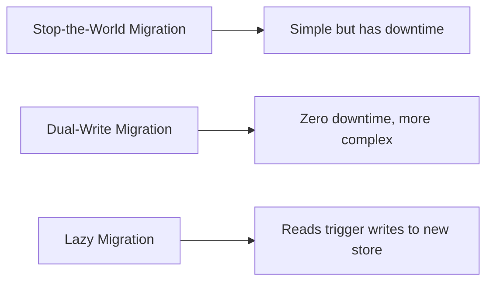

# How to Migrate State Data Between Dapr State Stores

Author: [OneUptime](https://oneuptime.com)

Tags: Dapr, State Management, Migration, Microservice, Operations

Description: Learn how to migrate state data from one Dapr state store to another with zero downtime using dual-write patterns and incremental migration strategies.

---

## Introduction

Migrating a state store is one of the trickier operations in a Dapr application. You might be moving from Redis to PostgreSQL for better durability, upgrading to a hosted service, or consolidating stores across environments. This guide covers strategies for performing these migrations safely, including dual-write for zero-downtime migrations.

## Migration Strategies Overview



Choose based on your tolerance for downtime and data volume.

## Strategy 1: Stop-the-World Migration

Simplest approach, requires a maintenance window.

```bash
# Step 1: Scale down all applications
kubectl scale deployment myapp --replicas=0

# Step 2: Export data from old store (Redis example)
redis-cli --scan --pattern "myapp||*" | while read key; do
  value=$(redis-cli GET "$key")
  echo "$key|$value"
done > state_backup.txt

# Step 3: Import to new store (PostgreSQL example)
# Use the Dapr HTTP API with the new component configured
while IFS='|' read -r key value; do
  curl -X POST http://localhost:3500/v1.0/state/new-statestore \
    -H "Content-Type: application/json" \
    -d "[{\"key\": \"$key\", \"value\": $value}]"
done < state_backup.txt

# Step 4: Update component to point to new store
kubectl apply -f new-statestore-component.yaml

# Step 5: Scale applications back up
kubectl scale deployment myapp --replicas=3
```

## Strategy 2: Dual-Write Migration (Zero Downtime)

Run both state stores simultaneously, writing to both and reading from the old one until validation is complete.

### Phase 1: Enable Dual-Write

Add a new state store component alongside the old one:

```yaml
# Old component (still primary)
apiVersion: dapr.io/v1alpha1
kind: Component
metadata:
  name: statestore
spec:
  type: state.redis
  version: v1
  metadata:
    - name: redisHost
      value: redis-master:6379
---
# New component
apiVersion: dapr.io/v1alpha1
kind: Component
metadata:
  name: statestore-new
spec:
  type: state.postgresql
  version: v2
  metadata:
    - name: connectionString
      value: "host=pg-new user=dapr password=secret dbname=statedb"
```

Implement dual-write in your application:

```python
from dapr.clients import DaprClient
import logging

logger = logging.getLogger(__name__)

def save_state_dual(key: str, value: str, etag: str = None):
    with DaprClient() as client:
        # Write to old store (primary)
        client.save_state("statestore", key, value)

        # Write to new store (shadow)
        try:
            client.save_state("statestore-new", key, value)
        except Exception as e:
            logger.warning(f"Shadow write failed for {key}: {e}")
            # Do not fail the request - old store is still authoritative

def get_state_primary(key: str) -> str:
    with DaprClient() as client:
        result = client.get_state("statestore", key)
        return result.data
```

### Phase 2: Backfill Existing Data

Write a migration job that copies all existing keys:

```python
# migration_job.py
import redis
from dapr.clients import DaprClient

def migrate_keys(pattern: str = "myapp||*"):
    r = redis.Redis(host="redis-master", port=6379)
    dapr_client = DaprClient()

    migrated = 0
    errors = 0

    for raw_key in r.scan_iter(pattern):
        key = raw_key.decode()
        # Strip the appid prefix for Dapr API calls
        dapr_key = key.split("||", 1)[1] if "||" in key else key
        value = r.get(raw_key)

        try:
            dapr_client.save_state(
                store_name="statestore-new",
                key=dapr_key,
                value=value.decode()
            )
            migrated += 1
        except Exception as e:
            print(f"Error migrating {key}: {e}")
            errors += 1

    print(f"Migrated: {migrated}, Errors: {errors}")
    dapr_client.close()

if __name__ == "__main__":
    migrate_keys()
```

### Phase 3: Validate and Switch

Run a validation pass to ensure all keys exist in both stores:

```bash
# Count keys in old store
redis-cli KEYS "myapp||*" | wc -l

# Count keys in new store (PostgreSQL)
psql -h pg-new -U dapr -d statedb \
  -c "SELECT COUNT(*) FROM state WHERE key LIKE 'myapp||%';"

# Spot-check values
redis-cli GET "myapp||order-001"
# Compare with new store via Dapr API
curl http://localhost:3500/v1.0/state/statestore-new/order-001
```

### Phase 4: Switch Read to New Store

Update the application to read from the new store while still writing to both:

```python
def get_state_migrated(key: str) -> str:
    with DaprClient() as client:
        result = client.get_state("statestore-new", key)
        if result.data:
            return result.data
        # Fallback to old store during transition
        fallback = client.get_state("statestore", key)
        if fallback.data:
            # Write to new store (lazy backfill)
            client.save_state("statestore-new", key, fallback.data)
        return fallback.data
```

### Phase 5: Decommission Old Store

Once validation passes and all traffic reads from the new store:

```bash
# Remove old component after traffic fully shifted
kubectl delete component statestore

# Rename new component to statestore
kubectl apply -f - <<EOF
apiVersion: dapr.io/v1alpha1
kind: Component
metadata:
  name: statestore
spec:
  type: state.postgresql
  version: v2
  metadata:
    - name: connectionString
      value: "host=pg-new user=dapr password=secret dbname=statedb"
EOF
```

## Kubernetes Job for Automated Backfill

```yaml
apiVersion: batch/v1
kind: Job
metadata:
  name: state-migration
spec:
  template:
    metadata:
      annotations:
        dapr.io/enabled: "true"
        dapr.io/app-id: "migration-job"
    spec:
      restartPolicy: OnFailure
      containers:
        - name: migration
          image: myregistry/state-migration:1.0
          env:
            - name: SOURCE_STORE
              value: statestore
            - name: TARGET_STORE
              value: statestore-new
```

## Summary

State store migrations in Dapr can be done safely with a dual-write strategy: add the new store component, implement dual writes in your application, run a backfill job for existing keys, validate data integrity, gradually shift reads to the new store, then decommission the old one. For smaller datasets or scheduled maintenance windows, the stop-the-world approach is simpler. Always validate key counts and spot-check values before switching reads to the new store.
