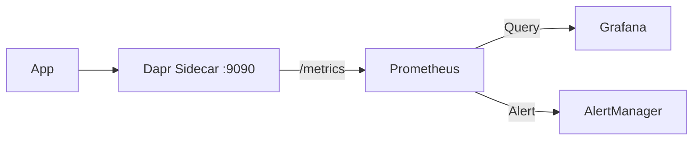

# How to Monitor State Store Performance in Dapr

Author: [nawazdhandala](https://www.github.com/nawazdhandala)

Tags: Dapr, State Management, Monitoring, Prometheus, Observability

Description: Learn how to monitor Dapr state store performance using Prometheus metrics, Grafana dashboards, and distributed tracing to detect latency, error rates, and throughput issues.

---

## Introduction

Monitoring state store performance is essential in production. Slow state operations cascade into slow API responses and timeouts. Dapr exposes rich Prometheus metrics for every state operation, making it straightforward to build dashboards and alerts for latency, throughput, and error rates.

## Metrics Architecture



## Enabling Dapr Metrics

Metrics are enabled by default. Verify the port:

```yaml
annotations:
  dapr.io/enabled: "true"
  dapr.io/app-id: "orderservice"
  dapr.io/metrics-port: "9090"    # Default metrics port
```

Test the metrics endpoint:

```bash
kubectl port-forward deployment/orderservice 9090:9090
curl http://localhost:9090/metrics | grep dapr_component
```

## Key Dapr State Management Metrics

| Metric | Type | Description |
|--------|------|-------------|
| `dapr_component_state_operations_total` | Counter | Total state operations by type and status |
| `dapr_component_state_operation_duration_milliseconds` | Histogram | Latency per state operation |
| `dapr_http_server_request_count` | Counter | HTTP requests to Dapr sidecar |
| `dapr_http_server_latency` | Histogram | Sidecar HTTP request latency |

## Prometheus Scrape Configuration

```yaml
# prometheus.yml
scrape_configs:
  - job_name: dapr-sidecar
    kubernetes_sd_configs:
      - role: pod
    relabel_configs:
      - source_labels: [__meta_kubernetes_pod_annotation_dapr_io_enabled]
        action: keep
        regex: "true"
      - source_labels: [__meta_kubernetes_pod_annotation_dapr_io_metrics_port]
        action: replace
        target_label: __metrics_path__
        replacement: /metrics
      - source_labels: [__address__, __meta_kubernetes_pod_annotation_dapr_io_metrics_port]
        action: replace
        regex: ([^:]+)(?::\d+)?;(\d+)
        replacement: $1:$2
        target_label: __address__
```

## Useful PromQL Queries

### State Operation Throughput

```promql
# Total state operations per second by operation type
rate(dapr_component_state_operations_total[5m])
```

### State Operation Error Rate

```promql
# Error rate for state store operations
rate(dapr_component_state_operations_total{status="error"}[5m])
/ rate(dapr_component_state_operations_total[5m])
```

### P95 State Operation Latency

```promql
# 95th percentile latency for state operations
histogram_quantile(0.95,
  rate(dapr_component_state_operation_duration_milliseconds_bucket[5m])
)
```

### Get vs. Set Breakdown

```promql
# Read operations per second
rate(dapr_component_state_operations_total{operation="get"}[5m])

# Write operations per second
rate(dapr_component_state_operations_total{operation="set"}[5m])

# Delete operations per second
rate(dapr_component_state_operations_total{operation="delete"}[5m])
```

## Grafana Dashboard

Create a dashboard with these panels:

```json
{
  "title": "Dapr State Store Performance",
  "panels": [
    {
      "title": "Operation Throughput (ops/sec)",
      "type": "graph",
      "targets": [
        {
          "expr": "sum(rate(dapr_component_state_operations_total[5m])) by (operation)",
          "legendFormat": "{{operation}}"
        }
      ]
    },
    {
      "title": "Error Rate (%)",
      "type": "stat",
      "targets": [
        {
          "expr": "100 * sum(rate(dapr_component_state_operations_total{status='error'}[5m])) / sum(rate(dapr_component_state_operations_total[5m]))"
        }
      ]
    },
    {
      "title": "P95 Latency (ms)",
      "type": "graph",
      "targets": [
        {
          "expr": "histogram_quantile(0.95, rate(dapr_component_state_operation_duration_milliseconds_bucket[5m]))"
        }
      ]
    }
  ]
}
```

## Alerting Rules

```yaml
# prometheus-alerts.yaml
groups:
  - name: dapr-state
    rules:
      - alert: DaprStateHighErrorRate
        expr: |
          rate(dapr_component_state_operations_total{status="error"}[5m])
          / rate(dapr_component_state_operations_total[5m]) > 0.01
        for: 2m
        labels:
          severity: warning
        annotations:
          summary: "Dapr state store error rate above 1%"
          description: "Error rate: {{ $value | humanizePercentage }}"

      - alert: DaprStateHighLatency
        expr: |
          histogram_quantile(0.95,
            rate(dapr_component_state_operation_duration_milliseconds_bucket[5m])
          ) > 100
        for: 5m
        labels:
          severity: warning
        annotations:
          summary: "Dapr state store P95 latency above 100ms"

      - alert: DaprStateStoreDown
        expr: |
          up{job="dapr-sidecar"} == 0
        for: 1m
        labels:
          severity: critical
        annotations:
          summary: "Dapr sidecar is down"
```

## Tracing State Operations

Enable distributed tracing to see state operations in context:

```yaml
apiVersion: dapr.io/v1alpha1
kind: Configuration
metadata:
  name: tracing-config
spec:
  tracing:
    samplingRate: "0.1"
    otel:
      endpointAddress: http://otel-collector:4317
      protocol: grpc
```

In Zipkin or Jaeger you will see spans like:
- `CallLocal/statestore/get`
- `CallLocal/statestore/set`

These show state operations as child spans of incoming HTTP requests.

## Redis-Specific Monitoring

```bash
# Redis INFO for connection pool stats
redis-cli -h redis-master INFO clients
# connected_clients: 15
# blocked_clients: 0

# Command latency
redis-cli -h redis-master INFO commandstats | grep get

# Slow log
redis-cli -h redis-master SLOWLOG GET 10

# Memory usage
redis-cli -h redis-master INFO memory | grep used_memory_human
```

## Summary

Monitor Dapr state store performance by scraping the sidecar's `/metrics` endpoint with Prometheus. Key metrics to track are `dapr_component_state_operations_total` for throughput and error rate, and `dapr_component_state_operation_duration_milliseconds` for latency percentiles. Set alerts when error rate exceeds 1% or P95 latency exceeds 100ms. Pair metrics with distributed tracing to see state operations as spans within request traces, giving full context for slow requests.
