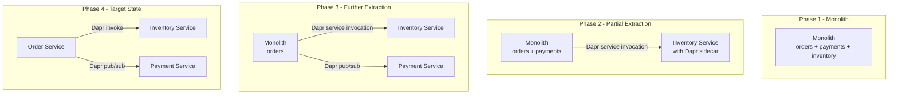
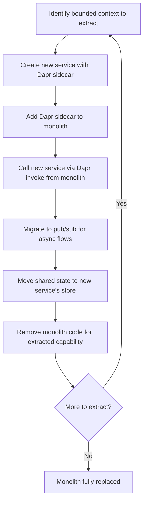

# How to Migrate from a Monolith to Microservices Using Dapr

Author: [nawazdhandala](https://www.github.com/nawazdhandala)

Tags: Dapr, Microservice, Migration, Architecture, Strangler Fig

Description: A practical guide to incrementally migrating a monolithic application to microservices using Dapr, covering the strangler fig pattern, state migration, and service extraction.

---

## Why Use Dapr for Monolith Migration?

Migrating a monolith is risky when done all at once. Dapr enables incremental extraction: you carve out one capability at a time, deploy it as a microservice with a Dapr sidecar, and route traffic from the monolith to the new service. The monolith itself can optionally get a Dapr sidecar to call extracted services.



## The Strangler Fig Pattern with Dapr

The strangler fig pattern involves routing traffic to the new service while keeping the monolith running. Over time, the monolith shrinks as functionality migrates out.

### Step 1 - Add a Dapr Sidecar to the Monolith

Add Dapr annotations to the monolith deployment without changing application code:

```yaml
apiVersion: apps/v1
kind: Deployment
metadata:
  name: monolith
spec:
  template:
    metadata:
      annotations:
        dapr.io/enabled: "true"
        dapr.io/app-id: "monolith"
        dapr.io/app-port: "8080"
        dapr.io/app-protocol: "http"
```

Now the monolith can call Dapr APIs.

### Step 2 - Extract the First Service

Choose a bounded context with minimal shared state to extract first. Good candidates:
- Notification/email service (typically stateless)
- Report generation (no real-time dependencies)
- User profile management (self-contained data)

Create a new service with a Dapr sidecar:

```yaml
# notification-service deployment
apiVersion: apps/v1
kind: Deployment
metadata:
  name: notification-service
spec:
  template:
    metadata:
      annotations:
        dapr.io/enabled: "true"
        dapr.io/app-id: "notification-service"
        dapr.io/app-port: "3000"
```

### Step 3 - Call the New Service from the Monolith

Update the monolith to call the notification service via Dapr service invocation instead of an internal function call:

```python
# Before: internal function call
def send_order_confirmation(order):
    notification.send_email(order.customer_email, order)

# After: Dapr service invocation
import requests, os

def send_order_confirmation(order):
    dapr_port = os.getenv('DAPR_HTTP_PORT', '3500')
    requests.post(
        f"http://localhost:{dapr_port}/v1.0/invoke/notification-service/method/send",
        json={"email": order.customer_email, "orderId": order.id}
    )
```

### Step 4 - Migrate to Pub/Sub for Looser Coupling

Instead of direct invocation, use pub/sub to further decouple:

```python
# Monolith publishes an event
requests.post(
    f"http://localhost:{dapr_port}/v1.0/publish/pubsub/order-events",
    json={"type": "order.placed", "orderId": order.id, "email": order.customer_email}
)
```

```python
# Notification service subscribes
@app.route('/dapr/subscribe', methods=['GET'])
def subscribe():
    return jsonify([{
        "pubsubname": "pubsub",
        "topic": "order-events",
        "route": "/handle-order-event"
    }])

@app.route('/handle-order-event', methods=['POST'])
def handle_event():
    data = request.get_json()
    if data.get('type') == 'order.placed':
        send_confirmation_email(data['email'], data['orderId'])
    return '', 200
```

## Migrating Shared State

### Option 1 - Shared State Store (Transitional)

During migration, both the monolith and the new service can read the same state store:

```yaml
# Shared state store - accessible to both apps
apiVersion: dapr.io/v1alpha1
kind: Component
metadata:
  name: shared-statestore
spec:
  type: state.redis
  version: v1
  metadata:
  - name: redisHost
    value: redis:6379
# No scopes = all apps can access
```

### Option 2 - Dedicated State Store Per Service (Target)

As you finalize service boundaries, give each service its own state store:

```yaml
# orders-statestore - only order-service can use it
apiVersion: dapr.io/v1alpha1
kind: Component
metadata:
  name: orders-statestore
spec:
  type: state.postgresql
  version: v1
  metadata:
  - name: connectionString
    secretKeyRef:
      name: orders-db-secret
      key: conn
scopes:
- order-service
```

## Migration Checklist



## Handling Transactions Across Services

Monoliths often use database transactions. After extraction, use the Outbox pattern with Dapr:

```yaml
# Enable transactional outbox on the state store
apiVersion: dapr.io/v1alpha1
kind: Component
metadata:
  name: orders-statestore
spec:
  type: state.postgresql
  version: v1
  metadata:
  - name: connectionString
    secretKeyRef:
      name: orders-db-secret
      key: conn
  - name: outboxPublishPubsub
    value: pubsub
  - name: outboxPublishTopic
    value: order-events
  - name: outboxDiscardWhenMissingState
    value: "false"
```

The outbox pattern ensures state changes and event publishing are atomic without a distributed transaction.

## Running Monolith and Microservices Side by Side

During migration, both will run simultaneously. Dapr handles routing between them:

```bash
# View all registered Dapr apps
kubectl get pods --all-namespaces -l dapr.io/enabled=true

# Check service discovery
curl http://localhost:3500/v1.0/metadata | jq '.appConnectionProperties'
```

## Summary

Dapr enables incremental monolith-to-microservices migration using the strangler fig pattern. Add a Dapr sidecar to the monolith, extract services one bounded context at a time, and route calls through Dapr service invocation or pub/sub. Migrate shared state gradually from a common store to service-owned stores. The outbox pattern replaces database-level transactions across extracted services. This approach keeps the monolith running throughout the migration with no big-bang cutover.
