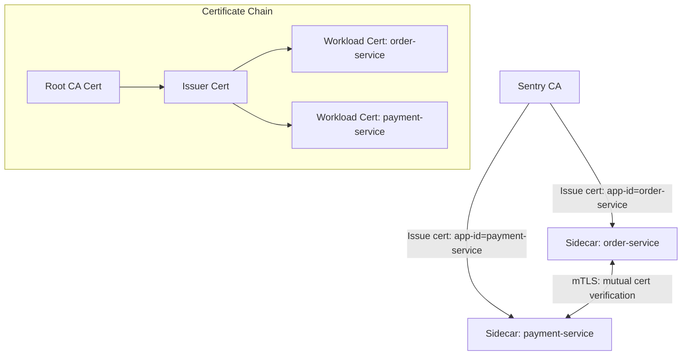

# How to Configure Dapr mTLS for Service-to-Service Security

Author: [nawazdhandala](https://www.github.com/nawazdhandala)

Tags: Dapr, mTLS, Security, Encryption, Kubernetes

Description: Learn how Dapr uses mutual TLS (mTLS) to encrypt and authenticate all service-to-service communication, and how to configure, rotate, and monitor Dapr's certificate infrastructure.

---

## Introduction

Dapr's Sentry service acts as a certificate authority (CA), automatically issuing short-lived workload certificates to every Dapr sidecar. All service-to-service communication between Dapr sidecars is encrypted and mutually authenticated using these certificates - with no application code changes required.

Key properties:
- All inter-sidecar traffic is encrypted with TLS 1.3
- Each sidecar has its own certificate identifying it by app ID
- Certificates rotate automatically (default: 24 hours)
- mTLS can be disabled per namespace for development/testing

## Architecture



## Prerequisites

- Dapr installed on Kubernetes
- Access to Kubernetes secrets in `dapr-system` namespace

## mTLS Default Behavior

mTLS is **enabled by default** when you install Dapr on Kubernetes. Sentry generates a self-signed root CA on first install and issues workload certificates automatically. You do not need to do anything to enable mTLS in standard deployments.

Verify mTLS status:

```bash
dapr mtls -k
```

Output:

```
Mutual TLS is enabled in your Kubernetes cluster
```

## Viewing Certificate Information

Inspect the current root certificate:

```bash
dapr mtls export -k --out ./certs

# View the root certificate
openssl x509 -in ./certs/ca.crt -text -noout | grep -A 3 "Validity"
```

View a workload certificate from a sidecar pod:

```bash
# Get sidecar logs showing cert info
kubectl logs -l app=order-service -c daprd | grep -i cert
```

## Disabling mTLS (Not Recommended for Production)

mTLS can be disabled in the Dapr Configuration:

```yaml
apiVersion: dapr.io/v1alpha1
kind: Configuration
metadata:
  name: app-config
  namespace: default
spec:
  mtls:
    enabled: false
```

Apply this configuration to specific apps:

```yaml
metadata:
  annotations:
    dapr.io/config: "app-config"
```

To disable mTLS globally (affects the Dapr control plane):

```bash
dapr mtls disable -k
```

Re-enable:

```bash
dapr mtls enable -k
```

## Custom Root Certificate

For production deployments, replace the auto-generated root CA with your own certificate chain:

### Step 1: Generate Custom CA

```bash
# Generate root CA private key
openssl genrsa -out ca.key 4096

# Self-sign the root CA
openssl req -new -x509 -days 3650 -key ca.key \
  -subj "/CN=My Dapr Root CA/O=MyOrg" \
  -out ca.crt

# Generate issuer key and CSR
openssl genrsa -out issuer.key 4096
openssl req -new -key issuer.key \
  -subj "/CN=My Dapr Issuer/O=MyOrg" \
  -out issuer.csr

# Sign issuer cert with root CA
openssl x509 -req -days 365 -CA ca.crt -CAkey ca.key \
  -CAcreateserial -in issuer.csr -out issuer.crt \
  -extensions v3_ca \
  -extfile <(echo "[v3_ca]\nbasicConstraints=critical,CA:TRUE")
```

### Step 2: Apply Custom Certificates to Dapr

```bash
kubectl create secret generic dapr-trust-bundle \
  --namespace dapr-system \
  --from-file=ca.crt=ca.crt \
  --from-file=issuer.crt=issuer.crt \
  --from-file=issuer.key=issuer.key
```

Reinstall Dapr with custom certs:

```bash
helm upgrade dapr dapr/dapr \
  --namespace dapr-system \
  --set-file dapr_sentry.tls.root.certPEM=ca.crt \
  --set-file dapr_sentry.tls.issuer.certPEM=issuer.crt \
  --set-file dapr_sentry.tls.issuer.keyPEM=issuer.key
```

## Certificate Rotation

Dapr workload certificates rotate automatically. Monitor certificate expiry:

```bash
dapr mtls export -k --out ./certs
openssl x509 -in ./certs/ca.crt -text -noout | grep "Not After"
```

Rotate the issuer certificate manually:

```bash
# Update the dapr-trust-bundle secret with new certs
kubectl create secret generic dapr-trust-bundle \
  --namespace dapr-system \
  --from-file=ca.crt=new-ca.crt \
  --from-file=issuer.crt=new-issuer.crt \
  --from-file=issuer.key=new-issuer.key \
  --dry-run=client -o yaml | kubectl apply -f -

# Restart Sentry to pick up new certs
kubectl rollout restart deployment/dapr-sentry -n dapr-system
```

## SPIFFE Identity

Each Dapr workload certificate uses a SPIFFE (Secure Production Identity Framework for Everyone) identity in the Subject Alternative Name (SAN):

```
spiffe://{trustDomain}/ns/{namespace}/{appId}
```

For example:

```
spiffe://cluster.local/ns/default/order-service
```

This allows Dapr to cryptographically verify the identity of each sidecar during mTLS handshake.

## Configuring Certificate TTL

Tune workload certificate lifetime via Helm:

```bash
helm upgrade dapr dapr/dapr \
  --namespace dapr-system \
  --set dapr_sentry.logLevel=info \
  --set global.mtls.workloadCertTTL=24h \
  --set global.mtls.allowedClockSkew=15m
```

## Summary

Dapr mTLS provides automatic encryption and mutual authentication for all inter-sidecar communication using Sentry as the CA. It is enabled by default with no application changes required. For production, replace the auto-generated root CA with your own certificate chain, configure certificate TTL appropriately, and monitor for upcoming expirations. All workload certificates use SPIFFE identities, enabling strong cryptographic service identity verification across your cluster.
