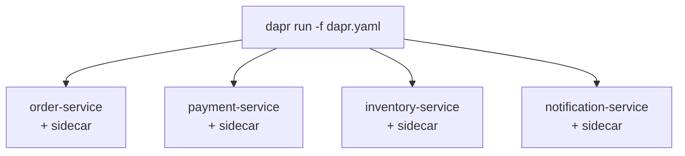

# How to Use Dapr Multi-App Run for Local Development

Author: [nawazdhandala](https://www.github.com/nawazdhandala)

Tags: Dapr, Multi-App Run, Local Development, Self-Hosted, CLI

Description: Use the Dapr multi-app run feature to start multiple services with their sidecars in a single command using a dapr.yaml configuration file for streamlined local development.

---

## What Is Multi-App Run?

Multi-app run lets you start multiple Dapr-enabled applications simultaneously using a single `dapr run -f dapr.yaml` command. Without it, you need a separate terminal for each `dapr run` invocation. The `dapr.yaml` file defines all services, their ports, and their individual configurations.



## The dapr.yaml File

```yaml
# dapr.yaml
version: 1
common:
  resourcesPath: ./components       # shared components directory
  env:
    NODE_ENV: development

apps:
- appID: order-service
  appDirPath: ./order-service/
  appPort: 3001
  daprHTTPPort: 3501
  daprGRPCPort: 50051
  command: ["node", "app.js"]
  env:
    PORT: "3001"

- appID: payment-service
  appDirPath: ./payment-service/
  appPort: 3002
  daprHTTPPort: 3502
  daprGRPCPort: 50052
  command: ["python3", "app.py"]
  env:
    PORT: "3002"

- appID: inventory-service
  appDirPath: ./inventory-service/
  appPort: 3003
  daprHTTPPort: 3503
  daprGRPCPort: 50053
  command: ["go", "run", "main.go"]
  env:
    PORT: "3003"

- appID: notification-service
  appDirPath: ./notification-service/
  appPort: 3004
  daprHTTPPort: 3504
  daprGRPCPort: 50054
  command: ["dotnet", "run"]
  env:
    ASPNETCORE_URLS: "http://+:3004"
```

## Running All Services

```bash
dapr run -f dapr.yaml
```

Output:

```text
Validating config and starting app "order-service"
Validating config and starting app "payment-service"
Validating config and starting app "inventory-service"
Validating config and starting app "notification-service"

Started Dapr with app id "order-service". HTTP Port: 3501.
Started Dapr with app id "payment-service". HTTP Port: 3502.
Started Dapr with app id "inventory-service". HTTP Port: 3503.
Started Dapr with app id "notification-service". HTTP Port: 3504.
```

All services start in parallel. Logs from all services are interleaved in the terminal.

## Full dapr.yaml Options

```yaml
version: 1
common:
  resourcesPath: ./components
  configFilePath: ./config.yaml
  logLevel: info
  enableApiLogging: false
  env:
    ENVIRONMENT: development

apps:
- appID: order-service
  appDirPath: ./order-service/
  appPort: 3001
  daprHTTPPort: 3501
  daprGRPCPort: 50051
  metricsPort: 9091
  profilePort: 7771
  command: ["node", "app.js"]
  appProtocol: http             # http | grpc | https | grpcs
  unixDomainSocket: ""
  resourcesPath: ./order-service/components   # service-specific components
  configFilePath: ./order-service/config.yaml  # service-specific config
  appHealthCheckPath: /healthz
  logLevel: debug               # override common log level
  appMaxConcurrency: 10
  enableApiLogging: true
  env:
    PORT: "3001"
    DB_HOST: localhost
```

## Project Structure

```text
my-project/
  dapr.yaml
  components/
    statestore.yaml
    pubsub.yaml
  order-service/
    app.js
    package.json
  payment-service/
    app.py
    requirements.txt
  inventory-service/
    main.go
    go.mod
  notification-service/
    Program.cs
    notification-service.csproj
```

## Stopping All Services

Press `Ctrl+C` in the terminal running `dapr run -f dapr.yaml`. All services and their sidecars stop gracefully.

Or stop from another terminal:

```bash
dapr stop -f dapr.yaml
```

## Stopping Individual Services

```bash
dapr stop --app-id order-service
```

Other services keep running.

## Listing Running Apps

```bash
dapr list
```

Output:

```text
APP ID               HTTP PORT  GRPC PORT  APP PORT  COMMAND   AGE   CREATED
order-service        3501       50051      3001      node ...  5m    10:00:00
payment-service      3502       50052      3002      python3   5m    10:00:00
inventory-service    3503       50053      3003      go run    5m    10:00:00
notification-service 3504       50054      3004      dotnet    5m    10:00:00
```

## Service-Specific Components

Override shared components for a specific service:

```yaml
apps:
- appID: order-service
  appDirPath: ./order-service/
  appPort: 3001
  daprHTTPPort: 3501
  command: ["node", "app.js"]
  resourcesPath: ./order-service/components  # uses its own statestore.yaml
```

## Using a Config File per Service

```yaml
apps:
- appID: order-service
  configFilePath: ./order-service/config.yaml  # custom tracing/middleware
```

```yaml
# order-service/config.yaml
apiVersion: dapr.io/v1alpha1
kind: Configuration
metadata:
  name: order-config
spec:
  tracing:
    samplingRate: "1"
    zipkin:
      endpointAddress: http://localhost:9411/api/v2/spans
```

## Template Variables

Multi-app run supports reading from `.env` files:

```bash
# .env
REDIS_HOST=localhost
KAFKA_BROKERS=localhost:9092
```

```yaml
# dapr.yaml
apps:
- appID: order-service
  command: ["node", "app.js"]
  env:
    REDIS_HOST: "${REDIS_HOST}"
```

Load the env file:

```bash
dapr run -f dapr.yaml --env-file .env
```

## Log Filtering

Filter logs for a specific service:

```bash
dapr run -f dapr.yaml 2>&1 | grep "order-service"
```

## Summary

Dapr multi-app run simplifies local development by starting all microservices and their sidecars with a single `dapr run -f dapr.yaml` command. The `dapr.yaml` file defines each service's app ID, ports, command, environment variables, and optional per-service components and configuration. All services stop together with `Ctrl+C` or individually with `dapr stop --app-id`. This approach reduces the number of terminal windows and makes the full local stack reproducible.
