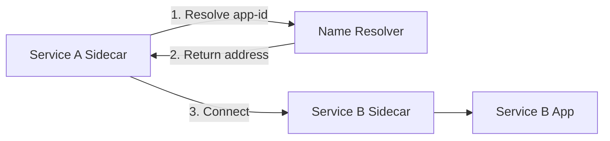

# How to Use Dapr Name Resolution for Service Discovery

Author: [nawazdhandala](https://www.github.com/nawazdhandala)

Tags: Dapr, Name Resolution, Service Discovery, Microservice, DNS

Description: Understand how Dapr name resolution works for service discovery in self-hosted and Kubernetes environments, including mDNS, Kubernetes DNS, and Consul.

---

## What Is Dapr Name Resolution?

Dapr name resolution is a pluggable building block that maps application IDs to network addresses. When Service A invokes Service B by its app ID, the Dapr sidecar uses a name resolver to find B's address. This abstracts away environment-specific service discovery so the same application code works locally and in production.

## Name Resolution Providers

Dapr ships with several built-in name resolution components:

| Provider | Environment | Mechanism |
|----------|-------------|-----------|
| mDNS | Self-hosted (local) | Multicast DNS broadcast |
| Kubernetes | Kubernetes | Kubernetes DNS + headless services |
| Consul | Any | HashiCorp Consul service catalog |
| SQLite | Self-hosted (single-host) | Local SQLite registry |

## How Name Resolution Fits in Service Invocation



## Default: mDNS in Self-Hosted Mode

By default, Dapr uses mDNS for name resolution in self-hosted mode. Each sidecar broadcasts its app ID and port over multicast DNS on the local network. Other sidecars listen and build a local registry.

No configuration is needed. This works automatically when you run:

```bash
dapr run --app-id service-b --app-port 8081 -- python service_b.py
dapr run --app-id service-a --app-port 8080 -- python service_a.py
```

Service A can now call Service B by app ID:

```bash
curl http://localhost:3500/v1.0/invoke/service-b/method/hello
```

## Default: Kubernetes DNS

On Kubernetes, Dapr uses the cluster's internal DNS. Each Dapr-enabled app is registered with the Dapr operator, which creates a headless Kubernetes service for it. The sidecar resolves app IDs using the cluster DNS.

No additional configuration is needed. The sidecar discovers other apps through:

```json
{app-id}-dapr.{namespace}.svc.cluster.local
```

## Configuring HashiCorp Consul Name Resolution

For multi-host self-hosted deployments or hybrid environments, use Consul:

```yaml
apiVersion: dapr.io/v1alpha1
kind: Component
metadata:
  name: nr-consul
spec:
  type: nameresolution.consul
  version: v1
  metadata:
  - name: selfRegister
    value: "true"
  - name: client
    value: |
      {
        "address": "consul-server:8500",
        "scheme": "http",
        "datacenter": "dc1"
      }
  - name: checks
    value: |
      [
        {
          "name": "Dapr Health Status",
          "checkID": "daprHealth",
          "interval": "15s",
          "http": "http://localhost:3500/v1.0/healthz"
        }
      ]
```

Save as `~/.dapr/components/consul.yaml` or apply as a Kubernetes ConfigMap, then restart sidecars.

## Configuring SQLite Name Resolution (Single-Host)

For a deterministic single-host setup without mDNS:

```yaml
apiVersion: dapr.io/v1alpha1
kind: Component
metadata:
  name: nr-sqlite
spec:
  type: nameresolution.sqlite
  version: v1
  metadata:
  - name: connectionString
    value: "/tmp/dapr-nr.db"
```

## Custom Name Resolution Configuration

You can reference a name resolution component in the Dapr configuration file:

```yaml
# ~/.dapr/config.yaml
apiVersion: dapr.io/v1alpha1
kind: Configuration
metadata:
  name: daprConfig
spec:
  nameResolution:
    component: nr-consul
    configuration:
      selfRegister: true
```

## Namespace-Aware Resolution on Kubernetes

To invoke a service in a different namespace:

```bash
curl http://localhost:3500/v1.0/invoke/service-b.production/method/hello
```

Or set the `dapr-app-id` header with the namespace qualifier:

```bash
curl http://localhost:3500/v1.0/invoke/service-b/method/hello \
  -H "dapr-app-id: service-b.production"
```

## Debugging Name Resolution

View the sidecar logs to trace resolution:

```bash
dapr logs --app-id service-a
```

Look for lines like:

```text
time="..." level=info msg="Resolved host service-b to address 192.168.1.5:3501"
```

On Kubernetes:

```bash
kubectl logs deployment/service-a -c daprd | grep -i resolv
```

## mDNS Limitations

mDNS works within a single local network segment. It does not work across subnets or in containerized environments where multicast is disabled (e.g., some Docker networking modes). For those cases, use Consul or Kubernetes DNS.

## Summary

Dapr name resolution is a pluggable subsystem that maps app IDs to network addresses. In self-hosted mode it defaults to mDNS, and on Kubernetes it uses the cluster's internal DNS. For multi-host or production self-hosted deployments, HashiCorp Consul provides a robust alternative. Name resolution is transparent to application code: you always invoke services by their logical app ID.
