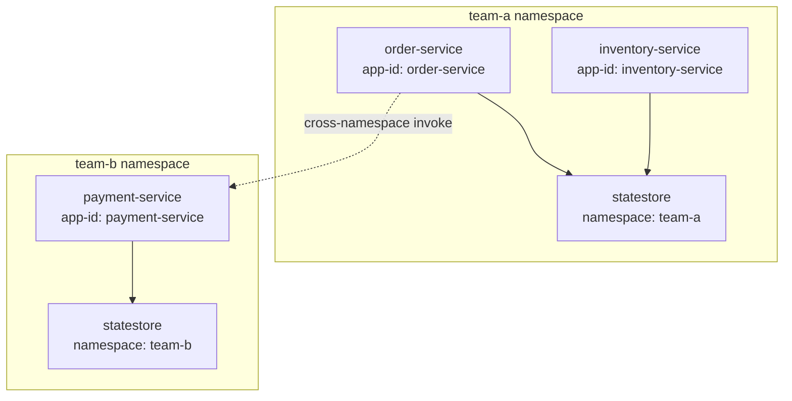
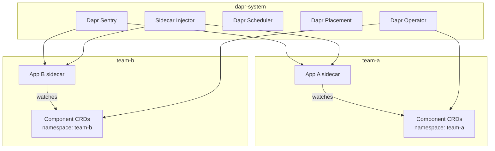

# How to Use Dapr Namespaces for Application Isolation

Author: [nawazdhandala](https://www.github.com/nawazdhandala)

Tags: Dapr, Namespace, Isolation, Kubernetes, Security

Description: Learn how Dapr uses Kubernetes namespaces and namespace-scoped components to isolate applications, control cross-namespace communication, and enforce security boundaries.

---

## Why Namespaces Matter in Dapr

Dapr runs in Kubernetes namespaces. Applications in different namespaces are isolated by default. This lets multiple teams share a Kubernetes cluster while preventing one team's services from accessing another team's state stores, secrets, or services.



## Namespace-Scoped Components

When you apply a Dapr component to a namespace, only applications in that namespace can use it.

```yaml
# team-a-statestore.yaml
apiVersion: dapr.io/v1alpha1
kind: Component
metadata:
  name: statestore
  namespace: team-a        # scoped to the team-a namespace
spec:
  type: state.redis
  version: v1
  metadata:
  - name: redisHost
    value: redis.team-a.svc.cluster.local:6379
  - name: redisPassword
    secretKeyRef:
      name: redis-secret
      key: password
auth:
  secretStore: kubernetes
```

```bash
kubectl apply -f team-a-statestore.yaml -n team-a
```

Applications in `team-b` cannot access this component even if they use the same name `statestore`.

## App ID Scoping Within a Namespace

You can further restrict component access to specific app IDs within a namespace:

```yaml
apiVersion: dapr.io/v1alpha1
kind: Component
metadata:
  name: orders-db
  namespace: team-a
spec:
  type: state.postgresql
  version: v1
  metadata:
  - name: connectionString
    secretKeyRef:
      name: pg-secret
      key: conn
auth:
  secretStore: kubernetes
scopes:
- order-service         # only this app in team-a can use orders-db
```

## Deploying Applications into Namespaces

```yaml
# order-service deployment in team-a
apiVersion: apps/v1
kind: Deployment
metadata:
  name: order-service
  namespace: team-a
spec:
  selector:
    matchLabels:
      app: order-service
  template:
    metadata:
      labels:
        app: order-service
      annotations:
        dapr.io/enabled: "true"
        dapr.io/app-id: "order-service"
        dapr.io/app-port: "3000"
        dapr.io/config: "team-a-config"
    spec:
      containers:
      - name: order-service
        image: myregistry/order-service:latest
```

## Cross-Namespace Service Invocation

To call a service in a different namespace, include the namespace in the app ID:

```bash
# Call payment-service in team-b namespace from any sidecar
curl http://localhost:3500/v1.0/invoke/payment-service.team-b/method/pay \
  -H "Content-Type: application/json" \
  -d '{"amount": 99.99}'
```

The format is `<app-id>.<namespace>`.

For this to work, the target service must be reachable at the network level (no blocking NetworkPolicy).

## Cross-Namespace Pub/Sub

Pub/Sub components are also namespace-scoped. To share a message broker across namespaces, deploy the component CRD in each namespace:

```bash
kubectl apply -f pubsub.yaml -n team-a
kubectl apply -f pubsub.yaml -n team-b
```

Both namespaces can then publish and subscribe to the same broker, but each team manages its own component definition and credentials.

## Namespace-Specific Configurations

You can have different `Configuration` resources per namespace for different tracing, middleware, or access control settings:

```yaml
# team-a specific configuration
apiVersion: dapr.io/v1alpha1
kind: Configuration
metadata:
  name: team-a-config
  namespace: team-a
spec:
  tracing:
    samplingRate: "1"
    otel:
      endpointAddress: http://otel-collector.monitoring:4317
      isSecure: false
      protocol: grpc
  accessControl:
    defaultAction: deny
    policies:
    - appId: inventory-service
      defaultAction: allow
      namespace: "team-a"
```

## Initializing Dapr in a Specific Namespace

By default, Dapr is installed in the `dapr-system` namespace. You can target a custom namespace:

```bash
dapr init --kubernetes --namespace dapr-system
```

But application deployments go into their own namespaces. The Dapr control plane in `dapr-system` manages all namespaces.

## Listing Resources by Namespace

```bash
# List components in a specific namespace
kubectl get components -n team-a

# List configurations
kubectl get configurations -n team-a

# List resiliency policies
kubectl get resiliency -n team-a

# List subscriptions
kubectl get subscriptions -n team-a
```

## Namespace Isolation Architecture



## Namespace Best Practices

- Use one namespace per team or microservice domain
- Never share component names with different backends across namespaces unless intentional
- Apply `defaultAction: deny` in access control configurations per namespace
- Use Kubernetes `NetworkPolicy` to complement Dapr's mTLS isolation
- Use separate Redis or database instances per namespace when data isolation is required

## Summary

Dapr honors Kubernetes namespaces as isolation boundaries. Component CRDs are namespace-scoped, so a Redis component in `team-a` is invisible to applications in `team-b`. App ID scoping within a namespace adds a second layer of access control. Cross-namespace service invocation is possible using the `<app-id>.<namespace>` format but requires network-level reachability. Combining namespace isolation, app scoping, access control policies, and NetworkPolicies gives you a defense-in-depth model for multi-team Kubernetes clusters.
