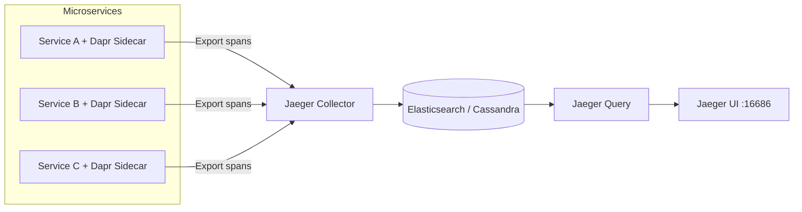

# How to Set Up Dapr Observability with Jaeger

Author: [nawazdhandala](https://www.github.com/nawazdhandala)

Tags: Dapr, Observability, Jaeger, Tracing, Distributed Tracing

Description: Learn how to configure Dapr distributed tracing with Jaeger to capture and visualize traces across microservices, including Jaeger deployment and sampling configuration.

---

## Introduction

Jaeger is a production-grade distributed tracing system originally developed by Uber Technologies. Dapr can export traces to Jaeger using the Zipkin-compatible endpoint that Jaeger provides, or via an OpenTelemetry Collector forwarding to Jaeger. This guide covers both approaches.

## Architecture



## Prerequisites

- Dapr installed on Kubernetes or locally
- Jaeger deployed
- Dapr Configuration resource

## Step 1: Deploy Jaeger on Kubernetes

### Option A - All-in-One (Development/Testing)

```yaml
apiVersion: apps/v1
kind: Deployment
metadata:
  name: jaeger
  namespace: default
spec:
  replicas: 1
  selector:
    matchLabels:
      app: jaeger
  template:
    metadata:
      labels:
        app: jaeger
    spec:
      containers:
      - name: jaeger
        image: jaegertracing/all-in-one:latest
        env:
        - name: COLLECTOR_ZIPKIN_HOST_PORT
          value: ":9411"
        ports:
        - containerPort: 5775
          protocol: UDP
        - containerPort: 6831
          protocol: UDP
        - containerPort: 6832
          protocol: UDP
        - containerPort: 5778
        - containerPort: 16686
        - containerPort: 14268
        - containerPort: 9411
---
apiVersion: v1
kind: Service
metadata:
  name: jaeger
  namespace: default
spec:
  selector:
    app: jaeger
  ports:
  - name: zipkin
    port: 9411
    targetPort: 9411
  - name: ui
    port: 16686
    targetPort: 16686
  - name: collector
    port: 14268
    targetPort: 14268
  type: ClusterIP
```

```bash
kubectl apply -f jaeger.yaml
```

### Option B - Jaeger Operator (Production)

```bash
kubectl create namespace observability

kubectl apply -f https://github.com/jaegertracing/jaeger-operator/releases/latest/download/jaeger-operator.yaml -n observability

# Create a Jaeger instance
kubectl apply -f - <<EOF
apiVersion: jaegertracing.io/v1
kind: Jaeger
metadata:
  name: jaeger
  namespace: default
spec:
  strategy: allInOne
  allInOne:
    image: jaegertracing/all-in-one:latest
    options:
      query:
        base-path: /jaeger
  ingress:
    enabled: false
  collector:
    options:
      collector:
        zipkin:
          host-port: ":9411"
EOF
```

### Local Docker

```bash
docker run -d \
  --name jaeger \
  -e COLLECTOR_ZIPKIN_HOST_PORT=:9411 \
  -p 5775:5775/udp \
  -p 6831:6831/udp \
  -p 6832:6832/udp \
  -p 5778:5778 \
  -p 16686:16686 \
  -p 14268:14268 \
  -p 9411:9411 \
  jaegertracing/all-in-one:latest
```

## Step 2: Configure Dapr to Export to Jaeger

Dapr can export to Jaeger via its Zipkin-compatible endpoint (port 9411):

```yaml
apiVersion: dapr.io/v1alpha1
kind: Configuration
metadata:
  name: jaeger-tracing-config
  namespace: default
spec:
  tracing:
    samplingRate: "1"
    zipkin:
      endpointAddress: "http://jaeger.default.svc.cluster.local:9411/api/v2/spans"
```

```bash
kubectl apply -f jaeger-tracing-config.yaml
```

## Step 3: Configure Dapr via OpenTelemetry Collector (Alternative)

For more advanced scenarios, route traces through an OpenTelemetry Collector to Jaeger:

```yaml
apiVersion: dapr.io/v1alpha1
kind: Configuration
metadata:
  name: otel-tracing-config
  namespace: default
spec:
  tracing:
    samplingRate: "1"
    otel:
      endpointAddress: "otel-collector.default.svc.cluster.local:4317"
      isSecure: false
      protocol: "grpc"
```

OpenTelemetry Collector config (`otel-config.yaml`):

```yaml
receivers:
  otlp:
    protocols:
      grpc:
        endpoint: 0.0.0.0:4317
      http:
        endpoint: 0.0.0.0:4318

exporters:
  jaeger:
    endpoint: jaeger.default.svc.cluster.local:14250
    tls:
      insecure: true

service:
  pipelines:
    traces:
      receivers: [otlp]
      exporters: [jaeger]
```

## Step 4: Annotate Your Deployments

```yaml
metadata:
  annotations:
    dapr.io/enabled: "true"
    dapr.io/app-id: "order-service"
    dapr.io/app-port: "3000"
    dapr.io/config: "jaeger-tracing-config"
```

## Step 5: Access the Jaeger UI

```bash
kubectl port-forward svc/jaeger 16686:16686
```

Open `http://localhost:16686` in your browser.

In the Jaeger UI:
1. Select your service from the "Service" dropdown
2. Set a time range
3. Click "Find Traces"
4. Click a trace to see the span waterfall

## Searching Traces

Use Jaeger's search to find traces by:

- **Service name**: matches Dapr app ID
- **Operation name**: e.g., `/invoke/method/checkout`
- **Tags**: key-value pairs attached to spans
- **Duration range**: find slow traces
- **Time range**: search within a specific window

## Trace Span Attributes

Dapr adds standard attributes to spans:

| Attribute | Value Example |
|---|---|
| `dapr.api` | `ServiceInvocation` |
| `dapr.app_id` | `order-service` |
| `dapr.target_app_id` | `payment-service` |
| `net.peer.name` | `payment-service.default` |
| `http.method` | `POST` |
| `http.status_code` | `200` |

## Production Sampling with Jaeger Agent

For high-throughput production systems, use Jaeger's remote sampling:

```yaml
spec:
  tracing:
    samplingRate: "0"  # Let Jaeger agent decide
    otel:
      endpointAddress: "jaeger-agent.default.svc.cluster.local:4317"
```

Configure Jaeger with probabilistic or rate-limiting sampling strategies in the Jaeger deployment.

## Summary

Jaeger integrates with Dapr via its Zipkin-compatible endpoint or through an OpenTelemetry Collector. Deploy Jaeger using the all-in-one image for development or the Jaeger Operator for production. Configure a Dapr Configuration resource with the Jaeger endpoint, apply it to your Deployments via annotations, and view traces in the Jaeger UI at port 16686. Dapr automatically instruments all building block operations, giving you end-to-end visibility across your microservices with no code changes.
