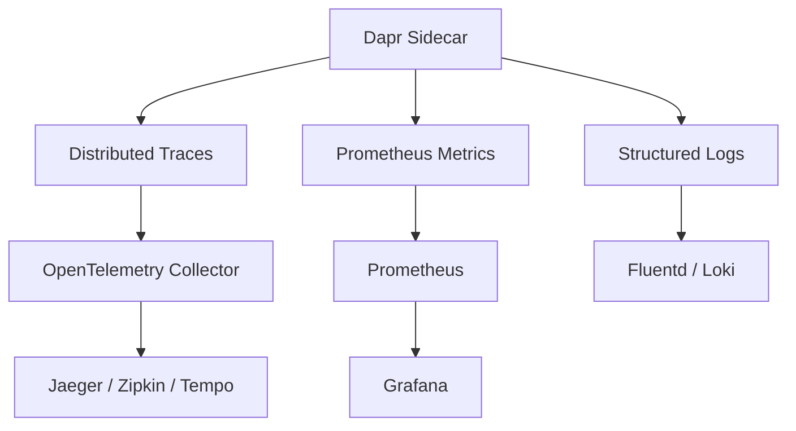
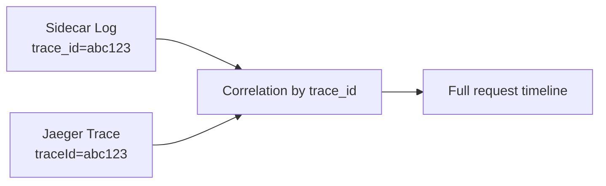

# How to Set Up Dapr Observability with Tracing, Metrics, and Logs

Author: [nawazdhandala](https://www.github.com/nawazdhandala)

Tags: Dapr, Observability, Tracing, Metric, Logging

Description: Configure Dapr distributed tracing with OpenTelemetry, scrape Prometheus metrics, and enable structured JSON logging for full observability of your microservices.

---

## Observability in Dapr

Dapr provides three observability pillars out of the box: distributed tracing, metrics, and structured logging. These are generated by the sidecar automatically - your application code does not need to be instrumented for basic observability.



## Part 1 - Distributed Tracing

### Configure the Dapr Configuration Resource

```yaml
# config.yaml
apiVersion: dapr.io/v1alpha1
kind: Configuration
metadata:
  name: tracing-config
  namespace: default
spec:
  tracing:
    samplingRate: "1"        # 1 = 100%, 0 = disabled, 0.5 = 50%
    otel:
      endpointAddress: http://otel-collector.monitoring.svc.cluster.local:4317
      isSecure: false
      protocol: grpc         # grpc or http
```

Apply the configuration:

```bash
kubectl apply -f config.yaml -n default
```

Reference it from your deployment:

```yaml
annotations:
  dapr.io/config: "tracing-config"
```

### Deploy the OpenTelemetry Collector

```yaml
apiVersion: apps/v1
kind: Deployment
metadata:
  name: otel-collector
  namespace: monitoring
spec:
  replicas: 1
  selector:
    matchLabels:
      app: otel-collector
  template:
    metadata:
      labels:
        app: otel-collector
    spec:
      containers:
      - name: otel-collector
        image: otel/opentelemetry-collector-contrib:latest
        args: ["--config=/conf/otel-collector-config.yaml"]
        volumeMounts:
        - name: config-vol
          mountPath: /conf
      volumes:
      - name: config-vol
        configMap:
          name: otel-collector-config
```

```yaml
# otel-collector-config.yaml ConfigMap
apiVersion: v1
kind: ConfigMap
metadata:
  name: otel-collector-config
  namespace: monitoring
data:
  otel-collector-config.yaml: |
    receivers:
      otlp:
        protocols:
          grpc:
            endpoint: 0.0.0.0:4317
          http:
            endpoint: 0.0.0.0:4318
    exporters:
      jaeger:
        endpoint: jaeger-collector.monitoring.svc.cluster.local:14250
        tls:
          insecure: true
      logging:
        loglevel: debug
    service:
      pipelines:
        traces:
          receivers: [otlp]
          exporters: [jaeger, logging]
```

### Tracing in Self-Hosted Mode with Zipkin

```yaml
# ~/.dapr/config.yaml
apiVersion: dapr.io/v1alpha1
kind: Configuration
metadata:
  name: daprConfig
spec:
  tracing:
    samplingRate: "1"
    zipkin:
      endpointAddress: http://localhost:9411/api/v2/spans
```

Run Zipkin (already started by `dapr init`):

```bash
open http://localhost:9411
```

### Viewing a Trace

A service invocation call from `order-service` to `payment-service` produces a trace with spans:

```mermaid
gantt
    title Distributed Trace
    dateFormat x
    axisFormat %Lms
    section order-service sidecar
    Outbound invoke     :0, 10
    section payment-service sidecar
    Inbound invoke      :5, 15
    section payment-service app
    /pay handler        :6, 14
```



## Part 2 - Metrics

### Prometheus Scrape Configuration

Dapr sidecars expose Prometheus metrics on port `9090` by default. Enable metrics collection with the annotation:

```yaml
annotations:
  dapr.io/enable-metrics: "true"
  dapr.io/metrics-port: "9090"
```

Add a Prometheus scrape config:

```yaml
# prometheus.yml scrape config
scrape_configs:
  - job_name: 'dapr-sidecars'
    kubernetes_sd_configs:
    - role: pod
    relabel_configs:
    - source_labels: [__meta_kubernetes_pod_annotation_dapr_io_enabled]
      action: keep
      regex: "true"
    - source_labels: [__meta_kubernetes_pod_annotation_dapr_io_metrics_port]
      action: replace
      target_label: __address__
      regex: (.+)
      replacement: ${1}
    - source_labels: [__meta_kubernetes_pod_ip]
      target_label: __address__
      replacement: $1:9090
```

### Key Dapr Metrics

| Metric | Description |
|--------|-------------|
| `dapr_http_server_request_count` | Total HTTP API requests |
| `dapr_http_client_request_count` | Outbound service invocation requests |
| `dapr_component_state_count` | State store operation count |
| `dapr_component_pubsub_ingress_count` | Pub/sub messages received |
| `dapr_component_pubsub_egress_count` | Pub/sub messages published |
| `dapr_grpc_server_started_total` | gRPC calls started |
| `dapr_actor_active_actors` | Active actor instances per type |

### Grafana Dashboard

Import the official Dapr Grafana dashboard (ID `12269`) or use the dashboards from the Dapr GitHub repository:

```bash
kubectl apply -f https://raw.githubusercontent.com/dapr/dapr/master/grafana/system-services-monitoring.json
```

## Part 3 - Structured Logging

### Enable JSON Logging

```yaml
annotations:
  dapr.io/log-level: "info"
  dapr.io/log-as-json: "true"
```

In self-hosted mode:

```bash
dapr run --app-id myapp --log-level info --log-as-json -- node app.js
```

### JSON Log Format

```json
{
  "time": "2026-03-31T12:00:00Z",
  "level": "info",
  "type": "log",
  "msg": "HTTP API Called",
  "app_id": "order-service",
  "ver": "1.14.0",
  "method": "POST",
  "resource": "/v1.0/state/statestore",
  "status": 204,
  "elapsed": 3
}
```

### Enabling API Logging

```yaml
annotations:
  dapr.io/enable-api-logging: "true"
```

This logs every call to the Dapr API, useful for debugging but verbose in production.

### Shipping Logs with Fluentd

```yaml
apiVersion: v1
kind: ConfigMap
metadata:
  name: fluentd-config
data:
  fluent.conf: |
    <source>
      @type tail
      path /var/log/containers/*daprd*.log
      pos_file /var/log/fluentd-dapr.pos
      tag dapr.*
      <parse>
        @type json
        time_key time
        time_format %Y-%m-%dT%H:%M:%S%z
      </parse>
    </source>
    <match dapr.**>
      @type elasticsearch
      host elasticsearch.logging
      port 9200
      index_name dapr-logs
    </match>
```

## Correlating Traces, Metrics, and Logs

Dapr injects the `traceparent` header (W3C Trace Context) into all service invocation calls. The sidecar logs include the trace ID, enabling correlation across logs and traces in tools like Grafana.



## Summary

Dapr provides distributed tracing via OpenTelemetry (or Zipkin), Prometheus metrics on each sidecar, and structured JSON logging - all without application code changes. Configure tracing using a `Configuration` CRD referencing an OTLP collector endpoint, enable metrics scraping with Prometheus relabeling on the `dapr.io/enabled` annotation, and ship JSON logs with Fluentd or a similar aggregator. Together, these three signals give you complete visibility into your Dapr microservices.
