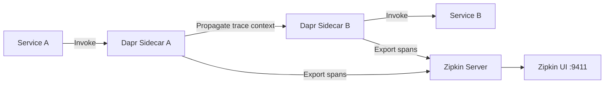

# How to Set Up Dapr Observability with Zipkin

Author: [nawazdhandala](https://www.github.com/nawazdhandala)

Tags: Dapr, Observability, Zipkin, Tracing, Distributed Tracing

Description: Learn how to configure Dapr distributed tracing with Zipkin to visualize service-to-service call traces, understand latency, and debug microservice interactions.

---

## Introduction

Dapr includes built-in distributed tracing support using the W3C Trace Context standard. When you enable tracing in Dapr's Configuration resource and point it at a Zipkin-compatible collector, every service-to-service call, pub/sub message, and actor invocation is automatically traced - no manual instrumentation needed.

## Architecture



## Prerequisites

- Dapr installed on Kubernetes or locally
- Zipkin deployed
- A Dapr Configuration resource

## Step 1: Deploy Zipkin

### Kubernetes

```yaml
apiVersion: apps/v1
kind: Deployment
metadata:
  name: zipkin
  namespace: default
spec:
  replicas: 1
  selector:
    matchLabels:
      app: zipkin
  template:
    metadata:
      labels:
        app: zipkin
    spec:
      containers:
      - name: zipkin
        image: openzipkin/zipkin:latest
        ports:
        - containerPort: 9411
---
apiVersion: v1
kind: Service
metadata:
  name: zipkin
  namespace: default
spec:
  selector:
    app: zipkin
  ports:
  - port: 9411
    targetPort: 9411
  type: ClusterIP
```

```bash
kubectl apply -f zipkin.yaml
```

### Local Docker

```bash
docker run -d \
  --name zipkin \
  -p 9411:9411 \
  openzipkin/zipkin:latest
```

## Step 2: Configure Dapr Tracing

Create a Dapr `Configuration` resource with Zipkin exporter:

```yaml
apiVersion: dapr.io/v1alpha1
kind: Configuration
metadata:
  name: tracing-config
  namespace: default
spec:
  tracing:
    samplingRate: "1"
    zipkin:
      endpointAddress: "http://zipkin.default.svc.cluster.local:9411/api/v2/spans"
```

Parameters:
- `samplingRate` - fraction of traces to sample: `"1"` = 100%, `"0.1"` = 10%
- `endpointAddress` - Zipkin spans endpoint URL

```bash
kubectl apply -f tracing-config.yaml
```

For local development:

```yaml
spec:
  tracing:
    samplingRate: "1"
    zipkin:
      endpointAddress: "http://localhost:9411/api/v2/spans"
```

## Step 3: Apply the Configuration to Your Apps

Reference the Configuration in your Deployment annotations:

```yaml
metadata:
  annotations:
    dapr.io/enabled: "true"
    dapr.io/app-id: "order-service"
    dapr.io/app-port: "3000"
    dapr.io/config: "tracing-config"
```

## Step 4: View Traces in Zipkin UI

Access the Zipkin UI:

```bash
# Kubernetes - port forward
kubectl port-forward svc/zipkin 9411:9411

# Open browser
open http://localhost:9411
```

In the UI:
1. Select the service name from the dropdown
2. Click "Find Traces"
3. Click on a trace to see the full span timeline

## Step 5: Generate Sample Traces

Make a few service calls to generate traces:

```bash
# Invoke service-to-service call
curl -X POST \
  http://localhost:3500/v1.0/invoke/checkout-service/method/checkout \
  -H "Content-Type: application/json" \
  -d '{"orderId": "test-001"}'
```

Dapr automatically creates spans for:
- Service invocation calls
- Pub/Sub message publishing and subscription
- State store operations
- Actor method invocations
- Binding calls

## Trace Context Propagation

Dapr propagates trace context using the W3C `traceparent` and `tracestate` headers. If your application makes outbound HTTP calls, propagate these headers to maintain the trace chain:

```javascript
// Node.js - propagate trace headers
app.post('/checkout', async (req, res) => {
  const traceparent = req.headers['traceparent'];
  const tracestate = req.headers['tracestate'];

  // Forward to downstream service
  await axios.post('http://localhost:3500/v1.0/invoke/payment-service/method/charge', payload, {
    headers: {
      'traceparent': traceparent,
      'tracestate': tracestate
    }
  });

  res.json({ status: 'ok' });
});
```

## Sampling Rate Tuning

For production, reduce sampling to avoid Zipkin overhead:

```yaml
spec:
  tracing:
    samplingRate: "0.01"  # Sample 1% of requests
```

For debugging a specific issue, temporarily increase to 100%:

```yaml
spec:
  tracing:
    samplingRate: "1"
```

## Viewing an Example Trace

A typical distributed trace in Zipkin shows the call hierarchy:

```mermaid
gantt
    title Distributed Trace Timeline
    dateFormat  x
    axisFormat %Lms
    section order-service
    Handle request    :0, 250
    section dapr-sidecar (order)
    Invoke payment    :50, 150
    section payment-service
    Charge payment    :60, 140
    section dapr-sidecar (payment)
    Write state       :100, 130
```



## Summary

Setting up Dapr tracing with Zipkin requires deploying Zipkin, creating a Dapr Configuration resource pointing to it, and annotating your Deployments with the configuration name. Dapr automatically creates spans for all building block operations without any code changes. Use the Zipkin UI to visualize call chains, identify latency hotspots, and debug distributed system behavior. Tune `samplingRate` between `0` and `1` based on your traffic volume and storage capacity.
