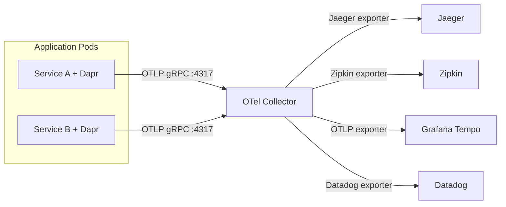

# How to Use Dapr with OpenTelemetry for Distributed Tracing

Author: [nawazdhandala](https://www.github.com/nawazdhandala)

Tags: Dapr, OpenTelemetry, Tracing, Observability, OTLP

Description: Learn how to configure Dapr to export traces via OpenTelemetry Protocol (OTLP) to any compatible backend using the OpenTelemetry Collector as a trace pipeline.

---

## Introduction

Dapr supports exporting traces using the OpenTelemetry Protocol (OTLP), which is the vendor-neutral standard for telemetry data. By routing traces through the OpenTelemetry Collector, you can fan out to multiple backends (Jaeger, Zipkin, Tempo, Datadog, Honeycomb) from a single export configuration, and enrich traces with additional attributes.

## Architecture



## Prerequisites

- Dapr v1.7 or later
- OpenTelemetry Collector deployed
- Target tracing backend (Jaeger, Zipkin, Tempo, etc.)

## Step 1: Deploy the OpenTelemetry Collector

Create the OTel Collector configuration:

```yaml
apiVersion: v1
kind: ConfigMap
metadata:
  name: otel-collector-config
  namespace: default
data:
  otel-collector-config.yaml: |
    receivers:
      otlp:
        protocols:
          grpc:
            endpoint: 0.0.0.0:4317
          http:
            endpoint: 0.0.0.0:4318

    processors:
      batch:
        timeout: 1s
        send_batch_size: 1024
      memory_limiter:
        check_interval: 1s
        limit_mib: 512
      resource:
        attributes:
        - action: insert
          key: environment
          value: production

    exporters:
      jaeger:
        endpoint: jaeger.default.svc.cluster.local:14250
        tls:
          insecure: true
      zipkin:
        endpoint: http://zipkin.default.svc.cluster.local:9411/api/v2/spans
      otlp/tempo:
        endpoint: tempo.monitoring.svc.cluster.local:4317
        tls:
          insecure: true
      logging:
        verbosity: detailed

    service:
      pipelines:
        traces:
          receivers: [otlp]
          processors: [memory_limiter, batch, resource]
          exporters: [jaeger, zipkin, otlp/tempo]
```

Deploy the Collector:

```yaml
apiVersion: apps/v1
kind: Deployment
metadata:
  name: otel-collector
  namespace: default
spec:
  replicas: 1
  selector:
    matchLabels:
      app: otel-collector
  template:
    metadata:
      labels:
        app: otel-collector
    spec:
      containers:
      - name: otel-collector
        image: otel/opentelemetry-collector-contrib:latest
        args: ["--config=/conf/otel-collector-config.yaml"]
        ports:
        - containerPort: 4317
          name: otlp-grpc
        - containerPort: 4318
          name: otlp-http
        - containerPort: 8888
          name: metrics
        volumeMounts:
        - name: config
          mountPath: /conf
      volumes:
      - name: config
        configMap:
          name: otel-collector-config
---
apiVersion: v1
kind: Service
metadata:
  name: otel-collector
  namespace: default
spec:
  selector:
    app: otel-collector
  ports:
  - name: otlp-grpc
    port: 4317
    targetPort: 4317
  - name: otlp-http
    port: 4318
    targetPort: 4318
```

```bash
kubectl apply -f otel-collector.yaml
```

## Step 2: Configure Dapr to Use OTLP

Create a Dapr Configuration resource:

```yaml
apiVersion: dapr.io/v1alpha1
kind: Configuration
metadata:
  name: otel-tracing-config
  namespace: default
spec:
  tracing:
    samplingRate: "1"
    otel:
      endpointAddress: "otel-collector.default.svc.cluster.local:4317"
      isSecure: false
      protocol: "grpc"
```

For HTTP instead of gRPC:

```yaml
spec:
  tracing:
    samplingRate: "1"
    otel:
      endpointAddress: "otel-collector.default.svc.cluster.local:4318"
      isSecure: false
      protocol: "http"
```

```bash
kubectl apply -f otel-tracing-config.yaml
```

## Step 3: Annotate Your Deployments

```yaml
metadata:
  annotations:
    dapr.io/enabled: "true"
    dapr.io/app-id: "order-service"
    dapr.io/app-port: "3000"
    dapr.io/config: "otel-tracing-config"
```

## Step 4: Add Custom Spans from Your Application

While Dapr automatically creates spans for its operations, you can add custom spans to your application code using the OpenTelemetry SDK:

### Python

```python
from opentelemetry import trace
from opentelemetry.sdk.trace import TracerProvider
from opentelemetry.sdk.trace.export import BatchSpanProcessor
from opentelemetry.exporter.otlp.proto.grpc.trace_exporter import OTLPSpanExporter
from opentelemetry.propagate import extract
from flask import Flask, request

# Initialize OpenTelemetry
tracer_provider = TracerProvider()
otlp_exporter = OTLPSpanExporter(endpoint="http://otel-collector:4317", insecure=True)
tracer_provider.add_span_processor(BatchSpanProcessor(otlp_exporter))
trace.set_tracer_provider(tracer_provider)
tracer = trace.get_tracer(__name__)

app = Flask(__name__)

@app.route('/checkout', methods=['POST'])
def checkout():
    # Extract trace context from Dapr-propagated headers
    context = extract(request.headers)

    with tracer.start_as_current_span("checkout-business-logic", context=context) as span:
        order = request.get_json()
        span.set_attribute("order.id", order.get('orderId'))
        span.set_attribute("order.amount", order.get('amount'))

        # Business logic here
        result = process_order(order)

        span.set_attribute("order.status", result['status'])
        return result

def process_order(order):
    with tracer.start_as_current_span("process-order"):
        return {'status': 'confirmed', 'orderId': order['orderId']}
```

### Go

```go
package main

import (
    "context"
    "net/http"

    "go.opentelemetry.io/otel"
    "go.opentelemetry.io/otel/exporters/otlp/otlptrace/otlptracegrpc"
    "go.opentelemetry.io/otel/propagation"
    sdktrace "go.opentelemetry.io/otel/sdk/trace"
    "go.opentelemetry.io/otel/trace"
)

var tracer trace.Tracer

func initTracing() {
    exporter, _ := otlptracegrpc.New(context.Background(),
        otlptracegrpc.WithInsecure(),
        otlptracegrpc.WithEndpoint("otel-collector:4317"),
    )
    tp := sdktrace.NewTracerProvider(
        sdktrace.WithBatcher(exporter),
    )
    otel.SetTracerProvider(tp)
    otel.SetTextMapPropagator(propagation.NewCompositeTextMapPropagator(
        propagation.TraceContext{},
        propagation.Baggage{},
    ))
    tracer = tp.Tracer("order-service")
}

func checkoutHandler(w http.ResponseWriter, r *http.Request) {
    // Extract trace context from Dapr-propagated headers
    ctx := otel.GetTextMapPropagator().Extract(r.Context(),
        propagation.HeaderCarrier(r.Header))

    ctx, span := tracer.Start(ctx, "checkout")
    defer span.End()

    span.SetAttributes(
        attribute.String("order.id", r.URL.Query().Get("orderId")),
    )

    // Business logic
    w.WriteHeader(http.StatusOK)
}
```

## Sampling Strategies

| Strategy | Config | Use Case |
|---|---|---|
| Always sample | `samplingRate: "1"` | Development, debugging |
| Never sample | `samplingRate: "0"` | Disable tracing |
| 10% sample | `samplingRate: "0.1"` | High-traffic production |
| 1% sample | `samplingRate: "0.01"` | Very high-traffic production |

## Summary

Dapr's OTLP integration makes it straightforward to export traces to any OpenTelemetry-compatible backend. Deploy the OpenTelemetry Collector as a central trace pipeline, configure Dapr with `otel.endpointAddress` pointing to it, and fan out to multiple backends (Jaeger, Zipkin, Tempo, Datadog) from a single configuration. Add custom spans from your application code using the OTel SDK to enrich traces with business context like order IDs and user identifiers.
