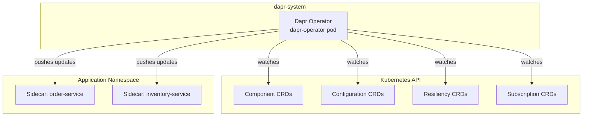
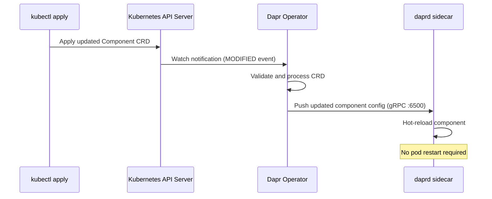

# How to Understand the Dapr Operator Service

Author: [nawazdhandala](https://www.github.com/nawazdhandala)

Tags: Dapr, Operator, Kubernetes, Control Plane, CRD

Description: Learn what the Dapr Operator service does in Kubernetes, how it manages Custom Resource Definitions, and how it delivers component updates to running sidecars.

---

## What Is the Dapr Operator?

The Dapr Operator is a Kubernetes controller that manages Dapr Custom Resource Definitions (CRDs). It runs in the `dapr-system` namespace and is responsible for:

1. Watching `Component`, `Configuration`, `Resiliency`, and `Subscription` CRDs
2. Delivering CRD updates to running Dapr sidecars
3. Managing the lifecycle of Dapr-related resources in Kubernetes



## How the Operator Delivers Updates to Sidecars

When you apply or update a Dapr CRD (for example, changing a `Component`), the Operator pushes the updated configuration to all relevant sidecars over gRPC on port `6500`. The sidecar does not need to restart.



## Dapr CRDs Managed by the Operator

```bash
# List all Dapr CRDs
kubectl get crds | grep dapr.io
```

Output:

```text
components.dapr.io
configurations.dapr.io
httpendpoints.dapr.io
resiliencies.dapr.io
subscriptions.dapr.io
```

## Inspecting the Operator

```bash
# Check the operator pod
kubectl get pods -n dapr-system -l app=dapr-operator

# View operator logs
kubectl logs -n dapr-system -l app=dapr-operator --tail=100

# Describe the operator deployment
kubectl describe deployment dapr-operator -n dapr-system
```

## Operator RBAC

The Operator has cluster-level read access to secrets (for resolving secret references in components) and full access to Dapr CRDs. It uses a `ClusterRole` and `ClusterRoleBinding`:

```bash
kubectl describe clusterrole dapr-operator-admin
```

Key permissions:

```yaml
rules:
- apiGroups: ["dapr.io"]
  resources: ["components", "configurations", "resiliencies", "subscriptions", "httpendpoints"]
  verbs: ["get", "list", "watch", "update", "patch"]
- apiGroups: [""]
  resources: ["secrets"]
  verbs: ["get", "list"]
- apiGroups: ["apps"]
  resources: ["deployments", "statefulsets"]
  verbs: ["get", "list", "watch"]
```

## Applying a Component and Watching It Load

```bash
# Apply a new Redis state store component
kubectl apply -f statestore.yaml -n default

# Watch the operator pick it up
kubectl logs -n dapr-system -l app=dapr-operator -f | grep "statestore"
```

Expected log output:

```text
time="2026-03-31T12:00:00Z" level=info msg="component updated" component=statestore namespace=default
time="2026-03-31T12:00:00Z" level=info msg="sending component update" app_id=order-service
```

## Hot-Reload Feature

Dapr supports hot-reloading of components when the Operator delivers updates. Enable it in the `Configuration` CRD:

```yaml
apiVersion: dapr.io/v1alpha1
kind: Configuration
metadata:
  name: appconfig
spec:
  features:
  - name: HotReload
    enabled: true
```

With hot-reload enabled, changing a component's connection string or credentials does not require restarting application pods.

## Operator High Availability

In production, run the Operator with multiple replicas using leader election:

```bash
helm upgrade dapr dapr/dapr \
  --namespace dapr-system \
  --set dapr_operator.replicaCount=3 \
  --set dapr_operator.leaderElection=true
```

Or in the Helm values file:

```yaml
dapr_operator:
  replicaCount: 3
  leaderElection: true
  resources:
    requests:
      cpu: 100m
      memory: 128Mi
    limits:
      cpu: 500m
      memory: 512Mi
```

## Troubleshooting

If a component is not loading in a sidecar:

1. Check that the component CRD was applied to the correct namespace:

```bash
kubectl get components -n default
```

2. Check the Operator logs for errors:

```bash
kubectl logs -n dapr-system -l app=dapr-operator | grep ERROR
```

3. Check the sidecar logs for component initialization failures:

```bash
kubectl logs <pod-name> -c daprd | grep "error\|component"
```

4. Verify the secret referenced in the component exists:

```bash
kubectl get secret redis-secret -n default
```

## Summary

The Dapr Operator is the Kubernetes controller responsible for watching Dapr CRDs and pushing component, configuration, resiliency, and subscription updates to running sidecars over gRPC. It enables hot-reload of infrastructure configuration without pod restarts, manages RBAC for CRD access, and can run in high-availability mode with leader election. When components are not loading, the Operator logs are the first place to look for errors.
