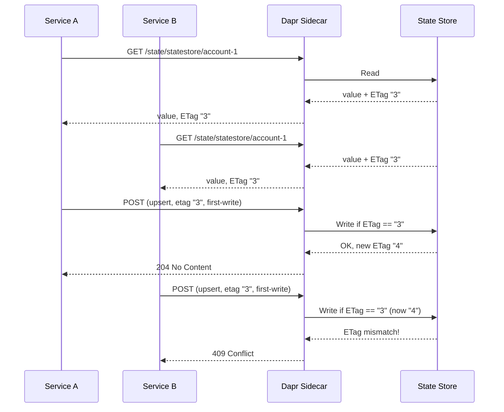

# How to Use Optimistic Concurrency Control with ETags in Dapr

Author: [OneUptime](https://oneuptime.com)

Tags: Dapr, State Management, Concurrency, ETag, Microservice

Description: Learn how to implement optimistic concurrency control using ETags in Dapr State Management to prevent lost updates in concurrent microservice environments.

---

## Introduction

Optimistic concurrency control (OCC) assumes conflicts are rare and checks for them only at write time. Dapr State Management implements OCC through ETags: a version token returned with every state read. If the ETag has changed by the time you write, Dapr rejects the update with a `409 Conflict`, signalling that another writer modified the data between your read and write.

## How ETags Work in Dapr



## Reading State and Capturing the ETag

### HTTP API

```bash
curl -v http://localhost:3500/v1.0/state/statestore/account-1

# Response headers:
# ETag: "3"
# Content-Type: application/json

# Response body:
# {"accountId": "account-1", "balance": 1000}
```

### Go SDK

```go
result, err := client.GetState(ctx, "statestore", "account-1", nil)
if err != nil {
    log.Fatal(err)
}
etag := result.Etag
value := result.Value
fmt.Printf("Balance: %s, ETag: %s\n", value, etag)
```

## Writing with ETag (First-Write-Wins)

### HTTP API

```bash
curl -X POST http://localhost:3500/v1.0/state/statestore \
  -H "Content-Type: application/json" \
  -d '[{
    "key": "account-1",
    "value": {"accountId": "account-1", "balance": 950},
    "etag": "3",
    "options": {
      "concurrency": "first-write",
      "consistency": "strong"
    }
  }]'

# If ETag matches: 204 No Content
# If ETag mismatch: 409 Conflict
```

### Python SDK

```python
from dapr.clients import DaprClient
from dapr.clients.grpc._state import StateOptions, Concurrency, Consistency
import json

def debit_account(account_id: str, amount: float):
    with DaprClient() as client:
        # Read with ETag
        result = client.get_state(
            store_name="statestore",
            key=account_id
        )
        if not result.data:
            raise ValueError("Account not found")

        account = json.loads(result.data)
        account["balance"] -= amount

        # Write with ETag check
        client.save_state(
            store_name="statestore",
            key=account_id,
            value=json.dumps(account),
            etag=result.etag,
            options=StateOptions(
                concurrency=Concurrency.first_write,
                consistency=Consistency.strong
            )
        )
```

## Handling 409 Conflict with Retry

```python
import time

def debit_account_with_retry(account_id: str, amount: float, max_retries: int = 5):
    for attempt in range(max_retries):
        try:
            debit_account(account_id, amount)
            return
        except Exception as e:
            if "etag mismatch" in str(e).lower() or "409" in str(e):
                if attempt < max_retries - 1:
                    time.sleep(0.1 * (2 ** attempt))  # exponential backoff
                    continue
            raise
    raise Exception(f"Failed after {max_retries} retries")
```

## Conditional Delete with ETag

ETags also work for conditional deletes:

```bash
# Delete only if the entry has not been modified since ETag "3"
curl -X DELETE http://localhost:3500/v1.0/state/statestore/account-1 \
  -H "If-Match: 3"

# 204 No Content - deleted
# 409 Conflict - ETag mismatch, not deleted
```

## ETag Behaviour Across State Stores

| State Store | ETag Implementation |
|-------------|-------------------|
| Redis | Lua script checks hash version |
| PostgreSQL | `xmin` system column |
| Azure Cosmos DB | `_etag` field |
| DynamoDB | Conditional expression on version attribute |
| MongoDB | Document version field |

The ETag value format varies by store but Dapr's API is consistent.

## When to Use OCC vs. Pessimistic Locking

| Scenario | Recommendation |
|----------|---------------|
| Low-conflict reads/writes | Optimistic (ETags) |
| High contention, long transactions | Pessimistic (Dapr Distributed Lock) |
| Idempotent updates | Last-write-wins (no ETag) |
| Financial/inventory updates | Optimistic with retry |

## Summary

Dapr implements optimistic concurrency control through ETags: read state to obtain the current ETag, include it in the write request with `concurrency: first-write`, and handle `409 Conflict` responses with a read-retry loop. This prevents lost updates without the overhead of distributed locks. All Dapr-supported state stores implement ETag semantics, so the pattern is portable across Redis, PostgreSQL, Cosmos DB, and others.
