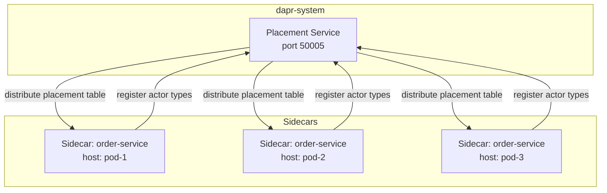
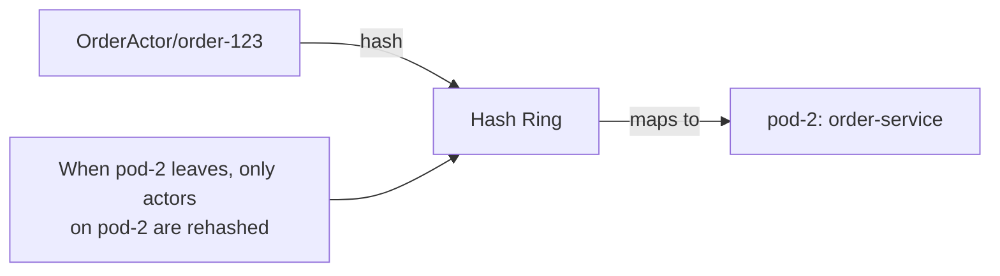
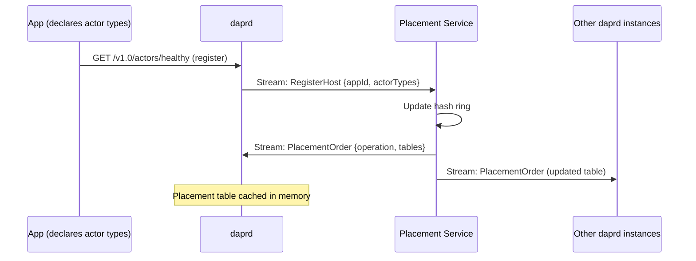
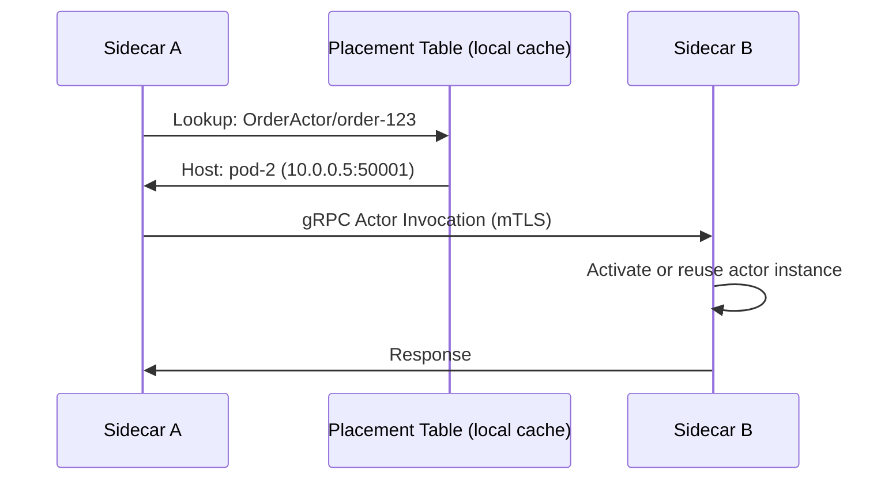

# How to Understand the Dapr Placement Service

Author: [nawazdhandala](https://www.github.com/nawazdhandala)

Tags: Dapr, Placement Service, Actor, Control Plane, Distributed System

Description: Understand how the Dapr Placement service tracks actor host locations using consistent hashing, distributes placement tables to sidecars, and supports high availability.

---

## What Is the Dapr Placement Service?

The Dapr Placement service is a control plane component that manages the location of virtual actor instances. It maintains a distributed hash table that maps actor types and IDs to the specific host (sidecar) that is currently running them. Every sidecar hosting actors registers with the Placement service and receives placement table updates.



## What Problem Does It Solve?

Virtual actors are single-threaded objects. Only one instance of `OrderActor` with ID `"order-123"` can be active at any time, regardless of how many replicas of the hosting service are running. The Placement service ensures every sidecar knows which pod is running which actor, preventing concurrent activation of the same actor instance.

## How Consistent Hashing Works

The Placement service uses consistent hashing (a hash ring) to assign actor instances to hosts. When the cluster topology changes (a pod starts or stops), only a small fraction of actor assignments change.



## Registration Flow

1. The application declares its actor types via the actors API.
2. The sidecar connects to the Placement service and streams the available actor types.
3. The Placement service distributes an updated placement table to all connected sidecars.
4. When a sidecar needs to invoke an actor, it looks up the placement table to find the correct host.



## Actor Invocation Routing

When sidecar A wants to call `OrderActor/order-123` on sidecar B:



## Placement Service in Self-Hosted Mode

When you run `dapr init`, a Placement service container starts automatically:

```bash
docker ps | grep placement
```

Output:

```text
... daprio/dapr:1.14.0  0.0.0.0:50005->50005/tcp  dapr_placement
```

You can also start it manually:

```bash
placement -port 50005
```

## Placement Service on Kubernetes

Check the Placement service:

```bash
kubectl get pods -n dapr-system -l app=dapr-placement-server
kubectl get svc -n dapr-system dapr-placement-server
```

The service listens on port `50005` for sidecar registration gRPC streams.

## High Availability Mode

In production, run Placement with 3 replicas using Raft consensus for leader election:

```bash
helm upgrade dapr dapr/dapr \
  --namespace dapr-system \
  --set dapr_placement.replicaCount=3 \
  --set dapr_placement.cluster.storageClassName=fast-ssd
```

Raft requires an odd number of nodes (1, 3, or 5) to achieve a quorum. With 3 replicas, the cluster can tolerate one failure.

```yaml
# Helm values
dapr_placement:
  replicaCount: 3
  resources:
    requests:
      cpu: 100m
      memory: 128Mi
    limits:
      cpu: 1000m
      memory: 512Mi
```

## Monitoring Placement

Check Placement logs for actor registration events:

```bash
kubectl logs -n dapr-system -l app=dapr-placement-server --tail=50
```

Check which actors are registered via the sidecar metadata:

```bash
curl http://localhost:3500/v1.0/metadata | jq '.actors'
```

Response:

```json
[
  {
    "type": "OrderActor",
    "count": 42
  },
  {
    "type": "UserActor",
    "count": 7
  }
]
```

## Key Configuration Points

The Placement service port is configured during Dapr initialization:

```bash
# Custom placement address in dapr run
dapr run \
  --app-id myapp \
  --placement-host-address localhost:50005 \
  -- node app.js
```

On Kubernetes, the sidecar discovers the Placement service address automatically through the `dapr-placement-server` Kubernetes service.

## Placement vs. Name Resolution

| Feature | Placement Service | Name Resolution |
|---------|------------------|-----------------|
| Purpose | Actor instance location | Service endpoint discovery |
| Used by | Actor building block | Service Invocation building block |
| Protocol | gRPC streaming | DNS / mDNS / Consul |
| Scope | Actor type + ID | App ID |

## Summary

The Dapr Placement service is a control plane component that maintains a consistent hash ring mapping actor instance IDs to the specific sidecar hosts running them. Sidecars register their actor types on startup and receive a distributed placement table. When an actor is invoked, the sidecar consults its local table copy to route the call to the correct host. In production, run Placement with 3 replicas using Raft consensus for high availability.
